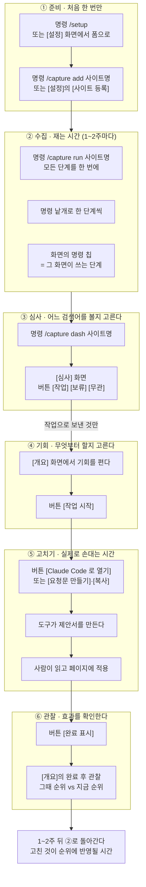
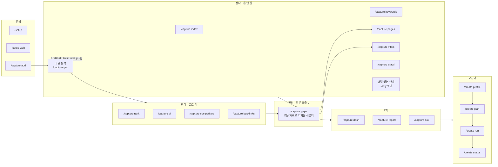
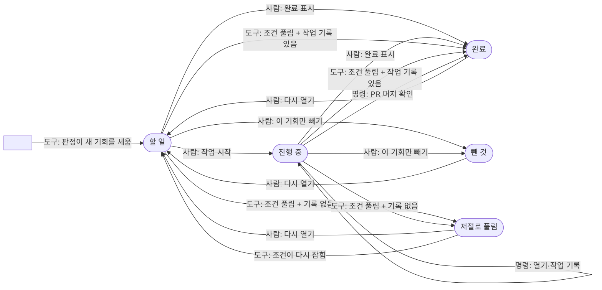
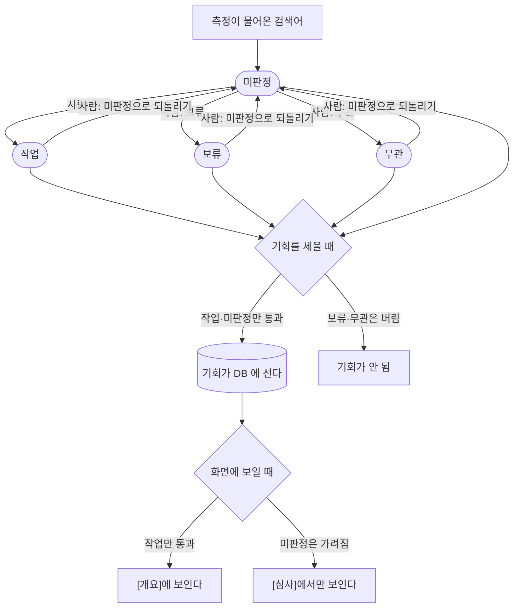
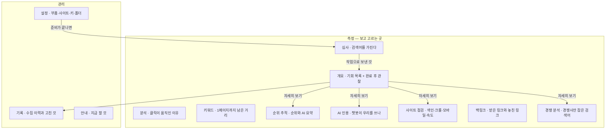

# seo-miner

내 사이트가 **검색과 AI 답변에서 어디쯤인지 재고, 그 숫자에서 손댈 것을 뽑아,
실제 코드 변경까지 잇는** Claude Code 플러그인.

측정은 스크립트가, 판단은 Claude가, 기억은 로컬 SQLite가 맡습니다. 한 바퀴 돌
때마다 자료가 쌓여서 다음 바퀴가 쉬워집니다.

```
② 검색 실적 수집 → ③ 키워드 찾기 → ④ AI 인용 확인 → ⑤ 기회 분석 → ⑥ 콘텐츠 작성
                                                                        └→ 다시 ②
```

**유료 API 키가 하나도 없어도** ②③④⑤가 전부 돌아갑니다. 유료 키는 새 기능이 아니라
자동화를 사는 것입니다. 다만 ②는 **구글 로그인 한 번**이 필요합니다(무료, 계정당 1회).
로그인 전에도 ③(키워드 찾기)은 그대로 돌아가므로, 로그인이 지금 안 되는 상황이면
`/capture keywords` 로 먼저 캐 두면 됩니다.

---

## 이런 걸 답해줍니다

- 조금만 밀면 1페이지인 검색어가 뭐고, **1페이지까지 몇 칸 남았나**
- 노출은 나오는데 **클릭이 0인 검색어**는 어디고, 제목 문제인가 경쟁 문제인가
- 애초에 **색인이 안 된 페이지**는 어디고, robots·크롤 실패·canonical 중 뭐 때문인가
- 같은 검색어인데 **모바일에서만 순위가 낮은** 건 어디인가 (2계단 이상)
- ChatGPT·Perplexity·Gemini가 이 주제에서 **누구를 인용하고 나는 왜 빠졌나**
- 같은 틀로 여러 장 찍을 수 있는 **pSEO 패턴**이 데이터에 있나
- 그래서 **다음에 뭘 하면 되나** — 한 번에 하나씩

## 설치

```
/plugin marketplace add seanjr2847/seo-miner
/plugin install seo-miner@seo-miner
```

설치 후 Claude Code를 재시작하고 `/setup`으로 시작합니다.
로컬 경로로 붙일 수도 있습니다: `/plugin marketplace add /path/to/seo-miner`

필수 준비물은 하나뿐입니다:

```
pip install requests pyyaml
```

> 명령 이름이 다른 플러그인과 겹치면 로더가 `/seo-miner:capture`처럼 앞에 플러그인
> 이름을 붙입니다. 아래 예시는 짧은 형태로 적었습니다.

## 시작하기

사용자가 하는 일은 **명령**과 **화면 버튼** 둘뿐입니다. 아래 그림 다섯이 그 뼈대이고,
빠짐없는 목록은 [화면별 행동](#화면별-행동-전수)에 있습니다.

### 그림 1 — 한 바퀴: 어느 시간에 무엇을 하나



**③이 ④의 문입니다.** 심사에서 `작업`으로 보내지 않은 검색어의 기회는 [개요]에
아예 안 뜹니다 — 없는 게 아니라 **가려진** 것입니다.

### 그림 2 — 명령: 무엇이 무엇을 필요로 하나



- **`/capture run` 은 위 단계들을 묶음으로 한 번에 돌립니다.** 묶음(메뉴의 제목 = 한 번에
  다시 재는 단위)끼리는 동시에 돌고, 순서가 필요한 단계만 앞 단계를 기다립니다. 묶음의
  정본은 `skills/capture/scripts/run_all.py` 의 `GROUPS`(순서는 `AFTER`), 단계 이름의
  정본은 `STAGES` 입니다. 묶음 몇 개만은 `--groups`, 단계 몇 개만은 `--only` / `--skip`.
- **한 단계가 넘어져도 나머지는 끝까지 갑니다.** 기다리던 뒤 단계는 지난 데이터로 돕니다.
  `--only` 로 고른 순차 실행만 예전처럼 `gsc` 실패에서 멈추고 남은 단계를 `안 돎` 으로
  찍습니다.
- **키가 없으면 유료 단계는 사유를 적고 건너뜁니다** — 실패가 아닙니다. DataForSEO
  잔액이 $1 미만이면 무료 확인 두 번으로 미리 막습니다.
- **`--only` 는 의존을 대신 채워 주지 않습니다.** `--only gaps` 는 재료가 없어도 그냥
  돌고 기회 0건으로 끝납니다.
- **요청문의 「진단」절을 채우는 것은 `/capture pages` 와 `/capture vitals` 입니다.**
  이 둘이 안 돌면 그 절이 통째로 비고 처방이 일반론에 머뭅니다.

### 그림 3 — 기회의 일생: 누가 상태를 바꾸나



- **`저절로 풀림` 은 사람이 만들 수 없습니다.** 도구만 쓰고, 조건이 다시 잡히면 도구가
  되엽니다. `완료`와 갈라 두는 이유는 완료 후 관찰이 **우리가 고친 효과**만 재야 하기
  때문입니다.
- **닫히는 길이 다섯**입니다: 사람이 [완료 표시] · 사람이 [이 기회만 빼기] ·
  `createdb sync` 가 PR 머지를 확인 · 자동 해소인데 작업 기록이 **있으면** 완료 ·
  **없으면** 저절로 풀림.
- **[이 기회만 빼기] 는 펼친 패널에만** 있습니다. 접힌 줄에는 다음 한 걸음만 섭니다.
- **[다시 열기] 는 두 자리**에 있습니다 — 목록, 그리고 완료 후 관찰에서 순위가 안 오른 줄.
- **묶인 줄의 버튼은 묶인 기회 전부**에 먹습니다.

### 그림 4 — 심사: 검색어를 가리는 다른 축



- **게이트가 둘**입니다. 세울 때는 `보류`·`무관`만 버리고, 보일 때는 `작업`이어야
  통과합니다. 그래서 **미판정 기회는 DB 에 있지만 [개요]에는 안 뜹니다.**
- **심사를 거치는 것은 검색어가 대상인 종류뿐**입니다. 주소·도메인·주제가 대상인
  종류는 심사 없이 바로 섭니다 — 종류 목록의 정본은 `scoring.py` 의 `ALL_KINDS` 와
  `KEYWORD_KINDS` 입니다.
- **`무관` 은 키워드 추적까지 끕니다**(`보류` 는 안 끕니다). 되돌리거나 다른 판정으로
  갈아타면 **그때 꺼진 추적만** 다시 켜집니다 — 애초에 후보였던 줄이나 사람이 직접 끈
  줄은 안 건드립니다.
- 심사는 **정규화한 검색어**에 붙습니다 — 기회 하나가 아니라 그 말 전체입니다.

### 그림 5 — 화면 지도



첫 화면은 상태가 정합니다 — 준비물이 덜 됐으면 **설정**, 한 바퀴도 안 돌았으면
**안내**, 미판정 검색어가 있으면 **심사**로 알아서 열립니다.

### 화면별 행동 전수

화면 하나를 깊이 보려면 **[화면별 문서](docs/screens/)** 로 가세요 — 화면마다 한 장씩,
할 수 있는 것·얻는 것·유즈케이스·비어 보일 때가 들어 있습니다. 아래 표는 한눈에 보는 요약입니다.

그림에 다 못 담은 것까지 여기 있습니다. **로컬 전용**은 박제본(`/capture report`)과
호스팅 화면에는 없습니다.

| 어디 | 할 수 있는 것 |
|---|---|
| **어느 화면에서나** | 왼쪽 레일로 화면 바꾸기 · 보는 사이트 고르기 · **구글 실적 기준일** 고르기(구글 실적 축만 과거로) · [새로고침] · 표 머리글로 정렬 · `i` 힌트 · 인쇄(접힌 것이 다 펴짐) · 준비 배너의 명령 칩 복사·이동 링크·[자세히]·[다시 시도] |
| **심사** | [작업] [보류] [무관] [미판정으로 되돌리기] · 판정·종류 거르개 · 검색 · 체크박스/행 클릭/`스페이스`로 고르기 · 키보드 `j` `k` `1` `2` `3` · [맨 위로] [조건 지우기] [개요] |
| **기회가 붙은 모든 화면** | 줄 펼치기 · [작업 시작] [완료 표시] [다시 열기] · (펼친 패널에만) [이 기회만 빼기] · [요청문 만들기] → [복사] · **[Claude Code 로 열기]**(로컬 전용, 도구를 안 골랐으면 [설정에서 고르기]) · 고칠 페이지 링크 열기 · [(화면) 화면에서 자세히 보기 →] |
| **개요** | 상태 거르개 · 종류 칩 · 검색 · [CSV 내려받기] · [N건 더 보기] [조건 지우기] [완료·제외 보기] [기회 열기] · 완료 후 관찰의 [다시 열기] |
| **분석** | 행 펼치기 · [검색어 열기] · [CSV 내려받기] |
| **키워드** | 정렬·구간 거르개 · 검색 · 방향 거르개 · 깊이 그림의 레인 클릭 · [그 줄 열기] [검색어 열기] [전체 보기] · [CSV 내려받기] ×2 |
| **순위 추적** | 지층 칩 · AI 요약 거르개 · AI 요약 공백 칩 · 검색 · 행 펼치기 · [문턱 N개 보기] 류 · [키워드 열기] · [순위 제공자 연결](로컬 전용) · [CSV 내려받기] [조건 지우기] |
| **AI 인용** | 상태 칩 · 카테고리·엔진 거르개 · 검색 · 질문 펼치기 · 엔진 카드·교차 칸 클릭 · [질문 열기] [질문 만들기] [키워드 열기] · [CSV 내려받기] [조건 지우기] |
| **사이트 점검** | 섹션 배지로 점프 · 색인 갈래 칩 · 크롤 갈래 칩 · 검색 ×2 · 행 펼치기 · [N건 더 보기] · [CSV 내려받기] ×7 |
| **백링크** | 행·카드 펼치기 · [도메인 열기] · [링크처 열기] [되찾을 링크 보기] [잃은 도메인 보기] · [CSV 내려받기] ×2 |
| **경쟁 분석** | 갈래 칩 · 카드 펼치기 · [검색어 열기] [키워드 열기] · [경쟁사 등록](로컬 전용) · [CSV 내려받기] [조건 지우기] |
| **기록** | 종류 칩 · 검색 ×2 · 결과·병합 거르개 · 실패한 실행 재실행 칩 · [← 기회 대상](개요의 그 카드로) · [병합 전만 보기] [기회 열기] · PR 링크 · [CSV 내려받기] ×2 |
| **안내** | [지금 할 것] 단계 칩 복사 · 접힌 설명 펴기 |
| **설정**(전부 로컬 전용) | 측정을 맡는 곳·기회를 열 도구·터미널 라디오(고르는 즉시 저장) · 사이트별 로컬 폴더 [저장] · [설치]/[다시 설치] · [사이트 등록] · [구글 로그인] [인증 파일 열기] [수집 부품 설치] [클라이언트 저장] · [키 저장] · [스킬 설치] · [링크 만들기] → [웹에서 등록] · [연결](웹에서 이어 하기) |

- **명령 칩은 전부 누르면 복사**됩니다(로컬). 붙여 넣는 곳은 채팅입니다.
- **CSV 는 지금 걸러 놓은 목록 그대로** 받습니다. 박제본에 남는 유일한 행동 계열입니다.
- **`/api/creation`** 은 화면에 버튼이 없습니다 — 개발 도구가 `createdb.py` 로 남기는
  창구이고, 그 기록이 [기록]의 「고친 것」과 기회 줄의 `적용 N건` 배지로 돌아옵니다.

- **`/capture run` 은 한 명령이 아니라 묶음들입니다.** 여러 수집·분석 단계를 묶음으로
  동시에 돌립니다. 하나가 실패해도 나머지는 계속 가고, 유료 키가 없는 단계는 알아서
  빠집니다. 묶음 몇 개만은 `--groups`, 단계 몇 개만은 `--only gsc,gaps` 나
  `--skip index,ai` 로 고릅니다. 묶음의 정본은 `skills/capture/scripts/run_all.py` 의
  `GROUPS`, 단계 이름·개수의 정본은 `STAGES` 하나입니다 — 여기에 옮겨 적지 않습니다.
- **대시보드에서는** 화면마다 맨 위의 [이 묶음 다시 재기], 전체는 [안내]의 [전체 다시
  재기]가 같은 일을 합니다. 도는 중에 누르면 대기열에 올라 이어서 돕니다.
- **고치는 일은 대시보드에서 시작합니다.** 기회를 눌러 여는 버튼이 요청문을 파일로
  써서 개발 도구를 띄웁니다 — 그 버튼이 그 기회를 '작업 시작'으로 찍습니다.
  '완료'는 고친 결과를 몇 주 지켜본 뒤 사람이 누릅니다.
- **막히면 `/setup`** 으로 돌아갑니다. 무엇이 빠졌는지와 다음 한 걸음 하나를 말해 줍니다.

```
/setup                     # 환경 진단 — 뭐가 되고 뭐가 빠졌는지, 다음 한 걸음 하나
/setup web                 # 같은 걸 화면으로: 부품 설치·사이트 등록·키 저장을 폼에서
# 구글 로그인(무료)을 먼저 해 두면 다음 줄에서 서치콘솔 속성 표기를 물어보지 않습니다
/capture add <사이트>       # 온보딩 인터뷰 4문항 (타입 · 도메인 · 언어-지역 · 시드 키워드)
/capture run <사이트>       # 수집·분석 전 단계를 한 번에 (단계표 정본: run_all.py 의 STAGES)
/capture dash <사이트>      # 대시보드 (아래)
```

`/setup web`으로 띄운 화면에서 **채팅 없이** 기본 부품 설치·첫 사이트 등록·구글 연결
파일 설치·API 키 저장까지 끝낼 수 있습니다. 등록이 끝나면 헤더 **[안내]** 에 6단계와
**지금 할 것** 하나가 뜹니다 — 어디까지 왔는지는 말이 아니라 실제로 모인 자료로
판정합니다.

## 대시보드

`/capture dash <사이트>` — 127.0.0.1 전용 로컬 웹 UI (파이썬 표준 라이브러리만,
빌드 도구·CDN 없음).

- **1페이지까지 남은 거리** — 순위를 깊이로 그립니다. 1페이지 영역을 깔고 10위에
  경계선을 그은 뒤, 2페이지 검색어는 **경계까지 되밀어야 할 거리**를 막대로 보여줍니다.
- **심사** — 측정이 물어온 검색어를 무관·보류·작업으로 먼저 가립니다. 띄어쓰기만
  다른 변형은 한 줄로 묶이고, 한 번 가린 검색어는 다음 측정에서 다시 안 올라옵니다.
  여러 줄을 골라 한 번에, 키보드 `j`/`k`·`1`/`2`/`3`으로도 됩니다.
- **다음에 손댈 것** — 작업으로 보낸 검색어의 기회를 할 일 → 진행 중 → 완료로 그
  자리에서 옮기고(클릭 즉시 저장), 완료한 것은 그때와 지금 순위를 나란히 봅니다
- **날짜별 추이** — 클릭·노출을 하루 단위로. 기간 합계만 있을 때는 "언제부터"를
  물어볼 수 없었습니다 (구글이 값을 확정할 때까지 기다리므로 **최근 3일은 비어 있습니다**)
- **모바일이 밀리는 검색어** — 같은 검색어의 모바일 vs 데스크톱 평균 순위 차
- **색인이 막힌 URL** — robots·크롤 실패·canonical 불일치·미색인 네 갈래로 분류
- **움직인 검색어 · 순위 기록 · AI 인용 현황 · 수집 이력**
- 라이트/다크, 모바일 대응, 외부 요청 0

리포트는 같은 화면의 **박제본**입니다:

```
/capture report <사이트>
```

그 시점 데이터를 페이지 안에 박아 넣은 자립형 HTML을 `~/.capture/reports/`에
남깁니다. 서버도 인터넷도 필요 없고 남한테 보내도 그대로 열립니다. 손댈 수 없는
기록이라 트리아지 버튼과 설정 패널은 빠집니다.

### 웹에서 이어 하기

같은 사이트를 **알아서 주기적으로 재게** 하고 싶으면 호스팅판으로 넘길 수 있습니다.
대시보드 **[설정] → 6. 웹에서 이어 하기**에서 링크를 만들어 열면, 구글 로그인 한
번으로 여기 적어 둔 설정 그대로(도메인·종류·씨앗 키워드·브랜드 표기·경쟁사) 등록
됩니다 — API 키는 서버가 대므로 다시 넣지 않습니다.

측정한 자료는 넘어가지 않습니다(웹이 자기 계정에서 처음부터 다시 잽니다). 로컬에
있던 것은 그대로 남고, 두 곳을 같이 써도 됩니다 — 웹은 주기 측정을, 플러그인은
해석과 판단이 필요한 작업을 맡습니다. 기회를 실제로 고치는 일은 이 PC 의 개발
도구가 엽니다(웹 화면은 브라우저라 PC 의 프로세스를 못 띄웁니다).

주소를 바꾸려면 `SEOMINER_HOSTED_URL` 환경 변수를 세우면 됩니다 (기본값의 정본은
`skills/capture/scripts/dashboard.py` 의 `HOSTED_URL`).

## 명령

| 명령 | 하는 일 |
|---|---|
| `/setup` | 환경 진단 — 뭐가 되고 뭐가 빠졌는지, 다음 한 걸음 하나. 기본은 [설정] 화면을 띄우고 채팅에는 한 줄 요약만 |
| `/setup web` | 같은 일을 화면으로 — 부품 설치·사이트 등록·구글 연결·키 저장을 폼에서 |
| `/setup doctor` | 진단 결과의 CLI 전문을 채팅으로 — 화면 대신 글로 봐야 할 때 |
| `/capture add` | 사이트 온보딩 — 4문항(타입·도메인·언어-지역·시드 키워드) + AI 질문 초안. 서치콘솔 속성은 로그인해 두면 목록에서 고릅니다 |
| `/capture run` | **한 번에 끝까지** — 단계 `gsc → ga4 → index → keywords → metrics → rank → crawl → ai → competitors → backlinks → gaps → pages → vitals → report` 를 묶음(정본 `run_all.py` 의 `GROUPS`)으로 나눠 동시에 돌리고(순서가 필요한 단계만 기다립니다 — `AFTER`) 꼬리(`TAIL`)로 마무리한 뒤 리포트 파일을 알려 줍니다. `--groups` 로 묶음 몇 개만 돌립니다. 돈이 나가는 축(정본은 `run_all.py` `STAGES` 의 `is_paid`)은 키가 없으면 알아서 빠집니다 |
| `/capture gsc` | Search Console 실적 자동 수집 — 합계·날짜별 추이·디바이스 분해 (구글 계정 연결 — 필수) |
| `/capture index` | 색인 상태 검사 (구글 URL Inspection, 무료 · URL당 1콜) — 막힌 URL을 기회로 |
| `/capture keywords` | 자동완성으로 키워드 후보 발굴 → 큐레이션 |
| `/capture rank` | SERP 순위 스냅샷 + 연관검색어·경쟁사 자동 수확 (유료 키) |
| `/capture crawl` | 사이트를 넓게 한 바퀴 — 깨진 내부 링크·리다이렉트 사슬·고아 페이지처럼 **한 장만 봐서는 안 나오는 것**. 회차로 남아 직전 대비 신규·해결을 셉니다 (내 사이트라 돈 안 듦) |
| `/capture ai` | AI 엔진 인용 체크 (OpenRouter) |
| `/capture competitors` | 경쟁사 탐지·역키워드·트래픽 몫 — 그쪽은 잡았는데 나는 없는 검색어 (DataForSEO Labs, 유료 키). 옛 이름은 `/capture gap` |
| `/capture backlinks` | 백링크 프로필·참조 도메인·앵커 + 링크 교집합(경쟁사는 받는데 우리는 못 받는 곳) (DataForSEO, 유료 키) |
| `/capture gaps` | 모아 둔 자료만으로 기회를 세웁니다 (API 호출 없음). 종류의 정본은 `skills/capture/scripts/scoring.py` 의 `ALL_KINDS` — 대시보드 [개요]의 칩이 그 한 벌을 그대로 그립니다 |
| `/capture pages` | 내 페이지를 직접 열어 감사 — title·설명·H1/H2·본문 길이·구조화 데이터·링크·alt. **이게 없으면 요청문의 '진단' 절이 통째로 빕니다** (내 사이트라 돈 안 듦) |
| `/capture vitals` | 속도 측정 (PageSpeed Insights, 돈 안 듦) — 모바일이 밀리는 검색어의 근거 |
| `/capture dash` | 로컬 대시보드 |
| `/capture report` | 그 시점 화면을 자립형 HTML로 박제 |
| `/capture ask` | 자유 질문 — Brain 조회 또는 서치콘솔 즉석 조회로 수치로 답함 |
| `/create profile` | 리포의 관례(스택·콘텐츠 위치·메타 방식·보이스) 발견·캐싱 |
| `/create plan` | 기회 → 작업 배치 (쓰기 전에 리포 git log와 대조) |
| `/create run` | 실제 파일 변경 → 브랜치 → 커밋(`[opp #id]`) → PR |
| `/create status` | 작성 이력·머지 여부 |

한 번 등록해 두면 이후에는 `/capture run {사이트}` 한 줄이 전부입니다. 스크립트가
묶음(정본 `skills/capture/scripts/run_all.py` 의 `GROUPS`)을 동시에 돌리고, 단계 목록의
정본은 `STAGES` 하나입니다. `gsc` 가 실패해도 멈추지 않고 뒤 단계가 지난 데이터로 돕니다 —
구글이 연결되지 않았으면 로그인 안내와 함께 **인증 없이 지금 되는 것**(`/capture keywords`)을
같이 알려 주므로 빈손으로 끝나지 않습니다.
다른 단계도 하나가 실패해도 나머지가 계속 갑니다. 돈이 나가는 축(정본은 `run_all.py`
`STAGES` 의 `is_paid`)은 키가 없으면 알아서 빠지고, 끝날 때 단계별 `완료 / 건너뜀 / 실패` 표 · 리포트 파일
경로 · **손댈 것 1순위와 `/create plan`** · 다음 바퀴 시점을 알려 줍니다.
(정기 자동 실행은 아직 없습니다 — 1~2주 뒤 같은 명령을 한 번 더 치는 방식입니다.)

## 준비물

**유료 키는 하나도 없어도 됩니다.** 필수는 구글 로그인 한 번(무료)뿐이고, 키는
새 기능이 아니라 **자동화를 사는 것**입니다 — `OPENROUTER_API_KEY`가 AI 인용
확인을, `DATAFORSEO_LOGIN`/`DATAFORSEO_PASSWORD`(대체재 `SERPER_API_KEY`)가
순위 추적을 켭니다.

**지금 무엇이 켜져 있고 무엇이 무슨 키로 열리는지는 `/setup` 이 찍어 줍니다** —
항목마다 무료/유료·발급처 주소·"그래서 뭘 하면 되는지"가 한 줄로 나옵니다.
그 준비 상태 명부의 정본은 `skills/setup/scripts/doctor.py` 의 `CAPABILITIES`
하나이고, 이 README는 그 목록을 복사해 두지 않습니다 — 두 벌이 되면 한쪽만
낡고, 낡은 쪽이 없는 할 일을 시킵니다.

키는 대시보드 **[설정] → API 키** 칸에 넣으면 `~/.capture/env`에 저장되고 모든
스크립트가 읽습니다 — 셸 rc를 편집할 필요가 없습니다. 셸에 `export`한 값이 있으면
그쪽이 우선합니다.

**구글 연결**은 **로그인 한 번**입니다. 구글 클라우드 콘솔에서 할 일은 **없습니다** —
플러그인이 자기 OAuth 클라이언트를 동봉합니다(rclone·gcloud가 쓰는 방식). 내가
소유한 속성이 한꺼번에 붙고, **속성마다 '사용자 및 권한'에 이메일을 추가하는 단계도
없습니다.** 채팅에 `GSC 연동해줘`라고 하거나 `/capture gsc`를 처음 돌리면 브라우저
로그인 창이 한 번 열립니다. 연결되면 `gsc_query.py`로 Claude가 서치콘솔을 즉석
조회할 수도 있습니다 — 별도 서버 없이 플러그인 안에서 끝납니다.

대가는 두 가지입니다. 동봉된 클라이언트는 구글 심사를 받지 않은 앱이라 동의 화면에
**"Google에서 확인하지 않은 앱"** 경고가 한 번 뜹니다(`고급` → `...(으)로 이동`으로
지나갑니다). 그리고 미검증 앱에는 **사용자 100명 상한**이 있습니다.

경고 화면과 상한이 싫으면 **자기 클라이언트**를 쓰면 됩니다. 구글 클라우드 콘솔에서
데스크톱 앱 OAuth 클라이언트를 하나 만든 뒤, 화면에 뜬 두 문자열만 넘깁니다:

```
python skills/setup/scripts/connect_gsc.py --client-id <ID> --client-secret <SECRET>
```

JSON을 내려받았다면 인자 없이 실행하면 다운로드 폴더에서 회수합니다. 자기
클라이언트는 번들을 이깁니다.

**파일이 있다 ≠ 연결됐다.** 번들 클라이언트는 설치만 하면 항상 존재하므로, 진짜
판정은 **로그인 토큰이 있느냐**입니다. `/setup`은 상태를 셋으로 말합니다 —
**연결됨** / **로그인 대기**(파일은 있고 로그인만 남음) / **인증 없음**.

토큰이 만료되면 로그인 창이 다시 한 번 뜨는 게 전부입니다(재설치가 아닙니다).
자기 클라이언트를 쓰면서 동의 화면을 테스트 모드로 두면 7일마다 그렇게 됩니다.
서버에서 사람 없이 돌려야 한다면 만료 없는 **서비스 계정** 갈래도 그대로 남아
있습니다(대신 속성마다 이메일 추가가 필요합니다). 절차는 `skills/setup/SKILL.md`의
"GSC 연결" 절에 있습니다.

## 데이터가 사는 곳

```
~/.capture/
├── brain.db                 # 모든 측정·기회·작업 기록 (SQLite, 첫 실행 때 자동 생성)
├── env                      # API 키 (KEY=VALUE)
├── projects/{사이트}.yaml    # 사이트 설정
├── gsc_oauth_client.json    # 자기 OAuth 클라이언트를 쓸 때만 (없으면 플러그인 번들)
├── gsc_service_account.json # 서비스 계정 키 (무인 수집을 쓸 때만)
├── gsc_token.json           # 구글 로그인 토큰 (로그인 한 번이면 생김)
├── docs/{사이트}/            # 포지셔닝·ASO·콘텐츠 계획 (마케팅 스킬 산출물)
└── reports/{사이트}/{날짜}.html
```

플러그인을 업데이트해도 이 폴더는 그대로입니다. `CAPTURE_HOME`으로 위치를 바꿀 수
있습니다.

## 마케팅 스킬 연계

측정과 기회 발굴은 seo-miner가 하고, **해석과 각도는 전문 스킬에 넘깁니다.**
그 스킬들은 seo-miner의 **준비물**입니다 — `aso`는 앱 스토어 리스팅이 있는
사이트에만 해당합니다. 출처: https://github.com/coreyhaines31/marketingskills.

`/setup`의 doctor가 아래 표 전부의 설치 여부를 봅니다. 빠진 게 있으면 **[선택]**
("더 켜고 싶으면") 통에 올립니다 — 측정·수집에는 필요가 없어서 첫 세션을 재시작으로
끊지 않습니다. 첫 리포트가 나온 뒤에 Claude가 "제가 대신 설치할까요?" 라고 묻습니다.
**승낙해 주시면 그대로 깔아 드립니다 (무료)** — 끝나면 Claude Code를 한 번
재시작하시면 그 스킬이 다음 세션부터 화면에 뜹니다. 거절하시거나 넘어가셔도
작업은 계속되고, 내장 규칙으로 채웁니다 — 그 결과물에는 "이 부분은 내장 규칙으로
처리했습니다"를 한 줄 남깁니다.
같은 세션에서 두 번 부탁드리지 않습니다.

| 스킬 | 언제 |
|---|---|
| `product-marketing` | `/setup` 온보딩 — 사이트 포지셔닝 문서 1회 생성 (`docs/{사이트}/positioning.md`) |
| `aso` | 앱 스토어 리스팅이 있는 사이트 — 리스팅 문서·문구 |
| `content-strategy` | `/capture keywords` 큐레이션 직후 — 키워드를 토픽 클러스터로 |
| `seo-audit` | 색인 차단·커버리지·순위 하락 기회가 몰릴 때 |
| `ai-seo` | `ai_citation_gap` — AI가 우리 대신 남을 인용할 때 |
| `site-architecture` | 카니벌라이제이션 — 같은 쿼리에 여러 URL이 물릴 때 |
| `programmatic-seo` | `pseo_pattern` 기회를 `/create plan`에서 집을 때 |
| `schema` | `/create run`이 페이지를 낼 때 — 구조화 데이터 |

넘기는 건 언제나 Brain 조회 결과(수치·기회 행)입니다. 산문 결과물은
`~/.capture/docs/{사이트}/`에 남아 다음 런이 다시 읽습니다. 계약 전문:
`skills/capture/references/external-skills.md`.

## 설계 원칙

- **추측 금지.** 순위·노출·인용에 대한 모든 주장은 Brain 조회 결과를 근거로 합니다.
  데이터가 없으면 "없다"고 말하고 수집을 제안합니다.
- **비용 고지.** 외부 API를 부르는 작업은 실행 전 `--dry-run`으로 호출 수를 보여주고
  확인을 받습니다.
- **발행 게이트.** `/create`는 main에 직접 쓰지 않습니다. 브랜치 → 커밋 → PR이고
  머지는 사람이 합니다.
- **루프 클로즈.** 실행한 기회는 Brain에 닫아 다음 측정이 그 성과를 재게 합니다.
  스킬을 안 거치고 손으로 고친 것도 기록합니다 — 안 그러면 같은 기회를 또 제안하고,
  모르고 실행하면 방금 손본 문구를 덮어씁니다.
- **로컬 전용.** 대시보드는 127.0.0.1에만 바인딩하고, 상태를 바꾸는 요청은 1회용
  토큰을 요구합니다.

## 한계

- 콘텐츠가 **DB에 사는 리포**는 `/create`의 파일 편집 모델 밖입니다. 파일로 존재하는
  면만 처리하고 나머지는 한계를 밝힙니다.
- 네이버·다음 등 국내 검색 표면은 미탑재입니다.
- 언어-지역은 사이트마다 고릅니다(목록 정본: `serp_adapter.LOCALES`). 그 나라 구글
  SERP 에서 순위를 재고 자동완성·AI 질문도 그 언어로 갑니다. 목록 밖 언어는
  미국/영어로 떨어지며 경고만 냅니다.
- DataForSEO 는 경로마다 한도가 달라 간격도 경로마다 둡니다(정본 `serp_adapter.PACED` —
  분당 12회 한도는 검색량(Google Ads) 경로 하나뿐입니다). 순위는 우선 대기열로 맡기고
  다 올 때까지 기다리며, 상한(`collect_serp.WAIT_LIMIT_S`)을 넘기면 그 단계를 실패로
  끝내고 이전 측정을 그대로 둡니다. 한도에 걸리면 기다렸다 다시 칩니다. Google Ads
  한도를 올렸으면 `SEOMINER_DFS_RPM` 으로 알려 주세요.
- 자동완성은 비공식 엔드포인트라 실패할 수 있습니다(실패 시 건너뛰고 계속).
- AI 인용 확인은 `OPENROUTER_API_KEY`가 있어야 합니다. 브라우저로 실제 앱을 조작해
  실측하던 `/browse`는 제거됐습니다.

## 요구 사항

Python 3.11+ · `requests`, `pyyaml`.

구글 연동을 쓰면 `google-api-python-client`, `google-auth`(조회용)와
`google-auth-oauthlib`(브라우저 로그인 창을 여는 부품)이 추가로 필요합니다.
**구글 계정 로그인(기본)이면 마지막 것도 선택이 아닙니다** — 없으면 로그인 자리에서
멈춥니다. 서비스 계정으로 붙였다면 로그인이 없어 그것 없이도 됩니다.

**마케팅 스킬 팩** (파이썬 패키지가 아니라 Claude Code 스킬입니다): 목록은 위
"마케팅 스킬 연계" 표이고, 개수를 세는 정본은 `doctor.py` 의 `ALL_SKILLS`입니다.
출처: https://github.com/coreyhaines31/marketingskills. **`/setup` 이 설치까지
도와드립니다** — 그 안의 버튼이나 채팅에 "마케팅 스킬 설치해줘" 한 마디면 됩니다
(설치는 무료, 끝나면 Claude Code 재시작이 한 번 필요합니다).

외부 MCP 서버도 node도 필요 없습니다.

MIT
