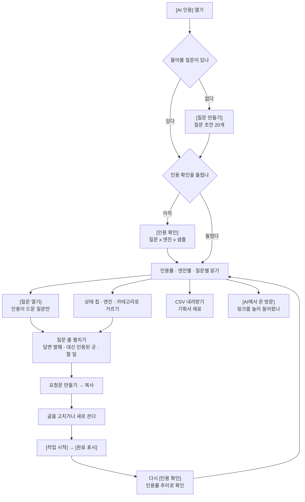

# [AI 인용] — 챗봇이 이 주제에서 누구를 인용하는지 보는 화면

ChatGPT·Perplexity·Gemini에 미리 정해 둔 질문을 실제로 물어보고, 그 답변이 우리를 출처로
쓰는지(인용) 이름만 부르는지(언급) 아무 데도 없는지를 세는 화면입니다. **구글 검색결과
맨 위에 뜨는 AI 요약은 여기가 아니라 [순위 추적] 화면의 [AI 요약] 열이 봅니다** — 그쪽은
검색어 하나를 구글에 조회해 요약이 떴는지·출처에 우리 링크가 실렸는지를 보고, 이 화면은
검색 엔진을 거치지 않고 챗봇에 문장으로 물어 그 답변을 봅니다. 재료도 다릅니다(저쪽은
SERP 조회, 이쪽은 AI 인용 확인 단계).

## 여기서 할 수 있는 것

| 할 일 | 어떻게 | 무엇이 바뀌나 |
| --- | --- | --- |
| 인용 확인 돌리기 | 화면 제목 옆 칩, 또는 다음 걸음 띠의 [인용 확인]·[인용 다시 확인]. 로컬은 `/capture ai {사이트}` 명령 칩을 복사해 채팅에 붙여 넣고, 호스팅은 버튼이 바로 서버에서 돌립니다 | 켜 둔 질문마다 엔진 세 곳에 샘플 수만큼 요청이 나가고, 새 회차의 답변으로 이 화면의 모든 표가 다시 채워집니다. 유료 호출입니다 |
| 질문 만들기 | 질문이 없을 때 띠·빈 상태에 서는 [질문 만들기]. 호스팅 전용 버튼이고, 로컬은 같은 자리에 `/capture add {사이트}` 명령 칩이 섭니다 | 사이트에 맞는 질문 초안 20개가 심어집니다. 만들기만 하고 인용 확인(유료 호출)은 따로 눌러야 합니다 |
| 질문 다시 만들기 | 경고 줄("구버전 N개")의 [질문 다시 만들기] (호스팅은 버튼, 로컬은 명령 칩) | 사이트의 페이지를 읽은 새 생성기로 질문을 다시 짓습니다. 옛 질문은 인용 이력이 붙어 있어 저절로 꺼지지 않습니다 |
| 기회 다시 분석 | 다음 걸음 띠의 [기회 다시 분석] (보조 버튼) | 이번 답변으로 인용 공백 기회와 점수를 다시 세웁니다 |
| 실적 수집하기 | [검색만 이기는 질문]이 비었을 때 그 자리의 [실적 수집] (호스팅은 버튼, 로컬은 `/capture gsc {사이트}` 명령 칩) | 구글 검색 실적이 들어와 "검색 순위 대 AI 인용"을 한 줄에 놓을 왼쪽 축이 생깁니다 |
| 상태로 거르기 | 질문 목록 위 칩 — [인용 드묾] [인용됨] [언급만] [안 잡힘]. 각 칩에 개수가 붙고, 누른 칩을 다시 누르면 풀립니다 | 목록이 그 상태의 질문만 남습니다. [인용 드묾]은 서버가 인용 공백으로 판정한 질문(기회가 붙은 질문)이라 1/6처럼 가끔 인용되는 질문도 들어옵니다 |
| 카테고리로 거르기 | 질문 목록 위 [카테고리 전체] 선택 상자(카테고리가 둘 이상일 때만 뜹니다) | 그 주제 묶음의 질문만 남습니다 |
| 엔진으로 거르기 | 질문 목록 위 [엔진 전체] 선택 상자(엔진이 둘 이상일 때만) | 표의 인용·언급·응답 수, 상태 칩 개수, 대신 인용된 곳, 답변 발췌까지 전부 그 엔진 몫으로 바뀝니다 |
| 질문·답변으로 찾기 | 질문 목록 위 검색칸 | 질문 문장뿐 아니라 답변 발췌 글자까지 뒤져 걸러 냅니다 |
| 질문 펼치기 | 질문 줄의 문장(셰브론)을 누릅니다 | 그 질문에서 우리가 빠진 답변의 원문 발췌(엔진별 한 건), 우리 대신 인용된 곳 목록, 상태별 할 일, 고칠 페이지와 그 페이지 진단, 요청문 상자가 열립니다 |
| 엔진 카드·엔진×카테고리 표 줄 누르기 | [엔진별 인용]의 카드나 그 아래 표의 줄을 누릅니다(질문별 목록이 있을 때만 손잡이가 생깁니다) | 그 엔진(·카테고리) 조합으로 질문 목록이 걸러지고 [질문별 인용]으로 내려갑니다 |
| [질문 열기] | 다음 걸음 띠의 버튼 | 인용이 드문 질문만 남기고, 첫 줄을 펴서 무엇을 고칠지까지 바로 보여 줍니다 |
| [키워드 열기] · [경쟁 분석 열기] · [순위 추적 열기] · [GA4 연결] | 각 섹션이 빈 상태일 때 그 안에 서는 버튼 | 이 화면을 채우려면 먼저 해야 할 일이 있는 다른 화면으로 넘어갑니다 |
| 계획으로 넘기기 | 질문 목록 위의 `/create plan {사이트}` 명령 칩(로컬 전용). 호스팅에서는 대신 [개요] 화면 버튼과 안내 한 줄이 섭니다 | 기회가 붙은 질문들로 무엇부터 쓸지 계획을 세우는 자리로 넘어갑니다 |
| CSV 내려받기 | 질문 목록 위 [CSV 내려받기] | 지금 걸러 놓은 질문 목록 그대로 파일로 받습니다 |
| 기회 상태 바꾸기 | 기회가 붙은 질문 줄의 [작업 시작] → 펼치면 [완료 표시] [이 기회만 빼기] [다시 열기] | 그 기회의 상태 배지가 바뀌고 [개요]의 목록·완료 후 관찰에 반영됩니다. 저장된 HTML 보고서(박제본)에는 서버가 없어 버튼이 아예 안 나옵니다 |
| 콘텐츠 작성 | 기회 줄의 작성 버튼 (호스팅 전용) | 그 기회를 저장소의 실제 콘텐츠 변경으로 넘깁니다. 로컬 대시보드는 이 자리 대신 이 PC의 개발 도구를 엽니다 |
| 요청문 만들기 | 펼친 질문 안의 [요청문 만들기]를 열고 [복사] | 그대로 Claude Code나 다른 AI·담당자에게 넘길 수 있는 요청문 전문이 클립보드로 갑니다 |
| 표 정렬하기 | 표 머리글을 누릅니다(줄이 8개 이상일 때만 손잡이가 됩니다) | 그 열 기준으로 다시 정렬됩니다 |
| 도메인·페이지 열기 | [우리 대신 인용되는 곳]·[AI만 인용하는 곳]의 도메인, [AI에서 온 방문]의 페이지 경로 | 새 탭에서 그 주소가 열립니다 |

## 여기서 얻는 것

**읽는 숫자**

- 머리의 다섯 칸: 인용률 / 언급률 / 받은 답변 / 점유 순위 / 안 잡힌 질문. 분모는 최근 확인
  한 회차에서 실제로 받은 답변 수이고, 답변 수는 질문 × 엔진 × 샘플이라 곱으로 떨어지지
  않습니다(같은 질문을 여러 번 묻습니다).
- **[안 잡힌 질문]의 밑줄은 눈금을 따라 갈립니다.** 질문별 판정 목록이 실려 온 보통의
  경우에는 **「인용이 드문 질문」** — 서버가 인용 공백으로 판정한 질문이라 상태 칩
  [인용 드묾]·띠의 [질문 열기]가 세는 것과 **같은 한 벌**이고, 1/6처럼 가끔 인용되는
  질문도 들어옵니다. 질문별 목록이 없는 **옛 박제본**에서만 **「인용도 언급도 없던
  질문」** 으로 적히고, 세는 것도 그쪽 눈금(인용 0 · 언급 0)입니다. 밑줄·띠 문장·
  상태 칩이 서로 다른 말을 하지 않도록 이 문구는 한 곳에서 나옵니다.
- **인용**은 답변의 인용 링크에 우리 도메인이 들어간 것, **언급**은 답변 본문에 우리 브랜드
  이름이 나온 것입니다. 인용은 언급에 포함되므로 두 값이 같게 설 수 있습니다.
- 인용률 추이 그래프: 확인 1회가 점 1개, 세로축은 0~100% 고정. 실선이 인용률, 점선이
  언급률입니다. 확인이 3회 쌓이기 전에는 선을 그리지 않습니다.
- 엔진별 인용 카드와 엔진×카테고리 표(엔진 · 카테고리 · 인용 · 언급 · 답변 · 조합 인용률).
- 질문별 인용 표(점수 · 질문 · 카테고리 · 엔진 · 인용 · 언급 · 응답 · 대신 인용된 곳). 점수는
  인용이 드문 질문에만 붙는 기회 점수(100점 만점)이고, 목록은 그 점수 내림차순입니다.
- 질문을 펼치면: 엔진별 답변 발췌 한 토막씩, 우리 대신 인용된 도메인과 그 횟수(4/6 = 우리가
  빠진 답변 6건 중 4건에서 인용), 제3자 플랫폼 여부(점선 칩), 상태별 할 일, 고칠 페이지와
  그 페이지 진단.
- [우리 대신 인용되는 곳]: 인용된 도메인 상위 15곳을 우리 도메인과 같은 자에 올린 막대
  (순위 · 도메인 · 막대 · 몫% · 건수), 우리 줄에는 「← 우리」가 붙습니다.
- [검색만 이기는 질문]: 구글에서는 우리가 위인데 AI 답변에서는 인용이 드문 질문
  (질문 · 겹치는 내 검색어 · 내 평균순위 · 노출 · 대신 인용된 곳).
- [AI만 인용하는 곳]: AI가 인용해 가는 경쟁사 중 검색에서는 우리가 이기는 곳
  (도메인 · AI 인용 · 우리가 위인 검색어 · 그중 몇 개).
- [AI에서 온 방문] (GA4): AI 출처별 세션 막대와 페이지 표(페이지 · 세션 · 키 이벤트 · 출처).
  인용은 AI 답변 안에서 끝나는 숫자이고, 실제로 링크를 눌러 들어온 사람은 여기서만 확인됩니다.
- 숫자에 안 들어간 질문을 말하는 경고 줄: 마지막 확인이 끊겼는지·안 끝났는지, 측정 안 됨,
  오래됨(마지막 측정 30일 초과), 구버전 생성기가 지은 질문.

**밖으로 나가는 것**

- **CSV** — 지금 거른 목록 그대로. 열은 `질문`, `카테고리`, `인용`, `언급`, `응답`,
  `대신 인용된 곳`, `답변 발췌(엔진별)`. 파일 이름은 `seo-miner-ai인용-{날짜}.csv`입니다.
- **요청문** — 기회가 붙은 질문은 서버가 써 놓은 요청문이 그대로 나옵니다. 꼴은 셋 중
  하나입니다: 걸린 페이지가 있으면 [있는 페이지 고치기], 없으면 [새 글 설계], 우리 대신
  인용된 곳이 주로 커뮤니티·위키·영상·리뷰 같은 제3자 플랫폼이면 [제3자 플랫폼에 등장하기].
  기회로 아직 안 올라온 질문에도 요청문이 나오며, 그때는 걸린 페이지 유무로 앞의 둘 중
  하나가 붙습니다.
- **명령** — 로컬에서는 `/capture ai {사이트}`, `/capture add {사이트}`,
  `/create plan {사이트}` 같은 명령 칩을 복사해 채팅에 붙여 넣습니다.

## 언제 쓰나 — 유즈케이스

- **"챗봇이 우리 업종 질문에 누구를 답으로 쓰는지 알고 싶다."** 질문을 만들고 → [인용 확인]을
  한 번 돌리면 → 머리의 인용률·언급률과 [우리 대신 인용되는 곳]에서 지금 그 자리를 누가
  가져가고 있는지 바로 읽힙니다.
- **"인용이 안 되는 질문부터 손대고 싶다."** 띠의 [질문 열기] → 인용이 드문 질문만 남고 첫
  줄이 펴집니다 → 답변 발췌와 할 일을 읽고 → [요청문 만들기]를 복사해 글을 고치거나 새로
  씁니다 → [작업 시작] → 끝나면 [완료 표시].
- **"이름은 나오는데 링크가 안 걸린다."** 상태 칩 [언급만] → 그 질문들을 펼치면 "원문 출처가
  될 데이터(가격표·비교표·자체 조사)와 저자·갱신일"이 처방으로 나옵니다.
- **"구글에서는 1페이지인데 AI가 우리를 안 쓴다."** [검색만 이기는 질문]에서 이미 순위에 걸린
  페이지를 찾아 → 질문 문장 그대로의 H2와 직답을 얹습니다. 순위를 더 올릴 일이 아니라
  모양을 바꿀 일인 자리입니다.
- **"고친 게 실제로 방문으로 이어졌나."** [AI에서 온 방문]에서 고친 페이지의 세션·키 이벤트가
  오르는지 보고, 인용률 추이에서 회차별 오르내림을 확인합니다.

## 이 화면이 비어 보일 때

- **"물어볼 질문이 없습니다"** — 이 사이트에 질문이 한 개도 없습니다. [질문 만들기] (호스팅)
  또는 `/capture add {사이트}`(로컬)로 질문 초안 20개를 먼저 심습니다. 만들기만 하고 유료
  호출은 하지 않습니다.
- **"아직 물어보지 않았습니다"** — 질문은 준비됐는데 인용 확인을 한 번도 안 돌렸습니다.
  [인용 확인]을 누릅니다. 확인 1회는 질문마다 엔진 세 곳에 요청이 나가는 **유료 단계**입니다.
  로컬에서는 openrouter.ai/keys에서 받은 OpenRouter 키가 [설정]에 있어야 하고, 호스팅에서는
  키를 서버가 대므로 따로 넣을 것이 없습니다. 키가 없어도 다른 화면의 기회 목록까지는
  그대로 나옵니다.
- **"확인이 N회라 아직 추이가 없습니다"** — 답변은 매번 달라져서 한 번의 확인은 사실이 아니라
  표본입니다. 확인이 3회 쌓이면 인용률 선이 그려집니다.
- **[검색만 이기는 질문]이 비었을 때** — 세 가지로 갈립니다. 검색 실적을 아직 수집하지
  않았거나([실적 수집]), 1페이지 안에 든 검색어가 없거나([키워드 열기]), 질문과 검색어가
  낱말로 겹치지 않는 경우(상위 검색어를 그대로 질문으로 만들면 채워집니다).
- **[AI만 인용하는 곳]이 비었을 때** — 경쟁사가 아직 없거나, 경쟁 검색어를 아직 수집하지
  않았거나([경쟁 분석 열기]), 등록한 경쟁사가 AI 답변에 하나도 안 나왔거나(문제 없음),
  AI가 인용하는 경쟁사에 검색 순위부터 밀리고 있는 경우([순위 추적 열기])입니다.
- **[AI에서 온 방문]이 비었을 때** — GA4가 연결돼 있지 않으면 연결부터 하고([GA4 연결] 또는
  프로젝트 설정의 GA4 속성 ID), 연결은 돼 있지만 이 조회가 붙기 전 수집이면 다음 GA4
  수집부터 잡힙니다. 쟀는데 0이면 그 기간에 AI 출처에서 들어온 세션이 실제로 없는 것입니다.
- **경고 줄이 떴을 때** — "마지막 확인이 중간에 끊겼습니다"·"측정 안 됨"·"오래됨"이면 [인용
  다시 확인]을, "구버전"이면 [질문 다시 만들기]를 먼저 누릅니다. 기회 점수는 끝까지 간
  확인만 씁니다.
- **펼친 질문에 "이 질문으로 걸린 내 페이지가 구글 실적에 없습니다"가 뜰 때** — 고장이
  아닙니다. AI 질문은 문장이라 구글 검색어 목록에 그대로 잡히는 일이 드뭅니다. 그때 할 일은
  새로 쓸 글 기준으로 나옵니다.

<!--
근거:
- skills/capture/templates/views/ai.html — view-def(id·title·sections·stages), 섹션 제목과
  부제, 다섯 칸 띠(AI_render/VIEW 본문), 추이 그래프(AI_trendChart, 3회 문턱),
  엔진 카드·매트릭스(AI_engineCards·AI_drill), 질문 목록 표 머리글과 상태 칩(AI_ST_OPT),
  거르개·검색칸·CSV(AI_render·AI_csv), 펼침(AI_row·AI_detail·AI_play·AI_rivChip),
  AI_missWhat()(계기판 [안 잡힌 질문] 밑줄과 띠 문장이 같은 한 벌 — AI_GAPS·AI_DRILL 이
  있으면 「인용이 드문 질문」, 없는 옛 박제본만 「인용도 언급도 없던 질문」),
  missN 의 두 갈래 계산(byPrompt + AI_GAPS, 없으면 d.missed),
  띠 문구와 [질문 열기] (AI_nextStep·AI_showMissed), 명령 칩(AI_handoff·AI_emptyState),
  검색×AI 두 섹션(AI_vsSearch·AI_outranked), GA4 방문(AI_visits), 경고 줄(AI_health),
  빈 상태(AI_emptyState)
- skills/capture/templates/dashboard.html — W()(로컬/호스팅 갈림), window.act·stageRun,
  nextStep, go(), csv()(파일명·BOM), table()(정렬 문턱 SORT_MIN=8, 머리글 표기),
  askBlock·briefText, oppScore·oppWhy·oppActs·oppPanel·OPP_SET(상태 버튼), copyCmd
- skills/capture/scripts/dashboard.py — _axis_ai(matrix·cite_share 상위 15·ai_by_prompt·
  ai_gap_rows·ai_trend·missed), _ai_referrals(GA4 방문 3분기)
- skills/capture/scripts/scoring.py — AI_GAP_MAX_RATE(1/3)·AI_MIN_SAMPLES·ai_is_gap,
  ai_tally(대신 인용된 곳·엔진별·발췌), ai_health·AI_STALE_DAYS(30), third_party_platforms
- skills/capture/scripts/stage.py — STAGE_LABELS(ai·gaps·gsc 라벨), GAIN_WEB(호스팅은
  키를 서버가 댄다)
- skills/capture/scripts/collect_ai.py — DEFAULT_ENGINES(chatgpt·perplexity·gemini),
  ai_samples, OPENROUTER_API_KEY
- skills/capture/scripts/brief.py — SHAPE_NAMES·SHAPES 라벨, shape_of(ai_citation_gap →
  fix_page·new_content·presence)
- skills/capture/templates/views/rank.html — 구글 AI 요약([AI 요약] 열·aio/aio_cited)
- server/assets/dash.html — makePrompts(POST /api/ai/prompts, limit 20), viewChip/oppBtn
- skills/capture/SKILL.md — /capture add 5단계(질문 초안), 호스팅의 [질문 만들기] 자리
- skills/create/SKILL.md — /create plan
-->
