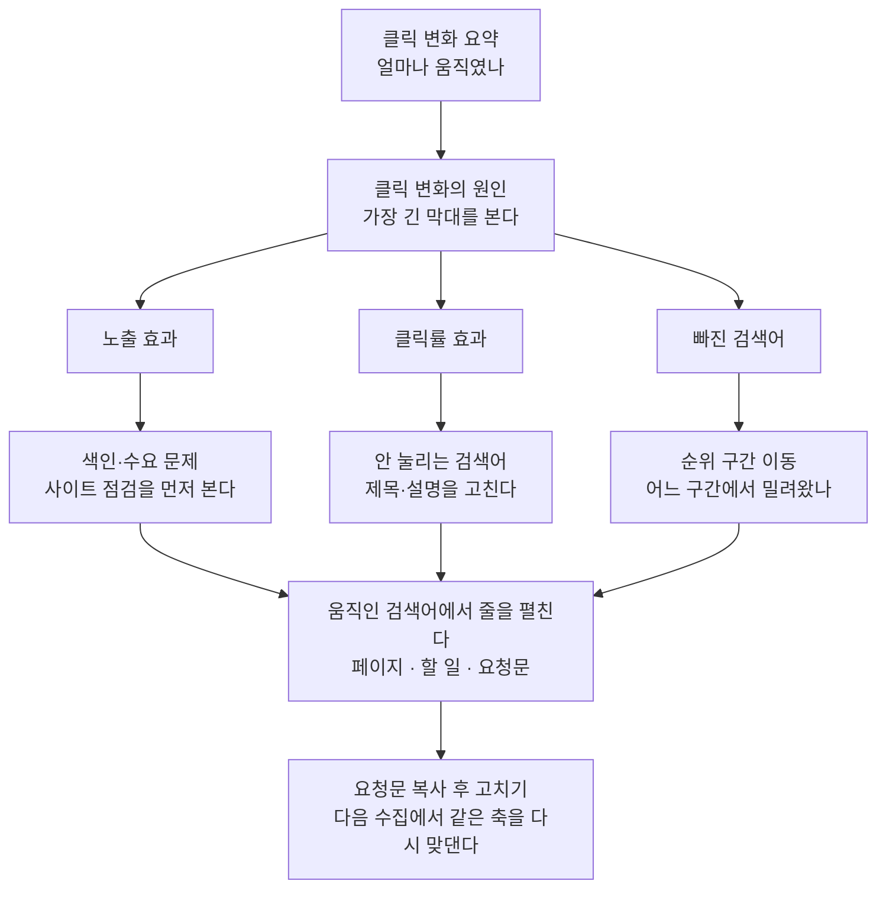

# [분석] — 클릭이 왜 늘고 줄었는지 원인별로 가르는 화면

「클릭 −12%」까지만 아는 것과 「노출이 빠져서 −12%」를 아는 것은 손댈 자리가 정반대입니다.
이 화면은 두 시점의 검색 실적을 맞대어 클릭 변화를 **노출 효과 · 클릭률 효과 · 새 검색어 ·
빠진 검색어** 넷으로 가르고, 그 다음 「어느 검색어 · 어느 페이지」까지 내려갑니다.

이 화면을 채우는 단계는 **검색 실적 수집**과 **기회 분석** 둘입니다.

---

## 이 화면의 표들

머리글(제목)과 그 위 눈금표(작은 라벨)를 화면에 있는 그대로 적었습니다.

### 위쪽 — 결론과 원인

| 자리 | 무엇을 답하는가 |
| --- | --- |
| **클릭 변화 요약** (이번 회차) | 클릭이 얼마나 움직였나. 한 문장 결론 + 숫자 타일 최대 4개 |
| **클릭 변화의 원인** (원인 분해) | 그 움직임이 **어느 축**에서 왔나. 0을 가운데 둔 좌우 막대 넷 |
| **움직인 검색어** (검색어별 기여) | 그 축을 **어느 검색어**가 움직였나. 잃은 쪽·얻은 쪽 두 덩어리 |

**클릭 변화 요약**의 숫자 타일은 재료가 있는 것만 섭니다 — 클릭 변화(이전 → 현재),
논브랜드 증감, 되찾을 클릭, 그리고 참여 세션(GA4 연결 시) 또는 1–3위 검색어.

**클릭 변화의 원인** 막대 넷의 이름과 뜻:

| 막대 | 뜻 |
| --- | --- |
| 노출 효과 | 노출이 움직여서 생긴 클릭 몫 |
| 클릭률 효과 | 같은 노출에서 눌린 비율이 움직여서 생긴 클릭 몫 |
| 새 검색어 | 이번에 처음 걸린 검색어가 벌어 온 클릭 |
| 빠진 검색어 | 이번 수집에서 사라진 검색어가 들고 간 클릭 |

넷의 합은 언제나 Δ클릭과 같습니다(항등식 분해). 가장 긴 막대가 이번에 손댈 자리입니다.

**움직인 검색어** 표의 열은 `검색어 · 원인 · Δ클릭 · 노출 · CTR · 평균 순위`.
「원인」 칸에는 **노출 / 클릭률 / 새로 / 빠짐** 배지가 붙습니다. CTR·평균 순위 칸은
`지난번 → 이번` 꼴로 한 칸에 들어갑니다. 잃은 쪽·얻은 쪽 각각 최대 8줄입니다.

### 아래쪽 — 갈래별로 다시 보기

| 표 | 무엇을 답하는가 |
| --- | --- |
| **하루 단위 클릭** (일별 추이) | 어느 **날**부터 달라졌나. 위 숫자는 수집 간격만큼 성기고, 이 선만 하루 단위다 |
| **안 눌리는 검색어** (되찾을 클릭) | 순위를 **안 올리고** 되찾을 수 있는 클릭이 어디 있나 |
| **순위 구간 이동** (순위 분포) | 1페이지 안에서 몇 개가 빠지고 늘었나 |
| **브랜드·논브랜드** (수요 구성) | 늘어난 클릭이 **새 수요**인가, 원래 나를 알던 사람인가 |
| **신규·재방문** (수요 구성 · GA4) | 방문자 쪽에서 본 같은 질문 — 유기 세션의 몇 %가 신규인가 |
| **검색 의도 구성** (의도별) | 정보성만 잡고 **거래성이 0** 아닌가 |
| **주제별 성적** (주제 묶음별) | 어느 주제가 클릭을 끌고, 어느 주제가 노출만 먹고 안 눌리나 |
| **단계별 이탈** (방문 이후 · GA4) | 노출 → 클릭 → 유기 세션 → 참여 세션 → 전환에서 어디가 새는가 |
| **채널별 세션 구성** (방문 이후 · GA4) | 검색이 흔들릴 때 대신할 채널이 있나 |
| **국가별 클릭** (국가별) | 타깃 밖 나라가 노출을 먹어 클릭률·평균 순위를 깎고 있나 |

각 표의 열:

- **안 눌리는 검색어** — `검색어 · 평균 순위 · 노출 · 실제 CTR · 기대 CTR · 되찾을 클릭`.
  1페이지(1–10위)이면서 노출 100 이상이고, 실제 클릭률이 그 순위의 기대치 **절반에 못 미치는**
  검색어만 올라옵니다. 되찾을 클릭 = 노출 × (기대 − 실제) 클릭률. 최대 15줄.
- **순위 구간 이동** — `구간 · 검색어 수 · 분포 · Δ`. 구간은 `1–3위 / 4–10위 / 11–20위 / 21위+`
  넷 고정이고, Δ는 직전 수집이 있을 때만 섭니다. 1페이지 안이 늘면 초록, 2페이지 밖이 늘면
  주황 — 구간마다 좋고 나쁨이 뒤집히기 때문입니다.
- **브랜드·논브랜드 / 검색 의도 구성 / 주제별 성적 / 국가별 클릭** — 넷 다 같은 열을 씁니다:
  `구분 · 검색어 수 · 클릭 · 노출 · CTR · 평균 순위`. 클릭·노출·CTR·평균 순위 칸 아래에는
  직전 대비 Δ가 작게 붙습니다(직전에 없던 갈래에는 안 붙습니다 — 비교 대상이 없으니까).
- **검색 의도 구성** 아래에 GA4를 연결했으면 대조 표가 하나 더 섭니다 —
  `의도 · 페이지 · 세션 · 전환 · 겹친 페이지`. 이건 **근사치**입니다: 검색어와 세션은 직접
  안 이어지고 페이지로만 이어지므로, 한 페이지가 여러 의도에 걸리면 그 전환이 갈래마다
  중복으로 잡힙니다(「겹친 페이지」가 그 수).
- **주제별 성적**에는 전환 근사가 없습니다 — 만들면 지어낸 값이 되므로 클릭 비중만 냅니다.

### 줄을 펼치면 나오는 것

**움직인 검색어 · 안 눌리는 검색어 · 순위 구간 이동 · 브랜드·논브랜드 · 검색 의도 구성 ·
주제별 성적** 여섯 표는 줄 자체가 손잡이입니다(▸ 표시).

- 움직인 검색어 / 안 눌리는 검색어: 그 검색어가 이미 기회 목록에 있으면 **기회 패널이
  통째로** 열립니다(페이지 · 할 일 · 요청문 · 상태 버튼). 아직 안 올라온 검색어면
  그 검색어가 걸린 페이지 표(`페이지 · 노출 · 클릭 · CTR · 평균순위`) + 그 페이지의 점검
  결과(`손댈 자리 · 지금 값 · 바꿀 값`) + 요청문으로 물러섭니다.
- 순위 구간 이동: 그 구간의 검색어 목록(`검색어 · 클릭 · 노출 · 평균 순위 · 이전 구간`).
  「이전 구간」이 그 검색어가 **어디서 밀려왔는지**를 말합니다.
- 브랜드·의도·주제·국가 갈래: 그 갈래 안에서 클릭이 큰 검색어
  (`검색어 · 클릭 · 노출 · 평균 순위 · Δ클릭`), 최대 15개.

---

## 여기서 할 수 있는 것

| 할 일 | 어떻게 | 무엇이 바뀌나 |
| --- | --- | --- |
| 원인 갈래 열기 | 여섯 표의 줄을 누르거나, 줄에 초점을 두고 Enter·Space | 그 줄 아래가 펼쳐집니다 — 페이지·할 일·요청문(검색어 표) 또는 검색어 목록(갈래 표) |
| 이번에 가장 크게 움직인 검색어로 바로 가기 | 화면 머리 밑 띠의 **[검색어 열기]** | 클릭이 가장 크게 움직인 줄이 펼쳐지고 화면이 그 자리로 스크롤합니다 |
| 표 정렬 바꾸기 | 열 이름을 누름(한 번 더 누르면 역순) | 그 표의 줄 순서가 바뀝니다. **펼쳐 둔 줄은 이때 접힙니다** |
| 움직인 검색어 내려받기 | 표 머리의 **[CSV 내려받기]** | 잃은 쪽 + 얻은 쪽 전부가 CSV 파일로 저장됩니다(아래 「나가는 것」) |
| 요청문 만들기 | 펼친 줄 안의 **[요청문 만들기]** → **[복사]** | 그 검색어·그 페이지에 맞춘 작업 지시문 전문이 클립보드로 갑니다 |
| 기회 상태 바꾸기 | 펼친 줄이 기회 패널일 때 **[할 일] / [진행 중] / [완료] / [이 기회만 뺌]** | 그 기회의 상태가 저장되고, 그 기회를 쓰는 다른 화면에도 같이 반영됩니다 |
| 실적 다시 수집 | 띠 또는 빈 상태 카드의 **[실적 수집] / [실적 다시 수집]**, 화면 머리의 단계 칩 | 호스팅에서는 그 자리에서 수집이 시작되고, 로컬에서는 `/capture gsc` 명령이 복사됩니다 |
| 기회 다시 뽑기 | 띠 또는 펼친 줄의 **[기회 분석]**, 화면 머리의 단계 칩 | 지금 숫자로 기회 목록을 다시 매깁니다 — 아직 기회로 안 올라온 검색어가 올라옵니다 |
| 기준 수집일 바꾸기 | 화면 위쪽 공용 머리의 **[기준 수집일]** 선택 | 이 화면 전체가 그날 기준으로 다시 그려집니다. 비교 짝은 **그날보다 이전** 중에서 고릅니다. 되돌아가는 것은 검색 실적 축 하나뿐입니다(순위·색인·기기·AI 인용은 각자 수집 주기를 따릅니다) |
| GA4 연결하러 가기 | 맨 위 안내줄의 **[GA4 연결]** | [설정] 화면으로 넘어갑니다. GA4 속성 ID를 넣으면 **다음 수집부터** 방문 이후 절 셋이 섭니다 |
| 브랜드 표기 채우러 가기 | 브랜드 절의 **[설정에서 채우기]** | [설정] 화면으로 넘어갑니다. 사람들이 실제로 치는 이름을 넣으면 **다음 분석부터** 브랜드·논브랜드가 갈립니다 |
| 미분류를 줄이러 가기 | 미분류 경고줄의 **[키워드 화면 열기]** | [키워드] 화면으로 넘어갑니다 |
| 주제 묶음 붙이기 | 주제별 성적이 빈 상태일 때 **[키워드 찾기]** (로컬만) | 묶음은 키워드를 찾을 때 함께 붙습니다. 화면에는 묶는 버튼이 없습니다 — 호스팅에서는 이 버튼 자체가 안 뜹니다 |
| 사이트 점검 열기 | 논브랜드가 줄었을 때 문장 안의 **[사이트 점검 열기]** | [사이트] 화면으로 넘어갑니다 |
| 페이지 열기 | 펼친 줄의 페이지 주소 / 갈래 펼침의 검색어 이름 | 그 페이지가 새 탭에서 열립니다(그 검색어가 걸린 페이지를 아는 경우에만 링크가 됩니다) |
| 근거 보기 | 열 이름·부제 옆 **ⓘ** | 그 숫자의 기준·계산식이 툴팁으로 뜹니다 |

내보낸 보고서 파일(박제본)에서는 누를 서버가 없으므로 버튼·명령 칩과 「수집하면 …
됩니다」 같은 행동 약속 문구가 빠집니다. 표·차트·펼침은 그대로 동작합니다.

---

## 여기서 얻는 것

### 읽는 정보

- **클릭 변화** — 이전 → 현재, 그리고 그 차이가 어느 축에서 왔는지(노출 효과 / 클릭률 효과 /
  새 검색어 / 빠진 검색어).
- **손댈 검색어 목록** — 잃은 쪽 최대 8개, 얻은 쪽 최대 8개. 각각 원인 배지 · Δ클릭 ·
  노출 · CTR(지난번 → 이번) · 평균 순위(지난번 → 이번).
- **되찾을 클릭의 총량과 목록** — 「아래를 다 고치면 같은 순위에서 N클릭쯤을 되찾습니다」.
  순위를 올리는 일이 아니라 제목·설명을 고치는 일입니다.
- **1페이지 인원수와 그 이동** — 노출 30 이상인 검색어 중 몇 개가 1–10위 안에 있고,
  직전보다 몇 개 늘거나 빠졌는지.
- **새 수요인지 아닌지** — 전체 클릭 중 논브랜드 비중, 논브랜드 증감.
- **의도 구성** — 거래성 검색어의 클릭 수와 평균 순위. 거래성이 0이면 그 사실을 먼저 말합니다.
- **하루 단위 곡선과 최고점 날짜** — 최근 28일, 「가장 많이 눌린 날은 …」.
- **GA4를 연결했다면** — 유기 세션의 신규 비중, 노출에서 전환까지 다섯 단계, 참여 세션 비율,
  전체 세션 중 검색이 데려오는 몫, 의도별·국가별 전환 근사치.

### 나가는 것

**CSV — 움직인 검색어**

- 파일명 꼴: `seo-miner-클릭변화-YYYY-MM-DD.csv` (날짜는 내려받은 날)
- 열: `검색어, 원인, Δ클릭, 노출, 이전 노출, CTR, 이전 CTR, 평균 순위, 이전 평균 순위,
  노출 효과, CTR 효과`
- 담기는 줄: 화면에 선 **잃은 쪽 + 얻은 쪽 전부**(각 최대 8줄).
  「원인」 칸은 화면 배지와 같은 말(노출 / 클릭률 / 새로 / 빠짐)로 나갑니다.
- 맨 앞에 BOM이 들어가므로 엑셀에서 한글이 깨지지 않습니다.

**요청문(프롬프트)**

펼친 줄의 [요청문 만들기]에서 복사하는 글 전문입니다. 그대로 Claude Code 에 붙여 넣으면
되고, 다른 AI 나 담당자에게 넘겨도 됩니다. 그 검색어의 문제(예: 「순위는 7위인데 클릭률
1.2%로 기대 3%의 절반이 안 됩니다」)와 대상 페이지, 점검 결과가 이미 안에 들어 있습니다.

**다른 화면으로 넘기는 것**

기회 상태를 바꾸면 그 기회를 쓰는 다른 화면에도 같이 반영됩니다.
이 화면 자체는 새 데이터를 만들지 않습니다 — 수집한 숫자를 가르기만 합니다.

---

## 언제 쓰나 — 유즈케이스

### 1. 클릭이 줄었다 — 무엇부터 봐야 하나

**클릭 변화의 원인**에서 가장 긴 막대를 봅니다.

- 노출 효과가 마이너스로 가장 길다 → 순위 문제가 아니라 **색인·수요**가 빠진 것입니다.
  [사이트] 화면의 점검부터 봅니다.
- 클릭률 효과가 마이너스로 가장 길다 → 노출은 그대로인데 덜 눌린 것입니다.
  아래 **안 눌리는 검색어** 표가 그대로 손댈 목록입니다.
- 빠진 검색어가 크다 → 걸려 있던 검색어가 통째로 사라진 것입니다(색인에서 빠졌거나
  20위 밖으로 밀렸다는 뜻). **순위 구간 이동**의 「이전 구간」에서 어디로 밀렸는지 봅니다.

### 2. 이번 주에 순위를 안 올리고 클릭을 벌고 싶다

**안 눌리는 검색어** 표만 봅니다. 이미 1페이지에 있는데 그 순위에서 보통 나오는 클릭률의
절반도 못 받는 검색어들이라, 제목·설명만 고치면 되는 **가장 싼 클릭**입니다.
「되찾을 클릭」이 큰 줄부터 펼쳐 페이지를 확인하고 요청문을 복사합니다.

### 3. 클릭은 늘었는데 문의가 안 는다

**브랜드·논브랜드**에서 늘어난 몫이 브랜드 검색뿐인지 봅니다 — 그렇다면 이미 나를 알던
사람이 더 온 것이라 새 수요는 못 잡은 것입니다. 그다음 **검색 의도 구성**에서 거래성
클릭이 0인지 봅니다. 0이면 글을 더 쓰는 게 아니라 가격·비교·신청처럼 사려는 사람이 치는
말로 페이지를 하나 만드는 것이 먼저입니다. GA4 를 연결했다면 **단계별 이탈**에서 참여
세션 비율까지 이어서 봅니다.

### 4. 노출은 많은데 평균 순위·클릭률이 계속 나쁘다

**국가별 클릭**에서 타깃 밖 나라가 노출을 먹고 있는지 봅니다. 그 몫은 클릭률·평균 순위만
끌어내립니다. 그다음 **주제별 성적**에서 노출은 많은데 안 눌리는 묶음을 찾습니다 —
글을 더 쓸 곳이 아니라 있는 글의 제목·설명을 고칠 곳입니다.

---

## 이 화면이 비어 보일 때

### 아직 한 번도 수집하지 않았다

아래 여섯 절(하루 단위 클릭 · 되찾을 클릭 · 브랜드·논브랜드 · 검색 의도 · 주제 묶음 ·
국가별 클릭)이 **한 카드로 접혀** 「실적을 수집하면 여기부터 채워집니다」 하나만 뜹니다.
같은 버튼이 여섯 번 반복되지 않게 일부러 접은 것입니다. 수집하고 나면 절마다 조건이
다르므로 각자 따로 섭니다.

### 수집이 한 번뿐이다

「맞댈 수집이 아직 없습니다」. 원인 분해는 **두 시점을 맞대야** 나옵니다. 한 번 더
수집하면 이전과 현재가 생깁니다.

### 「기간이 달라 안 맞댔습니다」

직전 수집이 다른 기간(예: 28일치 대 90일치)이라 짝을 짓지 않은 것입니다. 기간이 다른 두
기록을 빼면 증감이 전부 거짓이 되므로 일부러 비웁니다. **같은 기간으로** 한 번 더
수집하면 채워집니다.

### 움직인 검색어가 없다 / 목록에 없는 검색어가 있다

이름을 붙여 세우는 데는 **노출 30 이상**만 씁니다. 그보다 적은 검색어의 클릭률 흔들림은
원인이 아니라 표본 부족입니다. 그 검색어들은 위 합계(원인 막대)에는 이미 들어 있고,
「목록에 없는 검색어 N개」로 접혀 있습니다. 순위 구간 이동도 같은 하한을 씁니다.

### 되찾을 클릭이 없다

이건 좋은 소식입니다 — 1페이지에 있으면서 기대 클릭률의 절반도 못 받는 검색어가 없다는
뜻입니다. 이 표는 노출 100 이상만 봅니다.

### 하루 단위 클릭 — 오른쪽 끝 최근 3일이 늘 비어 있다

**버그가 아니라 수집 창입니다.** 구글이 최근 2~3일 수치를 나중에 상향 보정하기 때문에,
수집기는 확정치만 가져오려고 창 끝을 **오늘에서 3일 뺀 날**로 잡습니다. 값이 나중에
바뀌는 날짜가 섞이면 수집끼리 증감을 비교할 수 없기 때문입니다. 그래서 이 선의 오른쪽
끝은 언제나 3일 전이고, 최근 28일이 그 기준으로 채워집니다.
(선이 아예 안 그어지면 이틀 치가 아직 안 쌓인 것입니다.)

### 브랜드·논브랜드가 「브랜드 표기가 비었습니다」

내 이름을 치고 온 사람과 나를 모르고 온 사람을 가를 기준이 없는 상태입니다. 지금은
도메인 이름만 잡혀 있어 둘이 한 덩어리로 셉니다. [설정]에 사람들이 실제로 치는 이름을
넣으면 다음 분석부터 갈립니다.

### 신규·재방문 / 단계별 이탈 / 채널별 세션 구성이 아예 안 보인다

GA4 를 연결하지 않은 상태입니다. 이 세 절은 통째로 접히고, 화면 맨 위에 「방문 이후의
세션·전환은 GA4 를 연결해야 보입니다」 한 줄만 남습니다. 검색 실적은 검색결과
안(노출·클릭)까지만 보는 축이라, 방문 이후는 따로 연결해야 들어옵니다.

### 검색 의도 / 주제별 성적이 「미분류」로 쏠린다

의도와 주제 묶음은 걸린 검색어가 **키워드 목록에 올라 있어야** 붙습니다. 맞는 게 하나도
없으면 「맞는 검색어가 없습니다」가 뜨고, 미분류가 노출의 50%를 넘으면 표 위에 「노출의
N%가 미분류라 아래 비교는 나머지 얘기입니다」가 먼저 붙습니다. 묶음은 화면에서 붙이는
것이 아니라 **키워드 찾기** 단계가 붙입니다.

### 국가별 클릭이 「국가별 실적이 아직 없습니다」

국가 분해를 아직 한 번도 수집하지 않은 상태입니다(지금은 기본으로 켜져 있습니다).
한 번 더 수집하면 채워집니다. 「수집은 했는데 담긴 행이 없다」는 다른 문구로 갈라
말합니다. 이 절만 다른 수집일을 쓰므로, 기준 날짜는 부제가 따로 적습니다.

<!-- 근거:
  skills/capture/templates/views/analysis.html — view-def(title·sub·sections·stages),
    절 제목·눈금표·부제·ⓘ 문구, AN_CAUSE / AN_EFFECT / AN_INTENT / AN_NEWRET 라벨,
    AN_HEAD · AN_MIX_HEAD 열 이름, anCsv() 의 CSV 열, anToggle / anKey 펼침,
    anEmptyFill / AN_FILLABLE 빈 상태 접기, anNext() 띠 문장·버튼, anQueryPanel 펼침 내용,
    anNoGa4 · anBrand · anIntent · anCluster · anCountry · anUnmatched 빈 상태 문구
  skills/capture/templates/dashboard.html — csv()(파일명 꼴 seo-miner-NAME-날짜.csv, BOM),
    act()(로컬은 /capture 명령 복사 칩, 호스팅은 실행 버튼), window.go(), nextStep(),
    pageTable() / pageFix() / askBlock() / oppPanel() / oppActs() / OPP_LABEL,
    viewCmds()(화면 머리 단계 칩), renderDates()(기준 수집일 선택·축별 날짜),
    deadSweep()(박제본에서 .acts / .cmd / .live 제거), 표 정렬 위임
  skills/capture/scripts/dashboard.py — _axis_gsc(): shift · rank_bands · ctr_gaps ·
    brand_split · by_intent · by_cluster · by_country · country_date · daily,
    _axis_ga4(): ga4_funnel · ga4_channels · ga4_intent · ga4_by_newret
  skills/capture/scripts/scoring.py — click_shift()(중간점 분해, 네 항의 합 = Δ클릭, limit=8),
    SHIFT_MIN_IMP=30, ctr_gaps()(PAGE1=10, CTR_GAP_MIN_IMP=100, CTR_GAP_FACTOR=0.5, limit=15),
    EXPECTED_CTR, RANK_BANDS, rank_bands() / DETAIL_TOP_N=15, _bucket_perf() / _perf_row(),
    brand_split()(별칭 없으면 빈 목록), keyword_perf() / UNCLASSIFIED,
    ga4_intent_approx()(shared_pages), country_perf(limit=12), ga4_funnel(),
    daily_trend(days=28), snapshot_pair()(period_mismatch, at 고정)
  skills/capture/scripts/collect_gsc.py — end = date.today() - timedelta(days=3) (GSC 확정 버퍼)
  skills/capture/scripts/gsc_query.py — 수집기는 dataState=final + 3일 버퍼, 즉석 조회는 all
  skills/capture/scripts/db.py — GSC 가 최근 2~3일치를 나중에 상향 보정한다(upsert 주석)
  skills/capture/scripts/stage.py — STAGE_LABELS: gsc "검색 실적 수집" / "실적 다시 수집",
    gaps "기회 분석" / "기회 다시 분석", keywords "키워드 찾기"
-->
