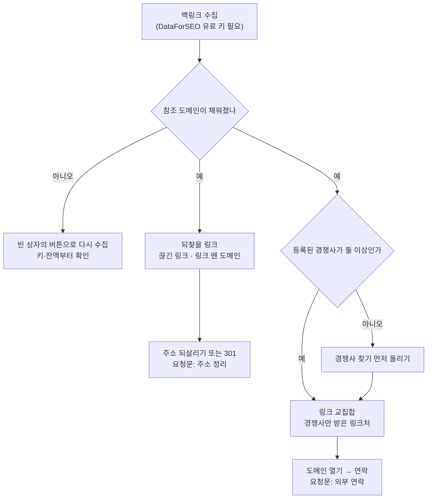

# [백링크] — 누가 우리를 링크하는지, 어디를 놓쳤는지 본다

받은 링크(참조 도메인·개별 링크·앵커)와 놓친 링크(깨진 백링크·경쟁사만 받은 링크처·
링크를 뗀 도메인)를 한 화면에 모읍니다. 이 화면의 결론은 총 백링크 수가 아니라
**참조 도메인 수와 그 기울기**입니다.

이 화면을 채우는 단계는 **백링크 수집** 하나이고, **DataForSEO 유료 키가 필요합니다**
(로컬은 `DATAFORSEO_LOGIN`/`DATAFORSEO_PASSWORD`, 호스팅은 서버가 비용을 냅니다).
링크 교집합은 **경쟁사 찾기**가 모아 둔 경쟁사를 재료로 씁니다 — 그래서 이 화면은
두 단계(백링크 수집·경쟁사 찾기)를 부를 수 있고, 제목 옆 칩은 그중 백링크 수집만
세웁니다.

## 이 화면의 섹션

- **다음 한 걸음** — 제목 바로 아래. 지금 이 사이트에서 가장 값싼 다음 행동 하나만
  문장과 버튼으로 말합니다(교집합 → 되찾을 링크 → 잃은 도메인 → 경쟁사 찾기 →
  다시 수집 순으로 물러섭니다).
- **백링크 프로필** — 요약 다섯 칸(참조 도메인·총 백링크·순위 반영 비율·깨진
  백링크·도메인 지수)과, 우리에게 링크를 건 도메인 표.
- **되찾을 링크 / 끊긴 링크와 잃은 도메인** — 이미 번 링크 중 지금 깨져 있는 것.
  되살리면 그대로 돌아오므로 교집합보다 앞에 둡니다.
- **링크 교집합 / 경쟁사만 받은 링크처** — 경쟁사들은 링크를 받는데 우리만 못 받은
  도메인. 우리가 이미 받고 있는 곳은 빠져 있어, 남은 것이 곧 할 일 목록입니다.
- **수집한 링크 전부 / 앵커와 개별 링크** — 왼쪽은 앵커 텍스트 분포(과최적화 경고
  포함), 오른쪽은 개별 링크 한 줄씩. 좁은 화면에서는 표 대신 카드로 쌓입니다.

## 여기서 할 수 있는 것

| 할 일 | 어떻게 | 무엇이 바뀌나 |
| --- | --- | --- |
| 백링크 수집하기 | 화면 제목 옆 칩. 로컬은 `/capture backlinks {사이트}` 를 복사해 채팅에 붙여 넣고, 호스팅은 같은 자리의 실행 버튼을 누릅니다 | 요약·참조 도메인·개별 링크·앵커·링크 교집합 다섯 축이 새로 적재되고 화면 전체가 다시 그려집니다 |
| 수집을 명령줄에서 돌리기 | `python scripts/run_all.py --project {사이트} --only backlinks`, 또는 수집기 직접 `python scripts/collect_backlinks.py --project {사이트}` | 위와 같습니다. 풀런(`/capture run {사이트}`)에도 이 단계가 들어 있습니다 |
| 7일 안에 이미 산 것을 다시 사기 | `--max-age 0` 을 붙입니다(기본은 7일 안이면 건너뜁니다) | 신선도 건너뜀을 무시하고 실제로 다시 조회합니다 |
| 얼마나 받아 올지 조절하기 | `--limit N`(기본 200, `0` 이면 요약만) | 참조 도메인·개별 링크·앵커의 공통 상한이 바뀝니다 |
| 참조 도메인 정렬하기 | 표의 머리글을 누릅니다(줄이 8개 이상일 때만 정렬 손잡이가 생깁니다) | 그 열 기준으로 순서가 바뀝니다. 펼쳐 둔 도메인 줄은 먼저 접힙니다 |
| 링크를 뗀 도메인 펼치기 | 적동으로 표시된 줄을 누르거나, 그 줄에서 Enter·Space | 그 아래에 점수·근거·할 일 카드가 열립니다(잃은 날·최초 발견·그 도메인에서 온 링크 수 포함) |
| 참조 도메인 CSV 내려받기 | [백링크 프로필] 머리 오른쪽 [CSV 내려받기] | 아래 「나가는 것」의 참조 도메인 파일이 받아집니다 |
| 개별 링크 CSV 내려받기 | [개별 링크] 칸 머리의 [CSV 내려받기] | 아래 「나가는 것」의 개별 링크 파일이 받아집니다 |
| 끊긴 링크 하나를 자세히 보기 | [되찾을 링크]의 카드를 펼칩니다 | 근거·할 일 목록·요청문·상태 버튼이 나옵니다. 기회로 올라오지 않은 줄은 그 이유를 말합니다 |
| 링크처 하나를 자세히 보기 | [링크 교집합]의 카드를 펼칩니다 | 같은 내용에 [도메인 열기]가 더 붙습니다 |
| 링크를 요청할 상대 사이트 열기 | 펼친 교집합 카드의 [도메인 열기] | 그 도메인이 새 탭으로 열립니다 |
| 요청문 복사하기 | 펼친 카드의 [요청문 만들기] → [복사] | 전문이 클립보드로 갑니다. Claude Code 에 붙여 넣으면 답이 HTML 리포트로 열립니다 |
| 기회 상태 바꾸기 | 카드의 [작업 시작] / [완료 표시] / [이 기회만 빼기] / [다시 열기] | 그 기회의 상태 배지가 바뀌고 저장됩니다(박제된 보고서에서는 버튼이 없습니다) |
| 그 기회를 편집기에서 열기 | 펼친 카드의 버튼 — 로컬은 [(고른 도구) 로 열기], 호스팅은 [이 PC 에서 열기] 안의 `/capture dash {사이트}` 복사 | 로컬은 그 사이트 폴더가 개발 도구로 열리고 묶인 기회가 '작업 시작'으로 찍힙니다 |
| 다음 한 걸음으로 이동하기 | [링크처 열기] · [되찾을 링크 N개] · [되찾을 링크 보기] · [잃은 도메인 보기] 중 그때 뜬 버튼 | 해당 섹션으로 스크롤하고, [링크처 열기]는 가장 많이 겹치는 링크처 카드를 펴 줍니다 |
| 경쟁사 먼저 찾기 | 교집합이 빈 상자일 때 그 안의 [경쟁사 찾기], 또는 [다음 한 걸음]의 같은 버튼 | 경쟁사 찾기 단계를 돌립니다. 경쟁사가 둘 이상이어야 교집합이 나옵니다 |
| 링크를 직접 열어 보기 | 표·카드의 주소를 누릅니다 | 새 탭으로 열립니다(링크 건 페이지, 우리 페이지 모두) |
| 숫자의 기준 확인하기 | 값 이름 옆이나 표 머리글의 (i) | 무엇을 잰 값인지, 무엇과 견준 것인지가 말풍선으로 뜹니다 |

## 여기서 얻는 것

**읽는 정보**

- 요약 다섯 칸: 참조 도메인 · 총 백링크 · 순위 반영 비율 · 깨진 백링크 · 도메인 지수.
  - 참조 도메인과 총 백링크에는 **직전 측정 대비 증감**이 붙고, 참조 도메인에는
    회차별 추이 스파크라인이 붙습니다(추이는 이 둘만 실려 옵니다).
  - 순위 반영 비율은 `순위로 넘어가는 링크 ÷ (넘어가는 것 + 안 넘어가는 것)` 입니다.
  - 도메인 지수는 DataForSEO 가 0~1000 으로 매깁니다.
  - 눈금 줄에는 측정일과, 증감이 붙은 값에는 견준 직전 측정일이 적힙니다.
- 참조 도메인 표 — 열은 `참조 도메인 · 지수 · 링크 수 · 순위 반영 · 최초 발견 ·
  잃은 날`. 뒤 두 열은 수집원이 값을 하나라도 준 경우에만 섭니다. `잃은 날`이 있는
  줄은 적동으로 표시되고 눌러서 펼칠 수 있습니다.
- 되찾을 링크 카드 — 우리 페이지 주소, 링크를 건 페이지 주소, 그 페이지의 지수,
  앵커. 부제에 끊긴 링크 개수와 링크를 뗀 도메인 수가 함께 뜹니다.
- 링크 교집합 카드 — 도메인, 지수, 이 도메인에서 링크를 받은 경쟁사 수, 링크가
  걸린 곳.
- 앵커 텍스트 표 — 열은 `앵커 · 링크 수 · 도메인 수`. 막대로 분포를 보여 주고,
  한 앵커가 전체 링크의 **50% 를 넘으면** 그 줄에 [과최적화] 배지와 곁줄 경고가
  붙습니다.
- 개별 링크 표 — 열은 `링크 건 페이지 · 앵커 · 우리 페이지 · 순위 반영`. 지금
  안 열리는 주소에는 ⚠ 가 붙습니다.

화면에 실리는 양에는 상한이 있습니다: 참조 도메인 200줄, 개별 링크 300줄, 앵커
100줄, 교집합 100줄. 그래서 요약의 「깨진 백링크」 수와 아래 목록의 건수가 어긋날
수 있고, 그럴 때는 부제의 (i) 가 그렇다고 말합니다.

**나가는 것 (CSV)**

| 파일명 꼴 | 열 |
| --- | --- |
| `seo-miner-referring-domains-YYYY-MM-DD.csv` | 도메인, 지수, 링크 수, 순위 반영, 최초 발견, 잃은 날 |
| `seo-miner-backlinks-YYYY-MM-DD.csv` | 링크 건 페이지, 앵커, 우리 페이지, 순위 반영, 깨짐 |

날짜는 내려받은 날이고, 맨 앞에 BOM 이 붙어 엑셀에서 한글이 깨지지 않습니다.
CSV 는 **지금 화면에 실린 목록 그대로**입니다(위의 상한이 그대로 적용됩니다).

**나가는 것 (요청문)**

이 화면에서 나오는 요청문은 두 종류입니다.

| 어디서 | 기회 종류 | 요청문 꼴 |
| --- | --- | --- |
| [되찾을 링크]의 카드 | 깨진 백링크 | **주소 정리** — 어디로 301 할지 정하고, 링크를 건 쪽에 보낼 짧은 안내문까지 |
| [링크 교집합]의 카드 | 경쟁사만 받는 링크 | **외부 연락** — 경쟁사가 링크된 그 글을 짚은 연락문과, 그쪽이 링크할 만한 우리 페이지 |

요청문은 **기회로 올라온 줄에서만** 나옵니다. 기회는 깨진 링크는 지수가 높은
것부터, 교집합은 경쟁사가 많은 곳부터 각각 15건까지 올라갑니다. 그 아래 줄도 카드
모양은 같지만 점수·요청문 없이 "왜 없는지"만 적힙니다.

## 언제 쓰나 — 유즈케이스

**1. 사이트를 개편하고 주소가 바뀌었다**
[되찾을 링크]부터 봅니다. 남이 걸어 준 링크가 향하던 주소가 지금 404 면 이미 번
링크를 흘리고 있는 것입니다. 지수가 높은 순으로 서 있으니 위에서부터 301 대상을
정하고, 카드의 요청문(주소 정리)을 복사해 작업을 맡깁니다.

**2. 콘텐츠는 쌓이는데 순위가 안 오른다**
요약의 참조 도메인 증감과 스파크라인을 봅니다. 기울기가 평평하면 글이 아니라 링크
쪽이 막힌 것입니다. 그다음 [링크 교집합]으로 내려가 경쟁사들이 공통으로 받는데
우리만 빠진 도메인을 위에서부터 [도메인 열기]로 확인하고, 요청문(외부 연락)으로
연락문을 만듭니다.

**3. 앵커가 한 문구에 몰린 것 같다**
[앵커 텍스트] 표를 봅니다. 한 문구가 전체의 50% 를 넘으면 [과최적화] 배지가 뜹니다.
새로 요청하는 링크는 다른 문구로 부탁합니다.

**4. 링크가 줄었다는 느낌이 든다**
참조 도메인 표에서 적동 줄(링크를 뗀 도메인)을 눌러 폅니다. 잃은 날과 그 도메인에서
오던 링크 수가 나오고, 그쪽에 지금도 관련 페이지가 있으면 다시 링크해 달라고 요청할
자리입니다.

## 이 화면이 비어 보일 때

- **아직 한 번도 수집하지 않았다** — [백링크 프로필]에 카드 하나가 서서 이 단계가
  무엇을 주는지 말하고 실행 버튼을 하나만 둡니다. 아래 세 섹션(되찾을 링크·교집합·
  수집한 링크 전부)은 채울 것이 없으므로 아예 감춰집니다. **선택 단계라 안 돌려도
  다른 화면과 기회 목록은 그대로 채워집니다.**
- **지난 수집이 실패했다** — "백링크 수집에서 멈췄습니다" 상자가 뜹니다. 보통
  수집원 키가 없거나 잔액이 0일 때 이렇게 끝납니다. 채운 뒤 다시 수집하면 이어서
  채워집니다.
- **유료 키가 없다** — 단계가 조용히 건너뜁니다. 로컬은
  `DATAFORSEO_LOGIN`/`DATAFORSEO_PASSWORD` 를 넣어야 하고, 호스팅은 서버가 비용을
  내므로 넣을 것이 없습니다.
- **돌렸는데 "최근 7일 안에 이미 수집했습니다" 라고 나온다** — 백링크는 하루 단위로
  움직이지 않아 기본 7일 안에는 다시 사지 않습니다. 정말 다시 사려면 `--max-age 0`.
- **참조 도메인이 0줄이다** — 받아 온 목록이 비었다는 뜻입니다. 백링크는 주 단위로
  움직이니 그때 다시 수집합니다.
- **끊긴 링크가 없다고 나온다** — 이건 좋은 소식이라 점선 빈 상자가 아니라 체크
  표시가 붙은 상자로 뜹니다. 할 일이 없으니 버튼도 달리지 않습니다.
- **요약의 「깨진 백링크」는 0이 아닌데 목록은 비어 있다** — 목록은 지수가 높은
  것부터 일부만 받아 오기 때문입니다. 부제의 (i) 가 그 수를 짚어 줍니다.
- **교집합이 비어 있다** — 이유가 둘입니다. ① 등록된 경쟁사가 둘 미만이면 맞댈
  대상이 없다고 말하고 [경쟁사 찾기] 버튼을 답니다. ② 경쟁사가 둘 이상인데도 비면
  "경쟁사들이 공통으로 받는 곳은 우리도 이미 받고 있습니다" — 지킬 자리라는 뜻입니다.
- **앵커·개별 링크만 비어 있다** — 상한을 `0` 으로 두고 돌리면 요약만 삽니다.
  `--limit` 을 올려 다시 수집합니다.
- **`최초 발견` · `잃은 날` 열이 아예 안 보인다** — 수집원이 그 값을 한 줄도 주지
  않으면 열을 세우지 않습니다(빈 열은 "값이 없다"가 아니라 "고장"으로 읽히기
  때문입니다).
- **박제된 보고서에서 버튼이 안 보인다** — 박제본에는 서버가 없어 실행·상태 변경
  버튼을 내지 않습니다. 표·카드·CSV 는 그대로 동작합니다.

<!-- 근거:
  C:\Projects\seo-miner\skills\capture\templates\views\backlinks.html
    — view-def(sections·stages·head), 섹션 제목·부제, 요약 띠 다섯 칸, 참조 도메인 표,
      과최적화 임계(BLK_ANCHOR_MAX=0.5), CSV 이름·열(BLK_csvDomains·BLK_csvLinks),
      빈 상태 문구(BLK_empty·BLK_ok·BLK_do), 다음 한 걸음(BLK_nextStep),
      링크 뗀 도메인 펼침(BLK_domToggle·BLK_domCollapse), 도메인 열기(BLK_site)
  C:\Projects\seo-miner\skills\capture\templates\dashboard.html
    — csv() 파일명 꼴·BOM, table() 정렬 임계(SORT_MIN=8), act()/SM.host.viewChip 의
      로컬 명령 칩과 호스팅 실행 버튼, oppPanel/oppDetail/askBlock(요청문 복사),
      OPP_SET 상태 버튼, oppBtn(도구로 열기), nextStep 자리
  C:\Projects\seo-miner\server\assets\dash.html — 호스팅 oppBtn([이 PC 에서 열기])
  C:\Projects\seo-miner\skills\capture\scripts\dashboard.py — _axis_backlinks()
      (payload 상한 200/300/100/100, 교집합은 we_have=0 만)
  C:\Projects\seo-miner\skills\capture\scripts\stage.py — STAGE_LABELS["backlinks"],
      GAIN_WEB["backlinks"] (호스팅은 서버가 비용)
  C:\Projects\seo-miner\skills\capture\scripts\run_all.py — STAGES 의 backlinks 자리,
      check_paid_keys(DataForSEO), --only/--skip
  C:\Projects\seo-miner\skills\capture\scripts\collect_backlinks.py — 다섯 축,
      --limit(기본 200, 0이면 요약만)·--max-age(기본 7일), 교집합 경쟁사 2~5곳
  C:\Projects\seo-miner\skills\capture\scripts\scoring.py — backlink_gaps(limit=15),
      _KIND_SPECS["backlink_broken"] ("깨진 백링크")·["backlink_prospect"] ("경쟁사만 받는 링크")
  C:\Projects\seo-miner\skills\capture\scripts\brief.py — KIND_SHAPE(backlink_broken→
      consolidate "주소 정리", backlink_prospect→outreach "외부 연락"), SHAPE_NAMES
  C:\Projects\seo-miner\skills\capture\SKILL.md — /capture run 풀런에 단계가 들어감.
      backlinks 전용 절은 없음(제목 옆 칩이 내는 `/capture backlinks {사이트}` 가
      사용자 쪽 입구이고, 명령줄로는 run_all --only backlinks / collect_backlinks.py)
-->
