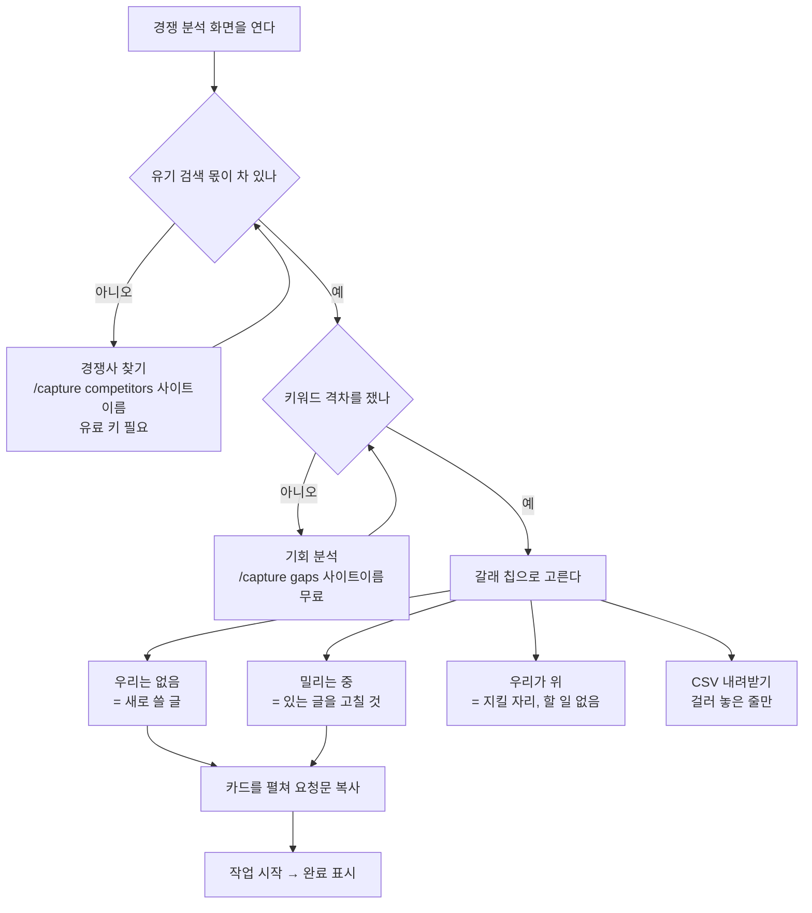

# [경쟁 분석] — 경쟁사가 순위를 잡고 있는데 우리는 없거나 밀리는 검색어를 가려내는 화면

화면이 스스로 다는 한 줄은 「경쟁사가 잡은 검색어 중 우리가 놓친 것을 봅니다」입니다.
섹션은 둘입니다 — 「유기 검색 몫」(누가 이 주제에서 얼마를 가져가나)과
「경쟁사만 잡은 검색어」(그중 우리가 놓친 줄).

이 화면을 채우는 단계도 둘입니다.

| 화면이 부르는 단계 이름 | 채우는 곳 | 돈 | 채팅에 치는 명령 |
|---|---|---|---|
| 「경쟁사 찾기」(「경쟁사 다시 찾기」) | 「유기 검색 몫」 + 「경쟁사만 잡은 검색어」의 재료 | 유료 — DataForSEO Labs 키 필요 | `/capture competitors {사이트}` |
| 「기회 분석」(「기회 다시 분석」) | 갭 줄에 붙는 점수·근거·할 일 | 무료 — 외부 호출 0건 | `/capture gaps {사이트}` |

**명령 이름은 단계 이름과 같습니다.** 화면 제목 옆 칩(로컬)은 단계 이름을 그대로 인자로
실어 `/capture competitors {사이트}` 를 복사해 주고, 스킬이 정의한 명령 절의 이름도 같은
`competitors` 입니다 — 복사해 붙여 넣으면 그대로 돕니다. (예전에는 명령만 단수
`/capture gap` 이라 칩이 없는 명령을 복사해 줬습니다. 이름을 단계에 맞춰 고쳤고, 화면에
「칩 이름 → 명령 이름」 특례표를 두지 않습니다 — 그게 곧 또 한 벌이 되기 때문입니다.)

**복수형 `/capture gaps` 는 같은 단계가 아닙니다.** 한 글자 차이지만 그쪽은 위 표의
둘째 줄 —「기회 분석」, 이미 모아 둔 자료로 점수만 매기는 무료 단계입니다. 잘못 치면
경쟁사 수집은 하나도 안 된 채 성공한 것처럼 끝납니다.

유료 키(`DATAFORSEO_LOGIN`/`DATAFORSEO_PASSWORD`)가 없으면 「경쟁사 찾기」는 **조용히
건너뜁니다** — 에러가 아니고, 이 단계를 안 돌려도 다른 화면과 기회 목록은 그대로 찹니다.

## 여기서 할 수 있는 것

| 할 일 | 어떻게 | 무엇이 바뀌나 |
|---|---|---|
| 경쟁사를 찾고 몫을 잰다 | 띠나 빈 상자의 「경쟁사 찾기」 버튼(호스팅) / 같은 자리의 명령 칩을 복사해 채팅에 붙여 넣기(로컬) | 「유기 검색 몫」 카드가 차고, 같은 실행이 「경쟁사만 잡은 검색어」의 재료도 함께 적재한다 |
| 키워드 격차를 잰다 | 띠나 빈 상자의 「기회 분석」 버튼 / 명령 칩 복사 | 갭 줄에 점수·근거·할 일이 붙고 점수 높은 순으로 다시 놓인다. 이미 모은 숫자만 쓰므로 조회 비용이 들지 않는다 |
| 갈래로 거른다 | 목록 위 칩 — 「전체」·「우리는 없음」·「밀리는 중」·「우리가 위」 | 목록·개수·CSV 가 모두 그 갈래만으로 좁혀진다. 같은 칩을 다시 누르면 풀린다 |
| 좁힌 조건을 푼다 | 걸러서 빈 상자의 「조건 지우기」 | 전체 목록으로 돌아온다 |
| 검색어 하나를 뜯어본다 | 갭 줄(검색어 카드)을 눌러 펼치기 | 점수 근거, 손댈 내 페이지, 할 일 목록이 열린다. 점수가 안 붙은 줄은 **왜 안 붙었는지**가 대신 열린다 |
| 격차가 가장 큰 것 하나를 연다 | 띠의 「검색어 열기」 | 칩으로 걸어 둔 조건을 먼저 풀고, 그 검색어 카드를 펼친 뒤 「경쟁사만 잡은 검색어」 섹션 머리로 화면을 올린다 |
| 요청문을 뽑는다 | 펼친 카드 안 「요청문 만들기」 → 「복사」 | 그 기회 한 건의 요청문 전문이 클립보드로 간다 (Claude Code 에 붙여 넣는 글) |
| 기회 상태를 바꾼다 | 펼친 카드의 「작업 시작」 → 「완료 표시」 → 「다시 열기」, 펼침 안쪽의 「이 기회만 빼기」 | 그 기회의 상태가 저장되고 다른 화면의 기회 목록에도 같이 반영된다. 박제 보고서에는 이 버튼이 없다 |
| 그 페이지를 지금 손댄다 | 펼친 카드의 「<도구> 로 열기」(로컬 — [설정]에서 고른 개발 도구로 사이트 폴더를 연다) / 「이 PC 에서 열기」(호스팅 — 로컬 대시보드를 띄우는 명령을 준다) | 로컬은 도구가 그 자리에서 열리고, 그 기회가 「작업 시작」으로 넘어간다. 도구를 아직 안 골랐으면 「도구 없음」과 「설정에서 고르기」가 대신 선다 |
| 목록을 파일로 뺀다 | 섹션 머리 오른쪽 「CSV 내려받기」 | 지금 걸러 놓은 줄만 CSV 로 내려온다 (바로 왼쪽의 개수 배지가 그 줄 수다) |
| 맞댈 상대를 직접 정한다 | 빈 상자의 「경쟁사 등록」 → [설정]의 「경쟁사 도메인」 칸(쉼표로 여러 개) | 다음 「경쟁사 찾기」가 자동으로 주운 도메인보다 **직접 적은 것을 먼저** 맞댄다 |
| 잡힌 후보를 추적에 켠다 | 띠의 「키워드 열기」 | [키워드] 화면으로 **옮기기만** 한다 — 켜는 것은 그 화면 후보 탭의 일이다 |

## 여기서 얻는 것

### 읽는 정보

**「유기 검색 몫」** — 같은 검색어 판에서 순위를 가진 도메인을 우리와 나란히 세운 카드입니다.
한 줄이 도메인 하나이고, 우리 줄에는 「← 우리」가 붙고 녹청으로 칠해집니다.
줄마다 다음이 있습니다.

- 몫(%) — 추정 트래픽 기준의 비율입니다. **저장된 값이 아니라 조회할 때 계산합니다**
  (경쟁사가 하나 늘면 분모가 바뀌기 때문입니다). 실측이 아니라 추정입니다.
- 「순위를 가진 검색어 N개」, 「1페이지 N개」
- 「추정 트래픽 N」
- 막대 — 길이가 추정 트래픽의 크기입니다. 색은 "누가 우리인가" 하나만 말합니다.

섹션 머리 부제는 한 줄로 등수부터 답합니다 — 「우리 몫은 N%, 가장 큰 곳은 example.com M%
입니다」. 눈금(눈썹 글자)에는 그 수집 날짜가 `YYYY-MM-DD 기준` 으로 붙습니다.

**「경쟁사만 잡은 검색어」** — 갭 한 줄이 기회 한 건입니다. 점수가 높은 것부터 놓이고,
점수가 없는 줄은 맨 아래로 갑니다. 한 줄에 다음이 있습니다.

- 점수(매겨진 줄만)
- 검색어 — 카드의 주인공이라 맨 위에 옵니다
- 갈래 배지 셋 중 하나
  - 「우리는 없음」 — 그 검색어에서 우리는 순위가 아예 없습니다. **새로 써야 하는 것**
  - 「밀리는 중」 — 둘 다 있는데 우리가 더 아래입니다. **있는 글을 고치는 것**
  - 「우리가 위」 — 같거나 우리가 위입니다. **지킬 자리**
- 잡고 있는 도메인과 그 순위, 그리고 「우리 N위」 또는 「우리 없음」
- 월 검색량 (점수가 붙은 줄은 근거 문장이 이미 검색량을 말하므로 여기서는 뺍니다)
- 펼치면 — 점수 근거, 손댈 내 페이지, 할 일 목록, 요청문, 상태 버튼

목록 위 칩은 갈래별 개수를 답니다: 「전체 N」·「우리는 없음 N」·「밀리는 중 N」·「우리가 위 N」.
칩의 개수는 그 수집 회차 **전부**를 세지만, 목록에 그려지는 줄은 검색량 큰 순으로 최대
300개입니다. 점수는 그중에서도 검색량이 큰 25건까지만 매기고, 「우리가 위」 갈래에는
아예 안 매깁니다(지킬 자리라 새 작업이 안 붙습니다) — 점수가 없는 줄을 펼치면 그 사실이
그대로 적혀 있습니다.

### 나가는 것

**CSV** — 「CSV 내려받기」가 내려 주는 파일 이름 꼴은

```
seo-miner-keyword-gap-YYYY-MM-DD.csv
```

날짜는 데이터의 수집일이 아니라 **내려받은 날**입니다. 열은 여섯입니다.

| 열 이름 | 값 |
|---|---|
| 검색어 | 갭 줄의 검색어 |
| 갈래 | 화면 배지 대신 내부 값이 그대로 들어갑니다 (`missing`·`weak`·`shared`) |
| 잡고 있는 곳 | 그 검색어를 잡고 있는 경쟁 도메인 |
| 경쟁사 순위 | 그 도메인의 순위 |
| 우리 순위 | 우리 순위. 없으면 빈 칸 |
| 월 검색량 | 월간 검색량 추정치. 없으면 빈 칸 |

칩으로 갈래를 좁혀 둔 상태면 **좁힌 줄만** 나갑니다. 엑셀에서 한글이 깨지지 않도록
BOM 이 붙습니다.

**요청문** — 카드를 펼쳐 「요청문 만들기」를 열면 그 기회 한 건의 요청문 전문이 있고,
「복사」가 클립보드로 넘깁니다. 그대로 Claude Code 에 붙여 넣는 글입니다.

## 언제 쓰나 — 유즈케이스

**1. 첫 바퀴 — 우리가 몇 등인지부터 본다.**
「유기 검색 몫」의 부제 한 줄이 「우리 몫은 4%, 가장 큰 곳은 example.com 31% 입니다」라고
답합니다. 막대 길이로 판이 어떻게 갈려 있는지가 한눈에 읽히고, 이 숫자가 뒤의 갭 목록을
읽는 기준이 됩니다.

**2. 새로 쓸 글감을 고른다.**
칩에서 「우리는 없음」만 켭니다. 남는 줄이 전부 "경쟁사는 잡는데 우리는 페이지조차 없는"
검색어입니다. 점수 순으로 위에서부터 카드를 펼쳐 요청문을 복사해 갑니다.

**3. 있는 글을 고쳐서 따라잡는다.**
「밀리는 중」만 켭니다. 새로 쓰는 것보다 싼 일입니다 — 이미 우리 페이지가 순위에 있고,
경쟁사보다 아래일 뿐입니다. 펼치면 손댈 페이지가 이미 정해져 나옵니다.

**4. 판을 통째로 다른 사람에게 넘긴다.**
갈래 칩으로 좁힌 뒤 「CSV 내려받기」를 눌러 외주 작가·담당자에게 그 목록만 넘깁니다.



## 이 화면이 비어 보일 때

빈 것과 실패한 것과 **재 봤는데 문제가 없는 것**은 다른 일입니다. 화면이 그 셋을 각각
다른 상자로 그립니다.

### 유료 키가 없을 때

「경쟁사 찾기」는 DataForSEO Labs 를 씁니다. `DATAFORSEO_LOGIN`/`DATAFORSEO_PASSWORD`
가 없으면 그 단계는 **조용히 건너뜁니다** — 에러가 아니고, 다시 물어보지도 않습니다.
그래서 두 섹션이 모두 빈 채로 남습니다.

- 「유기 검색 몫이 아직 비었습니다」 — 옆의 (i) 가 「선택 단계입니다. 안 돌려도 다른
  화면과 기회 목록은 그대로 채워집니다」라고 말합니다.
- 「경쟁사 찾기에서 멈췄습니다」 — 이건 **돌리다 실패한** 자리입니다(빨간 상자).
  보통 키가 없거나 **잔액이 0** 일 때 이렇게 끝납니다. 채운 뒤 다시 찾으면 이어서 찹니다.
- 「키워드 격차를 아직 재지 않았습니다」 — 격차 쪽은 **조회 비용이 들지 않습니다**.
  다만 위쪽 재료가 없으면 잴 것도 없으므로, 키 문제부터 풀어야 합니다.

호스팅에서는 키를 **서버가 댑니다** — 넣을 자리가 없고, 문구도 「조회 비용은 서버가
냅니다」로 바뀝니다. 그래서 위의 키 이야기는 로컬(플러그인) 얘기입니다.

### 경쟁사가 없을 때

키는 있는데 맞댈 상대가 없는 경우입니다. 「겹치는 경쟁 도메인이 없습니다」 상자가 서고,
「주제가 좁거나 순위를 가진 검색어가 적을 때 이렇게 나옵니다」라고 이유를 답니다.

경쟁사 목록이 채워지는 길은 셋입니다.

1. **순위 확인이 자동으로 줍는다** — 「순위 확인」 단계가 SERP 를 볼 때 상위에 자주 서는
   도메인을 경쟁사로 자동 적재합니다. 이번에 잰 검색어의 10% 이상(검색어가 적으면 최소
   3건)에서 상위에 선 도메인만, 많이 겹친 순으로 한 바퀴에 10개까지입니다.
   우리 자신과 제3자 플랫폼은 뺍니다.
   → **추적 검색어가 적으면 이 길이 아무것도 못 줍습니다.** 그때는 「경쟁사 찾기」가
   「등록된 경쟁사가 아직 없습니다」로 끝납니다.
2. **경쟁사 찾기가 스스로 찾는다** — 같은 실행이 DataForSEO Labs 에 "우리와 키워드가
   겹치는 도메인"을 따로 물어봅니다(기본 5곳). 사람이 등록한 게 하나도 없어도 이쪽이
   돌면 목록이 생깁니다. 다만 `--domain` 으로 대상을 직접 좁히면 이 자동 탐지는 꺼집니다.
3. **직접 등록한다** — [설정] 화면의 「경쟁사 도메인」 칸(쉼표로 여러 개)입니다. 빈
   상자의 「경쟁사 등록」 버튼이 바로 그 자리로 보냅니다. 프로젝트 yaml 의
   `competitors_manual`, 명령의 `--domain` 도 같은 자리입니다.

**직접 적은 것이 자동으로 주운 것보다 먼저** 쓰입니다. 셋을 합쳐도 한 바퀴에 맞대는
도메인은 **5개까지**이고(넘으면 앞 5개만), 그중 우리 순위와 나란히 놓고 갈래를 가르는
교집합 조회는 기본 3곳까지입니다.

읽기 전용 박제 보고서와 [설정] 화면이 없는 배포에서는 「경쟁사 등록」 버튼이 아예
안 나옵니다.

### 경쟁사는 있는데 목록이 비었을 때

이건 비어 보이는 게 아니라 **좋은 소식**입니다. 화면도 점선 빈 상자가 아니라 다른 톤의
상자로 그립니다.

- 「지금은 지킬 자리입니다」 — 경쟁사가 앞선 검색어가 하나도 없습니다. 주기적으로 다시
  재면 뒤집힌 자리가 잡힙니다. 여기엔 버튼을 달지 않습니다 — 재실행은 화면 머리가
  이미 갖고 있습니다.
- 「이 갈래에는 아직 없습니다」 — 칩으로 걸러서 비었을 뿐, 다른 갈래에는 남아 있습니다.
  「조건 지우기」를 누르면 전체가 다시 보입니다.
- 「기회 분석에서 멈췄습니다」 — 지난 실행이 도중에 멈춘 자리입니다. 다시 분석하면
  이어서 찹니다.

<!-- 근거:
  skills/capture/templates/views/competitors.html — view-def(id/title/sections/stages/head),
    CP_KINDS(갈래 세 벌과 뜻), CP_shares(몫 카드의 줄 구성), CP_card/CP_noOpp(갭 줄·점수 없는 줄),
    CP_chips/CP_pick(칩), CP_tools/CP_csv(개수 배지·CSV 열 이름과 필터 반영),
    CP_nextStep(띠의 네 상태·「검색어 열기」·「키워드 열기」), CP_toSettings(「경쟁사 등록」),
    CP_open, CP_standing, VIEW() 본문의 빈 상태 문구 전부
  skills/capture/templates/dashboard.html — window.act / SM.host.viewChip(`/capture <단계이름>` 을
    그대로 명령으로 쓰는 자리), csv()(파일명 꼴 seo-miner-<name>-<오늘>.csv, BOM),
    OPP_SET/OPP_NEXT(상태 버튼 라벨), oppActs/oppRest/oppDetail, askBlock/copyPrompt(요청문),
    SM.host.oppBtn(로컬 개발 도구 버튼·「도구 없음」)
  server/assets/dash.html — 호스팅의 SM.host.oppBtn 대체(「이 PC 에서 열기」), view-settings 존재
  skills/capture/scripts/dashboard.py — _axis_competitors(comp_date/comp_metrics/share 계산·
    gap_date/kw_gap LIMIT 300/kw_gap_counts GROUP BY)
  skills/capture/scripts/stage.py — STAGE_LABELS 의 「경쟁사 찾기」·「경쟁사 다시 찾기」·
    「기회 분석」·「기회 다시 분석」과 gain 문장, GAIN_WEB(호스팅은 「조회 비용은 서버가 냅니다」)
  skills/capture/scripts/run_all.py — STAGES 표의 competitors/gaps 자리와 설명,
    check_paid_keys("competitors")(DATAFORSEO 키 없으면 건너뜀), DFS_STAGES, MIN_BALANCE
  skills/capture/SKILL.md — `### /capture competitors {P}`(이 화면의 유료 단계, 옛 이름
    `/capture gap`)와 `### /capture gaps {P}`(복수 = 기회 분석), 축 셋·도메인 상한·
    비용 고지·건너뜀 톤
  skills/capture/scripts/test_seams.py — test_seam_43_chip_stages_have_skill_commands
    (화면 칩의 단계 이름 ↔ SKILL.md 의 `### /capture <단계>` 절을 못 박는 검사)
  skills/capture/scripts/collect_gap.py — 모듈 docstring(축 A/B/C, missing|weak|shared),
    _kind(), DOMAIN_CAP=5, _resolve_domains/_cap, limits.gap_limit=100 · auto_competitors=5 ·
    gap_rivals=3, 경쟁사 부재 시 noop 사유 문구
  skills/capture/scripts/scoring.py — rivals()(manual 먼저·제3자 플랫폼 제외),
    serp_rivals() / SERP_RIVAL_MIN_SHARE=0.10 · MIN_HITS=3 · MAX=10,
    content_gaps(limit=25, kind IN ('missing','weak'))
  skills/capture/scripts/collect_serp.py — db.add_competitors(..., "auto_rank") 자동 수확 자리
  skills/capture/templates/views/settings.html — 「경쟁사 도메인」 입력 칸과 그 설명
-->
