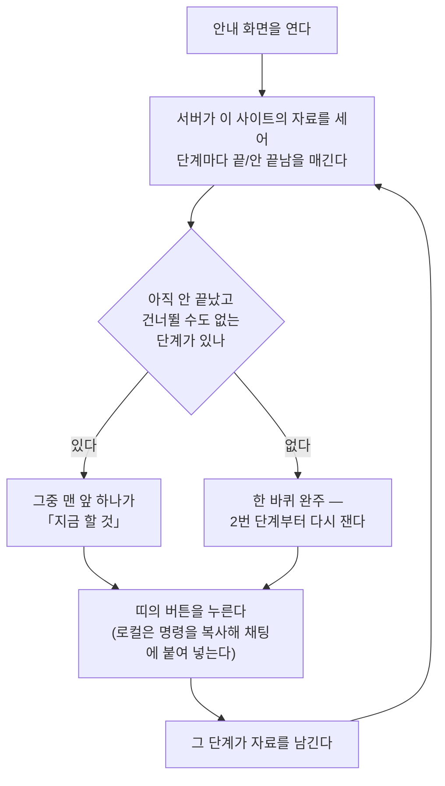

# [안내] — 무엇을 해야 하는지, 그리고 지금 어디까지 왔는지를 모인 자료로 판정해 보여 주는 화면

메뉴의 **관리** 묶음에 있습니다. 화면 설명은 "한 바퀴를 도는 순서와 지금 어디까지
왔는지를 봅니다"이고, 본문 제목은 **한 바퀴 순서**입니다. 그 아래 한 줄이 이 화면의
성격을 그대로 말합니다 — **"끝난 단계는 실제로 모인 자료를 보고 스스로 표시됩니다."**
체크박스를 손으로 켜는 화면이 아니라, 자료가 있으면 끝난 것으로 치는 화면입니다.

## 여기서 할 수 있는 것

| 할 일 | 어떻게 | 무엇이 바뀌나 |
| --- | --- | --- |
| 지금 할 단계 하나를 돌린다 | 화면 맨 위 띠("…지금 할 것은 N번 ○○입니다")의 버튼을 누른다. 호스팅에서는 바로 실행되는 버튼이고, 로컬에서는 명령 칩이라 누르면 복사되고 채팅에 붙여 넣어 돌립니다 | 그 단계가 자료를 남기고, 다음에 이 화면을 열면 그 줄이 끝난 것으로 표시되며 「지금 할 것」이 다음 단계로 넘어갑니다 |
| 목록에서 다른 단계를 돌린다 | 아직 안 끝난 단계 카드의 오른쪽 끝에 붙은 칩·버튼을 누른다 | 같습니다. 단, 맨 위 띠가 이미 주요 행동으로 들고 있는 단계는 카드에서 그 손잡이가 빠집니다 — 한 화면에 같은 행동이 두 번 서지 않게 합니다 |
| 지금 어디까지 왔는지 훑는다 | 카드 왼쪽 번호(갱도 벽을 따라 1부터), 제목 옆 상태 배지, 「지금 할 것」 배지를 본다 | 읽기만 합니다. 끝난 단계는 배지가 초록(산화동) 계열, 지금 할 단계는 카드 테두리가 굵어집니다 |
| 이 단계가 왜 필요한지 읽는다 | 카드 본문의 한 줄 설명을 읽는다. 제목 옆 `i` 에 마우스를 올리면 "한 바퀴 돌 때마다 재료가 쌓여서 다음 바퀴가 쉬워집니다. 앞 단계가 비어 있으면 뒤 단계는 잴 것이 없어 돌지 않습니다"가 뜹니다 | 읽기만 합니다 |
| 가운데 단계들을 이어서 돌리는 법을 본다 | 맨 아래 접힌 줄 "가운데 단계들은 … 하나로 이어서 돌릴 수 있습니다"를 펼친다 | 펼치면 두 가지를 말합니다 — 비용이 드는 단계는 돌리기 전에 물어본다는 것, 그리고 마지막 단계가 끝나면 **다시 실적을 수집하는 단계로 돌아온다**는 것 |

로컬과 호스팅에서 할 수 있는 일이 실제로 다른 자리입니다. 로컬은 채팅에 명령을 치고,
호스팅은 화면의 버튼을 누릅니다. 마지막 단계([콘텐츠 작성])만 예외로, 호스팅에서는
실행 버튼 대신 기회 목록으로 보내는 버튼이 섭니다 — 그 단계는 돌리는 것이 아니라
기회를 골라서 하는 일이기 때문입니다.

## 여기서 얻는 것

### 1. 「지금 할 것」 한 줄

화면 맨 위 띠가 판정을 문장 하나와 버튼 하나로 줄여 줍니다. 예를 들어
**"1·2번이 끝났고, 지금 할 것은 3번 키워드 찾기입니다. 이어서 돌리면 다음 단계가 볼
재료가 생깁니다."** 처럼 나옵니다.

- 끝난 것을 **개수가 아니라 번호**로 적습니다(`1·2번이 끝났고`). 단계는 건너뛰어 끝나기도
  해서 "몇 개 끝났다"와 "지금 몇 번이다"가 어긋날 수 있기 때문입니다. 이 번호는 아래
  카드 왼쪽의 원 숫자와 같은 말이라 눈으로 대조가 됩니다.
- 한 바퀴를 다 돌았으면 문장이 바뀝니다 — **"…단계를 모두 마쳤습니다. 다시 재면 그동안
  고친 것이 숫자로 나옵니다."** 이때 띠에 서는 버튼은 **2번 단계(실적 수집)** 입니다.

### 2. 「내가 어디까지 왔나」의 판정 근거

판정은 화면이 하지 않습니다. **서버가 그 사이트의 자료를 세어서** 단계마다 끝/안 끝남과
상태 문구를 정하고, 화면은 그것을 그리기만 합니다. 그래서 이 화면이 말하는 다음 할 일과
채팅에서 도구가 말하는 다음 할 일이 어긋나지 않습니다.

끝났다고 보는 근거는 단계마다 이렇습니다. **"행이 하나라도 있으면 끝"** 이 기본입니다.

| 번호 | 단계 | 끝났다고 보는 근거 | 배지에 적히는 것(예) |
| --- | --- | --- | --- |
| 1 | 사이트 등록 | 이 사이트에 도메인이 적혀 있다 | 도메인 그대로 / `아직 없음` |
| 2 | 검색 실적 수집 | 구글이 **연결돼 있고**, 서치콘솔 수집 기록의 수집일이 하루라도 있다 | `3번 수집 · 최근 2026-08-14` / `아직 수집 안 함` / `구글 로그인 대기` / `구글 인증 없음` |
| 3 | 키워드 찾기 | 추적 키워드 중 **직접 적은 씨앗이 아닌 것**이 하나라도 있다 | `찾은 것 42개 · 추적 45개` / `직접 적은 3개뿐` / `아직 없음` |
| 4 | AI 인용 확인 | 이 사이트의 질문에 달린 **답변 기록**이 한 건이라도 있다 | `답변 30개 확인 · 질문 10개` / `질문은 준비됨 · 아직 안 물어봄` / `물어볼 질문부터 필요` / `건너뜀 · …` |
| 5 | 기회 분석 | 이 사이트에 뽑힌 기회가 한 건이라도 있다 | `누적 164건 뽑음` / `아직 없음` |
| 6 | 콘텐츠 작성 | 이 사이트에 남은 **수정 기록**이 한 건이라도 있다 | `2건 고침` / `아직 한 건도 안 함` |

읽을 때 주의할 곳 셋:

- **2번은 자료만으로는 안 끝납니다.** 구글이 아직 연결 전이면 수집일이 몇이든 끝으로
  치지 않고, 배지가 `구글 로그인 대기`(인증 수단은 있는데 로그인 전) 또는
  `구글 인증 없음`(인증 수단 자체가 없음)으로 바뀌면서 손잡이도 수집이 아니라 연결로
  바뀝니다.
- **3번은 씨앗을 안 셉니다.** 등록할 때 손으로 적은 키워드는 "발굴을 돌렸다"는 증거가
  아니기 때문입니다. 씨앗만 있으면 `직접 적은 n개뿐`으로 표시되고 이 단계는 안 끝난 것입니다.
- **5번의 숫자는 누적입니다.** 처리한 기회까지 셉니다 — [개요]의 개선 기회 수(아직 처리
  안 한 것만 셈)와 숫자가 다른 것이 정상입니다.

여기 적은 여섯 줄은 **수집 단계 전체 목록이 아닙니다.** 수집 단계표의 정본은 서버의
단계표 한 벌이고(어느 파일인지는 문서 끝 근거 주석에 있습니다), 안내는 그중 사람이
직접 밟는 마디만 골라 세웁니다. 단계
이름·설명 문구의 정본도 서버의 단계 용어표 한 벌입니다 — 이 문서는 판정 근거를 적을 뿐
이름표 사본을 만들지 않습니다.

### 3. 「지금 할 것」이 하나로 좁혀지는 규칙

위에서부터 훑어 **아직 안 끝났고 건너뛸 수도 없는 첫 단계 하나**가 「지금 할 것」입니다.
그런 단계가 하나도 없으면 한 바퀴 완주입니다.

**건너뛰기**는 [AI 인용 확인]에만 걸립니다. 이 단계가 지금 환경에서 못 도는데(필요한
키가 하나도 없음) 기회 목록까지 가는 길을 막지도 않는 경우, 단계를 목록에서 빼지 않고
자리는 그대로 둔 채 「지금 할 것」만 다음으로 넘깁니다. 배지는 `건너뜀 · …`으로 사유를
말합니다 — 로컬은 연동하면 켜진다고, 호스팅은 키를 서버가 대므로 보통 "물어볼 질문부터
필요"하다고 말합니다. 예전에는 키 없는 사용자의 「지금 할 것」이 이 단계에 영영 붙어서
이 제품의 핵심인 기회 목록까지 못 갔습니다.

### 4. 같은 판정이 [개요]에도 실립니다

[개요] 위쪽 배너의 「지금 할 것」 줄과 이 화면의 판정은 **같은 한 벌**입니다. 두 화면이
서로 다른 다음 할 일을 말하는 일은 없습니다.

## 언제 쓰나 — 유즈케이스

**① 처음 붙였는데 뭘 눌러야 할지 모를 때.** 사이트를 막 등록했고 아직 아무 숫자도 없는
상태입니다. [개요]에 그릴 숫자가 없으니 이 화면이 대신 열리고, 띠가 "지금 할 것은 2번
검색 실적 수집입니다"라고 말합니다. 그것만 누르면 됩니다.

**② 며칠 만에 다시 열었을 때.** 어디까지 했는지 기억이 안 나도 카드 배지가 자료로
말해 줍니다 — `3번 수집 · 최근 2026-08-14`, `찾은 것 42개`. 끝난 번호와 지금 할 번호를
띠 한 줄에서 읽고 이어서 돌립니다.

**③ 유료 키 없이 쓰는데 특정 단계에서 막힌 것 같을 때.** [AI 인용 확인]이 `건너뜀`으로
표시돼 있고 「지금 할 것」은 그 다음 단계를 가리킵니다. 그 단계를 못 돌아도 기회 목록까지는
그대로 간다는 뜻입니다.

**④ 한 바퀴를 다 돌고 나서.** 띠가 완주를 알리고 버튼이 2번 단계로 되돌립니다. 고친 것이
순위와 인용에 반영됐는지는 다시 잴 때 숫자로 나옵니다.

## 이 화면이 자동으로 열릴 때

메뉴를 누르지 않아도 이 화면이 첫 화면으로 열리는 경우가 있습니다.

1. **한 바퀴도 안 돈 사이트일 때.** 아직 남은 단계가 있고(완주가 아니고), 그 사이트의
   **서치콘솔 수집일이 0일** 때 자동으로 열립니다. [개요]에 그릴 숫자가 아직 없는 상태라
   "무엇을 해야 하나"에 답하는 이 화면이 먼저 서는 것입니다. 수집일이 하루라도 생기면
   이 자동 착지는 더 이상 걸리지 않습니다.
2. **등록된 사이트가 하나도 없을 때.** [설정] 화면이 있는 배포(로컬)에서는 [설정]이
   먼저 열리고, [설정]이 없는 배포에서는 이 화면이 열립니다. 이때도 안내는 비지 않습니다 —
   빈 진행으로 그려져 **1번 사이트 등록**이 「지금 할 것」으로 섭니다.

자동 착지에는 순위가 있습니다. **설정(3) > 안내(2) > 미판정 심사(1)** 이고 큰 쪽이
이깁니다. 그래서 준비물이 덜 끝난 로컬에서는 [설정]이 이 화면보다 먼저 열리고,
호스팅에서는 [설정]으로 보내지 않으므로(서버가 준비물을 대는 자리라 사용자가 거기서 할
일이 없습니다) 안내가 이깁니다.

멈추는 조건도 있습니다.

- **메뉴를 한 번이라도 직접 누르면** 그 뒤로는 자동 착지가 전부 멈춥니다 — 사용자의
  선택이 이깁니다.
- 새로고침으로 직전에 보던 화면이 되살아나도, **이번 방문에 아직 메뉴를 누르지 않았다면**
  위 조건이 맞을 때 안내가 그 복원을 덮고 열립니다.
- **박제된 보고서 파일**에는 이 화면 자체가 없습니다. 종이에 남긴 기록에는 "지금 할 것"이
  없고 누를 수도 없기 때문입니다.

<!-- 근거:
  skills/capture/templates/views/guide.html — view-def(id·title·sub·sections·stages),
    섹션 제목 "한 바퀴 순서"·부제·힌트 문구, 접힌 loopback 문구, VIEW("guide") 의
    다음 행동 띠(끝난 번호 나열·「지금 할 것」 문장·완주 문장·완주 시 steps[1] 버튼).
  skills/capture/templates/dashboard.html — renderGuide()(카드 done/here/later 클래스,
    상태 배지, SM.host.stepChip 호출, #nx 배너 채우기, 자동 착지
    `if (here !== -1 && !(d.progress||{}).gsc_days) SM.land("guide", 2)`),
    SM.land()/SM.show()/SM.touched(직접 누르면 착지 중단, rank 비교),
    NAV_MANAGE(관리 묶음), load()(사이트 이름이 없으면 settings 있으면 settings, 없으면 guide),
    renderSetup 갈래의 `if (d.no_project) renderGuide(d)`,
    `if (d.show_setup && !window.SM_HOSTED) SM.land("settings", 3)`,
    checkTriageLand()의 land("triage", 1), __SNAPSHOT__ 갈래의 SM.drop("guide"),
    window.act()/window.stageRun()/SM.host.stepChip(로컬 명령 칩), applyWording(data-web).
  skills/capture/scripts/stage.py — progress()(gsc_snapshots 수집일·keywords(source!='seed')·
    ai_checks·opportunities·creations 카운트), gsc_state()(connected/pending/none),
    from_progress()(단계 6줄의 done·state·cmd·runnable, ai 의 skip,
    here = 첫 번째 not done and not skip, 없으면 -1), skippable("ai"), state(),
    setup_payload()(사이트 없으면 from_progress({}, "", "")), STAGE_LABELS/GAIN_WEB.
  skills/capture/scripts/dashboard.py — payload 의 "progress": stage.progress,
    "guide": stage.state, doctor 응답의 "guide": stage.state, _assemble(변종별 단계 용어표).
  skills/capture/scripts/run_all.py — STAGES(수집 단계표 정본, 안내 6줄과 다름).
  server/assets/dash.html — 호스팅 SM.host.stepChip(실행 버튼, create 는 "기회 열기").
-->
