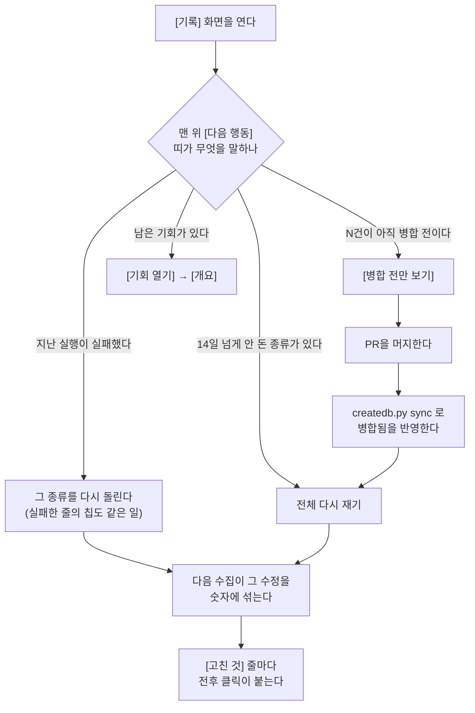

# [기록] — 무엇이 언제 돌았고 무엇을 고쳤는지 보는 곳

이 도구가 지금까지 **돌린 것**(어떤 수집이 언제 시작해 얼마나 걸렸고, 외부 호출 몇 번에 얼마를 썼고, 끝까지 돌았는지)과 이 도구를 계기로 **고친 것**(어떤 파일을 어느 브랜치에서 바꿨고, 그게 사이트에 반영됐는지)을 한 화면에서 봅니다.

## 이 화면의 두 자리

이 화면에는 성격이 다른 목록이 둘 있습니다. 섞어 읽으면 "실행은 40번 했는데 고친 건 0건"이 고장처럼 보이지만, 둘은 서로 다른 일을 세는 자리입니다.

| | [실행 기록] | [고친 것] |
| --- | --- | --- |
| 무엇을 세나 | 수집이 돈 횟수 | 파일이 바뀐 건수 |
| 무엇이 답해지나 | 어느 종류를 언제 마지막으로 돌렸나 / 실패하거나 건너뛴 게 있나, 왜 / 얼마나 걸렸고 얼마 들었나 | 어떤 파일·브랜치를 고쳤나 / 그게 사이트에 반영(병합)됐나 / 어느 기회에서 나온 수정인가 / 고친 뒤 클릭이 어떻게 됐나 |
| 누가 채우나 | 수집기 자신 — 한 번 돌 때마다 한 줄이 남는다 | **개발 도구**가 남긴다(아래) |
| 화면 부제 | "종류별 마지막 실행을 보고 다시 돌릴 것을 고릅니다." | "기회가 실제 파일 수정이 된 기록입니다." |

그리고 두 목록 위에 **[다음 행동] 띠**(맨 위 한 줄)와 **[남은 일] 목록**이 섭니다. 둘 다 위 두 목록을 센 결과에서 나옵니다 — 지난 실행이 실패했으면 그것부터, 아직 안 돌린 단계가 있으면 그다음, 14일 넘게 안 돈 종류가 있으면 그다음, 병합 전이 남았으면 그다음, 남은 기회가 있으면 마지막입니다. 맨 앞 하나는 띠가 가져가고 나머지가 [남은 일]로 내려갑니다.

### [고친 것] 기록은 이 화면에서 만들 수 없습니다

이 화면에는 "기록 추가" 버튼도, "병합됨으로 바꾸기" 버튼도 **없습니다**(로컬이든 호스팅이든). 읽기만 하는 자리입니다. 기록이 들어오는 길은 하나뿐입니다:

- `/create` 스킬이 콘텐츠 작업을 끝낼 때 `createdb.py done <사이트> <기회번호> --path <파일> [--branch <브랜치>] [--note <근거>]` 로 남깁니다. 호스팅이 가진 사이트면 같은 명령이 로컬 DB 대신 서버 창구로 갑니다 — 그래서 로컬이든 호스팅이든 남기는 명령은 똑같습니다.
- 이 스킬을 안 거치고 **손으로 고친 것도 똑같이 기록합니다.** 커밋 메시지에 `[opp #번호]` 를 남겨 두고 `createdb.py sync <사이트> --repo .` 를 돌리면 그 커밋들을 찾아 일괄로 기록합니다.
- 기록하지 않으면 이 도구는 영영 모릅니다. 다음 수집이 같은 기회를 또 제안하고, 이 화면은 "아직 고친 기록이 없습니다"라고 말합니다.

기록이 남아도 그 기회는 **완료가 아니라 진행 중**으로 남습니다. 글 하나로 묶음 기회가 통째로 닫히면 안 되기 때문입니다.

### 병합 전 / 병합됨 — 이 구분이 이 화면에서 제일 중요합니다

| | 병합 전 | 병합됨 |
| --- | --- | --- |
| 뜻 | 파일은 고쳤지만 **아직 사이트에 반영되지 않았다** | 반영됐다 |
| 그래서 | 검색엔진이 그 수정을 못 봅니다. 수집을 아무리 돌려도 숫자에 안 섞입니다 | 다음 수집부터 그 수정이 숫자에 섞입니다 |
| 배지 색 | 경고(주의를 끄는 색) | 완료 |

고친 파일이 브랜치에만 있고 PR이 머지되지 않았으면 그건 "고쳤다"가 아니라 "쓰기만 했다"입니다. 이 화면이 **병합 전 건수를 목록 머리의 칩으로 끌어올리는 이유**가 그것입니다 — 이 화면에서 지금 당장 할 수 있는 일이 그것 하나인데 예전에는 드롭다운을 열어야만 보였습니다.

병합됨으로 바뀌는 길은 둘입니다. 둘 다 이 화면 밖입니다:

1. `createdb.py sync <사이트> --repo .` — 그 브랜치의 **머지된 PR**이 있는지 `gh` 로 확인해, 있으면 기록을 병합됨으로 켜고 그 기회를 완료로 닫습니다. `gh` 가 없거나 로그인이 안 됐으면 한 줄 알리고 건너뜁니다(실패로 치지 않습니다). **호스팅이 가진 사이트에도 이 길이 그대로 먹습니다** — 로컬이 Brain 을 직접 고치는 자리에서 서버 창구(`POST /api/creation/merged`)를 부르고, 기회는 `/api/opp` 로 닫습니다. 기록이 닫혀야 다음 `sync` 의 대상(병합 전인 것)에서 빠집니다.
2. `createdb.py merged <기록번호>` — 손으로 하나 켭니다. **이쪽은 로컬 사이트 전용**입니다. 호스팅 사이트를 가리키면 "웹에 등록한 사이트의 머지 표시는 대시보드에서 합니다"라며 그냥 끝납니다 — 호스팅에서는 위 1번 `sync` 를 씁니다.

## 여기서 할 수 있는 것

### 실행 기록 쪽

| 할 일 | 어떻게 | 무엇이 바뀌나 |
| --- | --- | --- |
| 한 종류만 본다 | 목록 위 종류 칩(종류 이름 + 건수)을 누른다. 같은 칩을 다시 누르면 풀린다 | 아래 표가 그 종류만 남는다. **위쪽 눈금 줄과 [종류별 마지막 실행]은 안 바뀐다** — 그 둘은 거르기와 무관하게 늘 전체를 말한다(걸러 놓고 "총액"을 읽으면 거짓말이 되므로). 종류가 하나뿐이면 칩 줄 자체가 안 뜬다 |
| 결과로 거른다 | 도구줄 고르개에서 `전체` / `완료` / `문제` / `건너뜀` (각각 건수가 같이 적힌다) | 표가 그 판정만 남는다 |
| 말로 찾는다 | `종류·기록으로 찾기` 칸에 글자를 친다 | 종류 이름·기록(수집기가 남긴 문자열)·시각을 훑어 걸린 줄만 남는다. 칩·고르개와 함께 걸린다 |
| 조건을 지운다 | 걸러서 0건이 됐을 때 뜨는 [조건 지우기] | 찾는 말·결과 고르개·종류 칩이 모두 풀린다 |
| 더 본다 | 표 아래 [N건 더 보기] | 처음 12줄만 그린다. 누를 때마다 20줄씩 늘어난다 |
| 실패한 실행을 다시 돌린다 | **문제로 판정된 줄**의 기록 칸에만 서는 칩을 누른다 | 로컬에서는 `/capture <단계> <사이트>` 명령이 복사된다. 호스팅에서는 버튼이 그 단계를 실제로 돌린다. 전체 실행(종류가 `전체`)이면 전체 다시 재기 쪽으로 간다. **박제본(읽기 전용)에는 안 선다** |
| 실패 원인을 읽는다 | 문제 줄은 이유가 **항상 펴져 있다**(성공한 줄은 조용하다). 좁은 화면에서는 그 한 줄이 맨 왼쪽 시각 칸 아래로 당겨져 온다 | 안 바뀜(읽기) |
| 오래 걸린 실행의 분·초를 본다 | 1분이 넘는 [소요(초)] 칸에 손을 얹는다 | 툴팁에 `3분 12초` 꼴로 뜬다 |
| 목록을 파일로 받는다 | 도구줄 [CSV 내려받기] | 지금 걸러 놓은 목록 그대로 파일이 내려온다 |
| 전부 다시 돌린다 | 맨 위 [다음 행동] 띠의 [전체 다시 재기] | 로컬은 `/capture run <사이트>` 복사, 호스팅은 전체 실행. **이 버튼은 화면에 하나뿐이다** — 실행 기록 머리에 같은 버튼을 또 두지 않는다 |

### 고친 것 쪽

| 할 일 | 어떻게 | 무엇이 바뀌나 |
| --- | --- | --- |
| 아직 반영 안 된 것만 본다 | 목록 머리의 [병합 전 N건] 칩 | 목록이 병합 전만 남고, 병합 상태 고르개도 같이 `병합 전`으로 맞춰지며, 화면이 [고친 것] 자리로 스크롤된다 |
| 〃 (위에서 바로) | [다음 행동] 띠 또는 [남은 일]의 [병합 전만 보기] | 위와 **같은 일**을 한다(손잡이가 두 자리에 있을 뿐 동작은 한 벌) |
| 병합 상태로 거른다 | 고르개에서 `전체` / `병합 전` / `병합됨` (각각 건수) | 목록이 그 상태만 남는다 |
| 말로 찾는다 | `파일·기회·근거로 찾기` 칸 | 파일 경로·브랜치·근거(메모)·기회 대상을 훑어 걸린 줄만 남는다 |
| 이 수정을 낳은 기회로 간다 | 줄 안의 [← 기회 대상] 버튼(대상 이름이 화살표 뒤에 그대로 적힌다) | [개요] 화면으로 넘어가 남아 있던 거르기를 풀고, 기회 찾기 칸에 그 대상을 넣고, 그 기회 카드를 펴서 가운데로 스크롤한다. 지운 기회거나 옛 박제본이라 카드가 없으면 [개요]까지만 간다 |
| PR을 연다 | 근거가 `http` 로 시작하면 그 줄이 링크가 된다 | 새 탭에서 열린다. 근거가 주소가 아닌 메모면 그냥 문장으로 적힌다 |
| 고친 뒤 성과를 본다 | 줄마다 붙는 전후 클릭 문장에 손을 얹는다 | 툴팁이 "앞 N일과 뒤 N일의 하루 평균 클릭 — 같은 기간에 다른 것도 바뀌므로 이 수정만의 몫이라는 뜻은 아닙니다"라고 말한다 |
| 조건을 지운다 | 걸러서 0건일 때 [조건 지우기] | 찾는 말·병합 고르개가 풀린다 |
| 목록을 파일로 받는다 | [CSV 내려받기] | 지금 걸러 놓은 목록 그대로 |
| 첫 기록을 만들러 간다 | 고친 기록이 하나도 없을 때 빈 칸에 서는 [기회 열기] | [개요]로 간다. **남은 기회가 0건이면 이 버튼은 아예 안 선다** — 눌러도 [개요]에 아무것도 없으면 버튼이 거짓말을 한 셈이 되므로 |
| 작업 순서를 짜러 간다 | 같은 빈 칸의 `/create plan <사이트>` 칩 | 명령이 복사된다. **로컬 전용** — 호스팅에서는 이 칩이 안 선다 |
| (호스팅) 여기서 못 하는 일을 이어간다 | [고친 것] 아래 접혀 있는 "클로드 코드가 있으면 …" 줄을 편다 | `/capture keywords` · `/capture gaps` · `/capture ask` · `/create plan` 네 개의 복사 칩이 나온다. 기본은 접혀 있다 |

## 여기서 얻는 것

### 읽는 정보 — 실행 기록

- **눈금 줄(요약)**: `실행`(최근 40회까지 담습니다) · `문제`(중단·미완·오류) · `건너뜀`(있을 때만, 보통 한도·키 없음) · `외부 호출`(이 목록의 합계) · `비용`(수집기가 적어 둔 추정치). 비용은 늘 소수 둘째 자리까지고, 0보다 크고 1센트 미만이면 `<$0.01` 로 뭉뚱그립니다. **청구서가 아니라 추정치입니다.**
- **[종류별 마지막 실행]**: 종류마다 마지막으로 돌린 날짜와 `3일 전` 꼴의 경과. **14일 넘게 안 돈 종류에는 [14일 지남] 배지**가 붙고, 낡은 것이 앞으로 옵니다.
- **표**: `시각` · `종류` · `결과` · `소요(초)` · `호출` · `비용` · `기록` 일곱 열. 줄이 8개 이상이면 열 이름이 정렬 손잡이가 됩니다.
- **결과 판정**은 수집기가 남긴 기록으로만 가릅니다(새로 판단하지 않습니다):

  | 배지 | 조건 | 뜻 |
  | --- | --- | --- |
  | 중단 | 기록에 `중단:` 이 붙었다 | 도중에 예외로 멈췄습니다 |
  | 미완 | 끝난 시각이 없다 | 그 기록조차 못 닫혔습니다 — 프로세스가 죽었을 수 있습니다 |
  | 오류 N | 기록에 `errors=N`(N>0) | N건이 실패했습니다 |
  | 건너뜀 N | 기록에 `skipped=N`(N>0) | N건을 건너뛰었습니다 — 보통 한도·키 없음입니다 |
  | 완료 | 그 외 | 끝까지 돌았고 오류가 없습니다 |

- **[기록] 칸**은 수집기가 남긴 `key=value` 를 사람 말로 옮긴 것입니다(행·기간·페이지·공급자·기기·오류·건너뜀·수확 키워드·앵커·백링크·겹친 도메인 …). **모르는 키는 원문 그대로 둡니다** — 새 수집기가 새 값을 남겨도 화면이 삼키지 않습니다. 오류·건너뜀이 0보다 크면 그 값만 색이 바뀝니다.
- **첫 오류**는 외부 서비스가 돌려준 HTTP 상태줄 원문입니다. 화면은 앞자리로만 사람 말로 옮깁니다 — 5xx면 "외부 서비스(도메인) 서버 오류 — 잠시 뒤 다시 수집하면 됩니다", 4xx면 "요청이 거절됐습니다 — 키·권한·잔액을 확인하세요". 원문은 손을 얹으면 나옵니다.

### 읽는 정보 — 고친 것

한 줄에 담기는 것: 종류 라벨 배지 · 작성일 · `⑂브랜치` · **파일 경로** · [← 기회 대상] · 근거(메모 또는 PR 링크) · 전후 클릭 한 줄 · 병합 배지.

- **전후 클릭**: 고친 날 **앞 7일과 뒤 7일**의 하루 평균 클릭을 비교해 `12.4 → 15.1 (+2.7)` 꼴로 적습니다. 양쪽 각각 **3일 이상**의 일별 기록이 있어야 잽니다. 재료는 일별 클릭 기록(최근 28일치)이고 새로 조회하지 않습니다.
  - 일별 기록보다 오래된 수정이면 "일별 기록이 닿지 않는 날입니다 — 전후를 못 잽니다"
  - 아직 날이 모자라면 "아직 판단할 날이 모자랍니다"
  - **인과가 아닙니다.** 같은 기간에 다른 것도 바뀌므로 "덕분에"라고 쓰지 않습니다.
- **[한 바퀴] 문장**: 목록 아래에 "실적을 수집하고, 기회로 뽑고, 이 N건을 고쳤습니다 (그중 M건은 뽑아 둔 기회에서 곧장 왔습니다)"와, 잰 것 중 오른 것·내린 것·그대로가 각각 몇 건인지가 붙습니다. 못 잰 건수는 따로 적습니다 — 합이 안 맞으면 어느 쪽이 빠졌는지 셀 수 없기 때문입니다.

### 나가는 것 — CSV 두 개

두 목록 모두 도구줄의 [CSV 내려받기]로 **지금 걸러 놓은 목록 그대로** 내려받습니다. 파일 맨 앞에 BOM이 붙어 엑셀에서 한글이 깨지지 않습니다.

| 파일명 | 열 |
| --- | --- |
| `seo-miner-수집이력-YYYY-MM-DD.csv` | `시각` · `종류` · `결과` · `소요(초)` · `호출` · `비용(USD)` · `기록` |
| `seo-miner-고친것-YYYY-MM-DD.csv` | `작성일` · `종류` · `파일` · `브랜치` · `병합` · `기회` · `근거` |

날짜는 내려받은 날입니다. `기록` 열에는 수집기가 남긴 원문이 그대로, `비용(USD)` 열에는 반올림하지 않은 원값이 들어갑니다(화면의 `$0.00` 표기와 다를 수 있습니다). `병합` 열의 값은 `병합됨` / `병합 전` 두 가지입니다.

## 언제 쓰나 — 유즈케이스

**1. 숫자가 이상하다 — 수집이 조용히 실패한 건 아닌가.** 유료 단계는 키·잔액 때문에 통째로 실패하고도 다른 화면에서는 "아직 안 했음"으로만 보입니다. 결과 고르개를 `문제`로 놓으면 그런 실행만 남고, 줄마다 중단 사유·첫 오류가 펴져 있습니다. 그 자리에서 바로 그 종류를 다시 돌립니다.

**2. 고쳤는데 순위가 안 움직인다.** [병합 전 N건] 칩을 누릅니다. 병합 전이면 검색엔진이 아직 그 수정을 못 본 것이므로, 순위를 다시 재 봐야 소용이 없습니다. 먼저 PR을 머지하고, `createdb.py sync <사이트> --repo .` 로 그 사실을 기록에 반영한 다음 수집합니다.

**3. 이번 달에 얼마나 썼나.** 눈금 줄의 `외부 호출`과 `비용`이 최근 40회의 합계입니다. 어느 종류가 비싼지 보려면 종류 칩으로 좁히고 [비용] 열로 정렬합니다. 더 길게 보려면 CSV로 받아서 셉니다.

**4. 지난달에 고친 것들이 효과가 있었나.** [고친 것] 목록을 위에서부터 읽습니다. 줄마다 붙은 전후 클릭과 맨 아래 [한 바퀴] 문장이 오른 것·내린 것을 셉니다. 못 잰 건은 "아직 잴 날이 없다"고 말하지, 0으로 세지 않습니다.

## 이 화면이 비어 보일 때

| 보이는 것 | 왜 | 어떻게 하나 |
| --- | --- | --- |
| "아직 실행한 적이 없습니다" | 이 사이트로 수집을 한 번도 안 돌렸다 | 맨 위 [전체 다시 재기]. 한 번 돌면 무엇을 언제 얼마에 수집했는지가 줄로 남는다 |
| "맞는 실행이 없습니다" / "맞는 기록이 없습니다" | 종류·결과·병합 상태·찾는 말로 좁혀 놓았다 | [조건 지우기] |
| "아직 고친 기록이 없습니다" | 아직 아무것도 안 고쳤거나, **고쳤는데 기록을 안 남겼다** | 기회를 콘텐츠로 옮기고 `createdb.py done` 으로 남긴다. 이미 손으로 고쳤다면 커밋에 `[opp #번호]` 를 남기고 `createdb.py sync <사이트> --repo .` |
| 종류 칩 줄이 없다 | 돌린 종류가 한 가지뿐이다 — 거를 게 없어 칩을 안 그린다 | 안 해도 된다 |
| 섹션 눈썹(`최근 N일`)이 없다 | 그 목록이 덮는 기간을 잴 줄이 하나도 없다 | 안 해도 된다 |
| [남은 일] 목록이 통째로 없다 | 할 일이 [다음 행동] 띠의 한 건뿐이거나, 아예 없다. 없으면 띠가 "마지막 실행은 N 문제없이 끝났습니다"로 바뀐다 | 안 해도 된다 |
| 전후 클릭이 "일별 기록이 닿지 않는 날입니다" | 일별 클릭 기록(최근 28일)보다 오래전에 고친 것이다 | 잴 수 없다. 그 수정은 판단에서 뺀다 |
| 전후 클릭이 "아직 판단할 날이 모자랍니다" | 고친 날 앞뒤로 3일치가 아직 안 모였다 | 며칠 더 두고, 실적 수집을 한 번 더 돌린다 |
| [한 바퀴]가 "일별 클릭 기록이 아직 없어 전후를 못 잽니다" | 일별 실적을 한 번도 안 모았다 | 실적 수집을 한 번 돌린다 |
| 문제 줄인데 다시 돌리는 칩이 없다 | 박제본(내보낸 기록)을 보고 있다 — 누를 서버가 없다 | 라이브 대시보드에서 연다 |
| 병합 전 건수가 `sync` 해도 안 줄어든다 | `gh` 가 없거나 로그인이 안 돼 머지 확인을 통째로 건너뛰었거나(`머지 확인 건너뜀: …` 한 줄이 그렇게 말한다), 그 브랜치에 머지된 PR이 아직 없다 | `gh auth login` 뒤 다시 `sync` 한다. 호스팅 사이트도 같은 `sync` 로 반영된다 — 예전에는 서버 창구가 없어 호스팅 기록만 영영 '병합 전'이었지만 지금은 아니다 |
| 기록 칸에 영어 필드명이 그대로 보인다 | 수집기가 새로 남기기 시작한 키다 — 화면은 모르는 키를 삼키지 않고 원문 그대로 둔다 | 값은 그대로 읽을 수 있다 |

<!-- 근거:
  화면 전부(섹션·문구·칩·판정·CSV·빈 상태): skills/capture/templates/views/history.html
    - view-def(id/title/sections/stages 비움): 3~6행
    - 섹션 셋(#acts 다음 행동·실행 기록·#made-sec 고친 것)과 부제: 100~128행
    - 단계 라벨은 window.__STAGES__ 한 벌, full 만 사본: 136~143행 / 기록 key 라벨: 146~156행
    - 14일 기준(HS_STALE_DAYS), 12줄+20줄씩(HS_RN), 비용 표기(HS_usd): 158·284·205~209·439행
    - 첫 오류 5xx/4xx 사람 말(HS_errMsg·HS_errHost): 224~239행
    - 요약 눈금 다섯·종류별 마지막 실행·거르기와 무관하다는 규칙: 316~348행
    - 종류 칩/결과 고르개/찾기/CSV 도구줄: 362~396행, 표 일곱 열: 432~440행
    - 실패 줄의 재실행 칩(READONLY 면 안 뜸): 414행, HS_rerun: 176~178행
    - 전후 클릭 7일/3일(HS_EFF_WIN·HS_EFF_MIN), 일별 재료: 464~494행
    - [← 기회 대상] HS_toOpp: 496~511행, [병합 전만 보기] HS_showUnmerged: 513~518행
    - 병합 배지 툴팁 문구·PR 링크·고친 것 줄 구성: 531~558행
    - 병합 전 칩을 머리로 올린 이유·빈 상태(기회 열기는 HS_OPPS 일 때만, /create plan 은 W 로 로컬만): 560~574행
    - [한 바퀴] 문장·잰 것/못 잰 것 가름: 597~631행
    - CSV 두 벌의 열 이름: 443~448행, 633~639행
    - [다음 행동]/[남은 일] 순서와 READONLY 분기: 641~735행, 렌더 진입 VIEW(): 737~757행
  셸 공용 부품: skills/capture/templates/dashboard.html
    - W(로컬/호스팅 가름) 1192행, act()·siteArg() 1645~1658행, stageRun() 1673행
    - runVerdict(중단/미완/오류/건너뜀/완료) 1703~1717행, runFailed 1723~1728행
    - table(8줄 이상이면 정렬) 2620~2643행, csv(BOM·파일명 seo-miner-{이름}-{YYYY-MM-DD}.csv) 2648~2659행
    - num() 1168행, nextStep() 1588행, viewSub() 1555행
    - READONLY=true 는 박제본(window.__SNAPSHOT__)에서만: 2695행·3526~3539행(박제본의 #acts 는 셸이 채운다)
  서버 페이로드: skills/capture/scripts/dashboard.py
    - runs 최근 40건(id,kind,started_at,finished_at,api_calls,cost_estimate_usd,notes): 1404~1406행
    - creations 최근 50건 + opportunities.target 조인(opp_target): 1408~1412행
    - kind_labels(= scoring.KINDS): 1421~1423행
    - POST /api/creation 본체(기록은 남기고 기회는 acked): 1488~1515행, ROUTES 등록 1622행
    - 화면 코드에는 /api/creation 을 부르는 곳이 없다(dashboard.html·server/assets/dash.html 에 없음)
  호스팅 전용 머지 창구: server/app.py 의 `POST /api/creation/merged`
    (기록 번호(id)로 가리키고, 켤 수 있는 것의 정본은 db.unmerged_creations — 그 밖은 404.
     로컬은 db.mark_creation_merged 를 직접 부르므로 이 라우트가 필요 없어 dashboard.ROUTES
     가 아니라 호스팅 전용으로 선다)
  표 정의: skills/capture/scripts/db.py — runs 377~386행, creations 539~549행,
    mark_creation_merged 2028행, unmerged_creations 2033~2037행
  일별 28일: skills/capture/scripts/scoring.py daily_trend() 1829~1842행
  기록을 남기는 개발 도구: skills/create/scripts/createdb.py
    - CLI(done/list/merged/sync) 18~23행, 호스팅이면 서버 창구 44~65행
    - sync 가 [opp #id] 커밋을 훑는다 133~180행
    - sync_merged 가 gh 로 머지된 PR 확인 → 로컬은 db.mark_creation_merged + 기회 닫음,
      호스팅은 POST /api/creation/merged + POST /api/opp: 215~278행
    - merged(creation_id, project) 는 로컬 전용 — 호스팅이면 한 줄 알리고 종료: 293~299행
  루프 클로즈 규칙(기록 안 하면 Brain 이 모른다, 기록해도 acked 로 남는다):
    skills/create/SKILL.md 철칙 3·5
  호스팅 전용 "여기서 못 하는 것" 칸: skills/capture/templates/sections/sm-cc.html
    (section-def: view "history", after "made-sec", only "hosted")
-->
