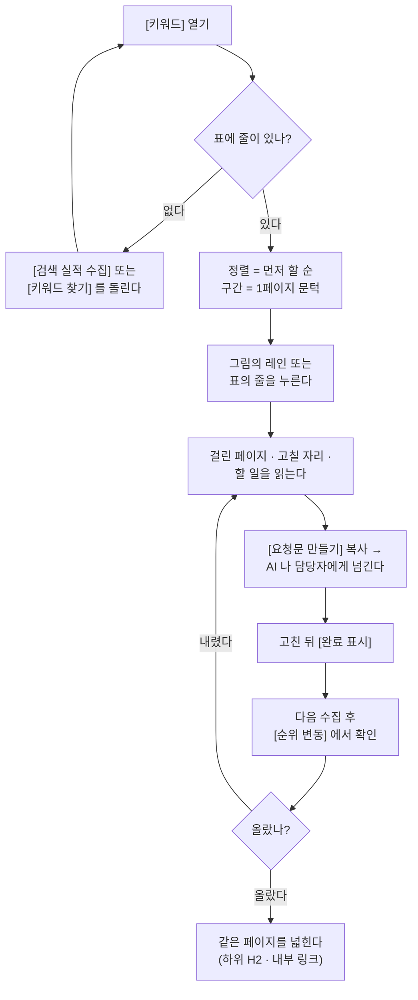

# [키워드] — 1페이지까지 얼마나 남았는지를 검색어마다 깊이로 그리고, 그중 무엇부터 손댈지 고르는 화면

화면 머리의 한 줄은 늘 이렇게 말합니다: **"검색어를 기회 점수 순으로 놓고 무엇부터 손댈지 봅니다."**

이 화면은 섹션 둘로 되어 있습니다.

- **[순위 상승 기회]** — 그림(깊이 로그) + 표. 검색어 하나가 한 레인이고, 가로축이 평균 순위,
  막대가 **1페이지까지 남은 거리**입니다. 목록에 문턱(11~20위) 검색어가 하나도 없으면
  제목이 **[1페이지 안 검색어]** 로 바뀝니다.
- **[순위 변동]** — 직전 수집과 견줘 **오른 것 · 내린 것**만 모은 표.

웹(호스팅)에서는 그 사이에 **[추적할 검색어]** 섹션이 하나 더 섭니다(로컬 대시보드에는 없습니다).

---

## 여기서 할 수 있는 것

| 할 일 | 어떻게 | 무엇이 바뀌나 |
| --- | --- | --- |
| 무엇부터 손댈지 정하기 | 첫 고르개(정렬 기준)에서 **먼저 할 순 / 노출 많은 순 / 1페이지에 가까운 순 / 클릭 많은 순** 중 하나 | 그림의 레인 순서와 아래 표의 줄 순서가 **함께** 바뀝니다. 기본값은 [먼저 할 순] (기회 점수 높은 순)이고, 점수가 붙은 줄이 하나도 없을 때만 [노출 많은 순]으로 물러섭니다 |
| 구간만 따로 보기 | 둘째 고르개(구간)에서 **전체 / 1페이지 문턱 11~20위 / 1페이지 안 4~10위** (각 항목에 개수가 붙습니다) | 그림·표·옆의 개수 표시가 그 구간만 남습니다. 눈썹의 순위 범위·제목·섹션 부제·위의 다음 행동 띠는 **안 바뀝니다**(그건 전체 목록의 상태입니다) |
| 그림에서 바로 할 일 열기 | 그림의 레인(검색어 줄)을 아무 데나 클릭 | 아래 표의 **같은 줄**이 펼쳐지고 그 자리로 스크롤됩니다 |
| 검색어 하나의 할 일 펼치기 | 표의 줄을 클릭(또는 줄에 포커스를 두고 Enter·Space) | 줄 아래에 패널이 열립니다 — 어느 페이지가 걸렸는지(표), 그 페이지의 무엇을 고칠지, 할 일 목록, 요청문 상자. 첫 칸의 ▸ 가 ▾ 로 바뀝니다 |
| 값 하나에 손 얹어 확인 | 그림의 레인에 마우스를 올림 | `검색어 · N위 · 노출 N · 클릭 N · 1페이지까지 N칸`(이미 1페이지면 그렇게) 말풍선 |
| 열 이름의 뜻 보기 | 표 머리글 옆 `i` 에 마우스/포커스 | 그 열이 무엇인지 설명이 뜹니다([1페이지까지], [점수], [노출], [Δ순위]) |
| 표를 다른 열로 다시 세우기 | 줄이 8개 이상일 때 표 머리글 클릭(다시 누르면 반대 방향) | 그 표의 줄 순서만 바뀝니다. 펼쳐 둔 줄은 이때 전부 접힙니다 |
| 기회 상태 바꾸기 | 펼친 줄(기회가 붙은 검색어)의 **[작업 시작] / [완료 표시] / [이 기회만 빼기] / [다시 열기]** | 그 기회의 상태 배지가 [할 일] → [진행 중] → [완료] 로 바뀝니다. 박제된 보고서에는 이 버튼이 없습니다 |
| AI 에게 넘길 요청문 만들기 | 펼친 줄의 **[요청문 만들기]** 를 펴고 **[복사]** | 그 검색어·페이지·점검 결과가 들어간 요청문 전문이 클립보드로 갑니다. 그대로 Claude Code 에 붙여 넣습니다 |
| 가장 먼저 볼 검색어로 건너뛰기 | 화면 위 다음 행동 띠의 **[검색어 열기]** | 띠가 이름을 부른 그 검색어의 줄이 펼쳐집니다 |
| 움직인 검색어 좁히기 | [순위 변동]의 **검색어로 찾기** 입력칸(부분 일치, 대소문자 무시)과 방향 고르개(**전체 / 오른 것 / 내린 것**, 개수 표시) | 그 표와 옆의 개수 표시만 바뀝니다 |
| 오른/내린 검색어의 할 일 보기 | [순위 변동] 표의 줄 클릭 | 같은 검색어가 위 [순위 상승 기회]에도 있으면 본문 대신 **[그 줄 열기]** 버튼이 나옵니다(할 일은 한 곳에만 둡니다). 위에 없을 때만 여기서 바로 펼칩니다 |
| 목록을 파일로 빼기 | 각 섹션의 **[CSV 내려받기]** | 지금 걸러 놓고 정렬해 놓은 **그대로** 내려받습니다 |
| 이 화면을 채우는 단계 돌리기 | 화면 제목 옆 칩 세 개(**검색 실적 수집 · 키워드 찾기 · 기회 분석**), 또는 빈 상태·띠 안의 버튼 | 로컬에서는 `/capture gsc`·`/capture keywords`·`/capture gaps` 명령이 복사됩니다(채팅에 붙여 넣어 실행). 웹에서는 그 자리가 바로 실행 버튼입니다 |
| 남의 브랜드 검색어 걸러내기 | **[타사 섞임]** 배지 옆 **[설정 열기]**(그 배포에 [설정] 화면이 있을 때) | [설정]에서 경쟁사 이름을 채우면 다음 수집부터 남의 브랜드 검색어가 이 목록에서 빠집니다 |
| 추적할 검색어 켜고 끄기 *(웹 전용)* | [추적할 검색어]의 **후보 / 추적 중** 탭에서 체크 후 **[추적에 넣기]** / **[추적에서 빼기]** | 켠 검색어만 순위를 잽니다. 오른쪽에 `추적 중 N / M개`가 뜨고 한도에 닿으면 경고가 붙습니다 |
| 다른 날 기준으로 보기 | 화면 밖 공용 고르개 **[기준 수집일]**(수집이 2회 이상일 때만 보임) | 이 화면 전체가 그날 수집분 기준으로 다시 그려집니다(비교 짝도 그날보다 이전 것에서 고릅니다) |

---

## 여기서 얻는 것

### 읽는 정보

**[순위 상승 기회] — 조금만 밀면 1페이지에 갈 검색어**

서버가 고른 검색어는 **평균 순위 4~20위**, **노출 10 이상**, **최대 15개**입니다(노출 많은 순으로
자른 뒤 남의 브랜드 검색어를 뺍니다). 그림과 표는 같은 목록을 같은 순서로 그립니다.

- 눈썹: 지금 목록에 든 순위의 범위(예: `5~19위 구간`). 범위가 없으면(한 개거나 전부 같은 순위) 비웁니다
- 부제: `N개 중 M개가 1페이지 문턱입니다.` / 문턱이 없으면 `N개 모두 1페이지 안입니다.`
- 그림 범례: **지금 평균 순위**(점) · **1페이지까지 남은 거리**(막대) · **1페이지 영역(1~10위)**(바탕)
- 가로축 눈금: `1 · 5 · 10 · 15 · 20위+`, 10위 자리에 **1페이지 경계** 선. 줄이 8개 이상이면 아래에도 같은 눈금
- 레인 왼쪽은 검색어(36자 넘으면 줄임), 오른쪽 끝은 `28일 노출` 같은 기간 합계 노출
- 표 열: **검색어**(기회 점수 막대·종류·근거가 함께) · **점수** · **평균 순위** · **1페이지까지** · **N일 노출** · **클릭**
  - [점수]는 기회 점수 100점 만점입니다. 보이는 줄 전부에 점수가 없으면 이 열 자체가 사라집니다
  - [1페이지까지]는 10위 경계까지 올려야 할 칸 수이고, 이미 1페이지면 `—`

**펼친 줄이 답하는 것** — 기회 목록에 올라온 검색어는 서버가 쓴 처방을 그대로 폅니다:
할 일 목록, 이 검색어로 걸린 페이지 표(페이지·노출·클릭·CTR·평균순위), **고칠 페이지** 링크와
점검 결과 표(손댈 자리 / 지금 값 / 바꿀 값), 이 기회로 만든 파일 기록, 요청문 상자.
아직 기회 목록에 없는 검색어는 화면이 대신 채웁니다 — 지금 상태 한 줄(`지금 12.4위 · 1페이지까지 2.4칸 · 노출 … · 클릭 …`),
상황에 맞는 할 일(내려간 검색어 / 올라온 검색어 / 1페이지 문턱 / 이미 1페이지 — 넷이 서로 다릅니다),
그리고 `이 검색어는 아직 기회 목록에 없습니다. 기회 분석 단계를 한 번 돌리면 점수가 붙습니다.`

**[순위 변동] — 직전 수집과 견준 결과**

- 눈썹: 비교한 두 날짜(`2026-08-21 → 2026-09-18`)
- 부제: `N일치끼리 견줘 오른 것 N개, 내린 것 N개입니다.`
- 표 열: **검색어** · **점수** · **평균 순위** · **Δ순위** · **클릭**(Δ 포함) · **노출**
  - Δ순위는 **양수면 위로 올라온 것**입니다. 0.5칸 이하 변화이면서 클릭도 안 변한 검색어는 애초에 안 올라옵니다
  - 오른 것·내린 것 각각 최대 10개입니다

### 나가는 것 (CSV)

두 섹션 모두 **지금 걸러 놓고 정렬해 놓은 목록 그대로** 내려받습니다. 엑셀에서 한글이 깨지지 않게
BOM 이 붙습니다.

| 버튼 자리 | 파일명 꼴 | 열 |
| --- | --- | --- |
| [순위 상승 기회] | `seo-miner-1페이지까지-YYYY-MM-DD.csv` | `검색어, 기회점수, 종류, 평균순위, 1페이지까지, 노출, 클릭, 구간` |
| [순위 변동] | `seo-miner-순위변동-YYYY-MM-DD.csv` | `검색어, 순위, Δ순위, 클릭, Δ클릭, 노출` |

날짜는 내려받은 날입니다. `구간` 값은 `1페이지` 또는 `2페이지`, `기회점수`·`종류`는 그 검색어가
기회 목록에 없으면 빈 칸입니다.

---

## 언제 쓰나 — 유즈케이스

**1. 이번 주에 글 한 편 쓸 시간밖에 없다**

정렬을 [먼저 할 순]으로 둔 채(기본값) 구간을 **[1페이지 문턱 11~20위]** 로 좁힙니다. 맨 위 줄이
"새 글 한 편보다 이 페이지 한 장을 미는 게 빠른" 자리입니다. 그 줄을 펼쳐 [요청문 만들기]를
복사해 Claude Code 에 붙여 넣고, 고친 뒤 **[완료 표시]** 를 누릅니다.

**2. 클릭이 줄었는데 어디가 빠진 건지 모르겠다**

[순위 변동]에서 방향을 **[내린 것]** 으로 좁힙니다. Δ순위가 큰 줄부터 펼치면 "새로 쓰기 전에
무엇이 달라졌는지부터 본다"는 할 일이 나옵니다 — 마지막 수정 되짚기, 지금 그 자리를 가져간
페이지의 H2 비교, 본문 갱신, 끊긴 내부 링크 되살리기.

**3. 순위는 다 1페이지인데 트래픽이 안 는다**

목록에 문턱 검색어가 없으면 제목이 **[1페이지 안 검색어]** 로 바뀌고 띠가
"남은 문제는 순위가 아니라 클릭입니다"라고 말합니다. [검색어 열기]로 가장 큰 자리를 펼치면
제목·설명 다시 쓰기, 첫 문단 직답, 스니펫용 표·목록으로 할 일이 갈립니다.

**4. 담당자·외주에게 목록째 넘겨야 한다**

구간과 정렬을 원하는 대로 맞춘 뒤 [CSV 내려받기]. 점수와 종류가 같이 나가므로 받는 쪽도
왜 이 순서인지 알 수 있습니다.

---

## 이 화면이 비어 보일 때

**[순위 상승 기회]가 비었다**

- `실적을 아직 수집하지 않았습니다` — 서치콘솔 실적이 한 번도 안 들어왔습니다. **[실적 수집]** 을 먼저 돌립니다.
- `4~20위에 걸린 검색어가 없습니다` — 실적은 들어와 있는데 그 구간에 걸린 검색어가 없다는 뜻입니다.
  같은 실적을 다시 읽어도 결과는 같습니다 — **[키워드 찾기]** 로 추적할 검색어를 더 캐는 쪽이 다음 걸음입니다.
  (노출 10 미만인 검색어는 통계로 안 보고 애초에 빼며, 목록은 최대 15개입니다.)
- `이 구간에는 검색어가 없습니다` — 구간 고르개 때문입니다. **[전체 보기]** 를 누르면 돌아옵니다.

**표는 있는데 [점수] 열이 통째로 없다 / 전부 `—` 다**

아직 기회 분석을 안 돌렸습니다. 펼친 줄이 그 자리에서
`이 검색어는 아직 기회 목록에 없습니다. 기회 분석 단계를 한 번 돌리면 점수가 붙습니다.` 라고 말합니다.
할 일과 요청문은 점수가 없어도 나옵니다.

**[순위 변동]이 비었다** — 이유가 셋이고 화면이 갈라 말합니다.

- `견줄 직전 기록이 없습니다` — 수집이 한 번뿐입니다. 한 번 더 수집하면 그때부터 갈립니다.
- `기간이 달라 견주지 않았습니다` — 직전 기록이 다른 기간(예: 28일치 ↔ 90일치)입니다. 빼면 Δ가 전부 거짓이
  되므로 비교를 접습니다. **같은 기간으로 한 번 더** 수집하면 채워집니다.
- `움직인 검색어가 없습니다` — 견주기는 했고 변동이 전부 노이즈 범위(순위 ±0.5칸 이내, 클릭 변화 없음) 안이었습니다. 정상입니다.
- `이 조건에 맞는 검색어가 없습니다` — 찾기 입력칸이나 방향 고르개 때문입니다. **[전체 보기]** 로 돌아옵니다.

**그림이 안 보이고 표만 있다**

창 너비가 640px 이하이면 그림을 숨깁니다. 좁은 화면에서는 눈금 왼쪽 끝만 남아 잘린 그림이 되기 때문이고,
같은 값을 표가 전부 들고 있습니다. 창을 넓히면 다시 나옵니다.

**펼쳤는데 "이 검색어로 어느 페이지가 노출됐는지는 아직 모릅니다"**

페이지별 실적이 아직 안 모였습니다. 실적을 한 번 더 수집하면 채워집니다.
`아직 점검하지 않았습니다` 는 그 페이지를 **내 페이지 점검**이 아직 안 읽었다는 뜻입니다.

**목록에 남의 브랜드 검색어가 섞인다**

**[타사 섞임]** 배지가 그 상태를 말합니다. [설정]에서 경쟁사 이름을 채우면 다음부터 빠집니다.

**숫자가 오늘 것 같지 않다**

이 화면의 숫자는 서치콘솔 수집분 기준이고, 순위는 **구글이 보고한 기간 평균 게재순위**입니다.
지금 직접 검색하면 다르게 보일 수 있습니다 — 실제로 검색해 잰 순위는 [순위] 화면에 있습니다.
화면 위 **[기준 수집일]** 이 과거 날짜로 고정돼 있지 않은지도 함께 봅니다.

<!-- 근거:
  skills/capture/templates/views/keywords.html — view-def(id·sections·stages), depthLog()·KW_tools()·
    KW_filtered()·KW_drawLog()(정렬 고르개 KW_SORTS, 구간 고르개 bands, 개수 표시, 640px 이하 .kwchart 숨김),
    레인 클릭 → data-lane 으로 표 줄 열기(document click 위임), KW_toggle()/KW_det()/KW_plan()/KW_state(),
    KW_mvRender()/KW_mvList()/KW_mvFiltered(), KW_csvLog()/KW_csvMv(), VIEW("keywords") 의 제목·부제·눈썹·
    빈 상태·다음 행동 띠 분기
  skills/capture/templates/dashboard.html — table()(>·? 표기, SORT_MIN=8 머리글 정렬), csv()(BOM,
    seo-miner-{이름}-{ISO날짜}.csv), oppOf/oppScore/oppMeter/oppWhy/oppActs/oppPanel·oppDetail(펼침 패널),
    OPP_LABEL·OPP_SET(상태 버튼 라벨), askBlock()(요청문 상자), pageTable()/pageFix()/playList(),
    window.act()(로컬 명령 칩 ↔ 호스팅 버튼)·stageRun()·go(), viewSub()·nextStep(), renderDates()(기준 수집일)
  skills/capture/scripts/dashboard.py — _axis_gsc()(striking·striking_page2·ups/downs·period_mismatch·
    gsc_date/gsc_prev/gsc_period·brand_catalog_empty·rules), _axis_query_pages()(query_pages·page_audits),
    _assemble()(view-def·section-def 조립)
  skills/capture/scripts/scoring.py — PAGE1=10, STRIKING_LO/HI=4/20, STRIKING_MIN_IMP=10, NOISE_POS=0.5,
    gap_to_page1(), striking()(limit=15, band), movers()(limit=10, moved_up/moved_down), snapshot_pair()
  skills/capture/scripts/stage.py — STAGE_LABELS(gsc·keywords·gaps 의 t/run)
  skills/capture/templates/sections/sm-kw.html, server/assets/dash.html(kwLoad·kwApply) — 호스팅 전용
    [추적할 검색어] 섹션과 후보/추적 중 탭
-->
