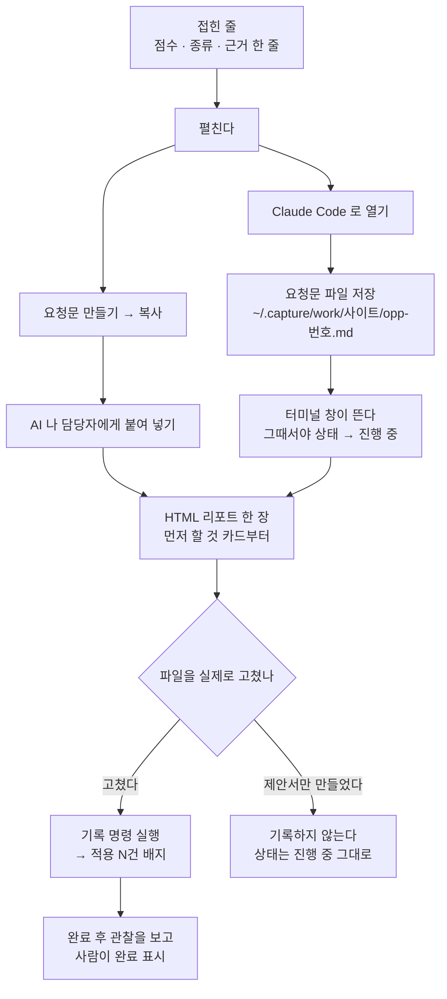

# 기회 카드 — 접으면 "무엇부터 왜", 펼치면 "어디를 어떻게", 그리고 AI 에게 그대로 넘길 요청문

기회 한 건이 화면에 서는 방식은 한 벌뿐입니다. 점수가 붙은 줄은 어느 화면에서든
같은 모양으로 접혀 있고, 누르면 같은 순서로 펼쳐지고, 같은 버튼이 같은 일을 합니다.
화면마다 다른 것은 **무엇을 대상으로 삼느냐**(검색어·URL·도메인·주제 묶음) 하나뿐입니다.

---

## 어디에 뜨나

[개요] · [순위 추적] · [키워드] · [분석] · [사이트 점검] · [AI 인용] · [백링크] · [경쟁 분석]
— 여덟 화면 전부입니다.

- [개요]는 기회만 모아 놓은 목록이라 카드가 곧 줄입니다.
- 나머지 일곱은 원래 그 화면의 표·목록에 카드가 얹힙니다. 그 줄의 대상(검색어·주소·도메인)에
  기회가 붙어 있으면 카드가 서고, 안 붙어 있으면 같은 모양의 줄이 점수 칸만 「—」로 남습니다.
  줄을 지우지 않는 것은 "왜 이 줄만 버튼이 없나"가 화면 밖에 남지 않게 하기 위해서입니다.
- 한 대상에 기회가 둘 이상 붙어 있으면(같은 검색어가 두 진단에 동시에 걸릴 수 있습니다)
  점수가 가장 높은 하나가 그 줄의 카드가 됩니다.
- 내보낸 기록(박제된 HTML 한 장)에서는 **버튼이 전부 빠집니다.** 그 파일에는 서버가 없어서
  눌러도 저장될 곳이 없기 때문입니다. 점수·근거·표·진단은 그대로 읽힙니다.

---

## 접힌 줄에서 볼 수 있는 것

왼쪽부터 점수, 대상, 배지들, 근거 한 줄입니다.

- **점수** — 0~100. 높을수록 먼저 손댑니다. 바로 아래 막대가 같은 값을 길이로 보여 줍니다.
  기회가 안 붙은 줄은 「—」이고 단위도 설명도 붙지 않습니다.
- **대상** — 검색어, 주소, 도메인, 또는 「주제 묶음 · ○○」.
- **종류 라벨** — 무슨 진단에 걸렸는지. 지키는 일(순위 하락·자기잠식·깨진 백링크·크롤 문제)은
  얻는 일과 다른 색으로 섭니다. 마우스를 올리면 그 종류의 통칭이 한글로 뜹니다.
- **상태 배지** — 「할 일」 「진행 중」 「완료」 「이 기회만 뺌」 「저절로 풀림」.
  [개요]에서는 「할 일」일 때만 안 답니다 — 기본 목록에서는 거의 모든 줄이 같은 말이라
  읽을 것만 늘기 때문입니다.

배지는 조건이 맞을 때만 추가로 섭니다.

| 배지 | 뜻 |
| --- | --- |
| 「GA4 ▲ ×1.3」 · 「GA4 ▼ ×0.6」 | GA4 를 연결했고, 실제 전환 기록이 이 기회의 점수를 올리거나 내렸다는 표시입니다. 승수가 1.0 이면(=점수가 안 바뀌면) 아예 안 뜹니다. 마우스를 올리면 반영 전 점수가 나옵니다. |
| 「검색어 N개」 | 같은 지면을 두고 다투는 검색어 여럿을 한 줄로 접었다는 표시입니다. 펼치면 전부와 묶은 이유가 나옵니다. ([개요]) |
| 「함께: ○○ · ○○ 외 N개」 | 그 묶음에 든 나머지 검색어를 네 개까지 흘려 보여 줍니다. ([개요]) |
| 「적용 N건」 · 「적용 N건 · 머지 M」 · 「머지됨 N건」 | 이 기회로 **실제로 고친 파일**이 기록돼 있다는 표시입니다. ([개요]) 자세한 것은 아래 「여기서 얻는 것」을 보세요. |
| 「도구 없음」 | 이 PC 에서 쓸 개발 도구를 아직 안 골랐거나, 고른 도구를 못 찾았다는 뜻입니다. 옆에 「설정에서 고르기」가 섭니다. |

**버튼이 접힌 줄에 서는 화면은 [백링크]와 [경쟁 분석] 둘뿐입니다.** 나머지 여섯 화면은
같은 버튼을 펼침 패널 맨 위로 옮겨 답니다 — 스무 줄짜리 목록에 버튼 마흔 개가 서지 않게,
대신 펼치면 맨 먼저 손에 닿게 한 것입니다. 어느 쪽이든 버튼의 종류와 하는 일은 같습니다.

---

## 펼치면 나오는 것

줄 아무 데나 누르면 펼쳐집니다(키보드로도 됩니다). 아래 순서로 나오고, 재료가 없는 칸은
통째로 빠집니다.

**1. 행동 줄 (맨 위)**
「요청문 만들기」 접이식이 주요 자리이고, 그 옆에 지금 상태에서 누를 수 있는 나머지 상태
버튼이 섭니다. 여섯 화면에서는 여기에 다음 상태 버튼(「작업 시작」 등)과 실행 버튼
(「Claude Code 로 열기」)도 함께 섭니다. [개요]는 그 검색어를 자세히 보는 원래 화면으로
가는 버튼을 하나 더 답니다.

**2. 묶인 검색어 N개** (묶인 줄에서만)
왜 한 줄인지 한 문장 — 같은 우리 페이지로 잡혔다 / 우리 페이지는 없지만 검색 결과 상위가
크게 겹친다 / 같은 주제 묶음이다 / 띄어쓰기·대소문자만 다르다 — 그리고 표:
**검색어 | 월 검색량 | 점수 | 상태**. 대표 검색어에는 「대표」가 붙습니다.
줄의 점수가 대표 검색어 점수와 다르면 나머지 검색어의 검색량을 더해 다시 잰 값이라고 적습니다.
아래에 "작업 시작·완료·빼기는 묶인 N개에 함께 적용됩니다. 할 일과 요청문은 대표 검색어
기준입니다"가 붙습니다.

**3. 할 일**
상황 한 문단 + 번호 매긴 목록. 이 문장들은 화면이 짓지 않고 서버가 종류별로 한 벌씩 갖고
있는 처방입니다. 검색 순위가 코앞인 종류에는 "이 순위는 구글이 보고한 평균 게재순위입니다"
라는 주석과 [순위 추적] 화면으로 가는 링크가 이어 붙습니다.

**4. 근거 표 — 이 검색어로 걸린 우리 페이지**
**페이지 | 노출 | 클릭 | CTR | 평균순위**.
걸린 페이지가 없으면 표 대신 왜 없는지를 말합니다 — 챗봇 질문이라 구글 검색어 목록에
잡히지 않았다 / 대상이 남의 도메인이라 고칠 페이지가 아니라 연락할 곳이다 / 대상이 주제
묶음이라 아직 이 주제를 다루는 페이지가 없다 / 아직 페이지별 실적을 안 모았다.
순위에는 안 걸렸지만 제목·H1 이 이 검색어로 된 우리 지면이 있으면 그 후보 목록을 냅니다.

**5. 고칠 페이지**
주소 한 줄. 이 주소는 **요청문이 고른 것과 같은 것**입니다 — 화면이 따로 고르면 요청문과
화면이 서로 다른 페이지를 말하게 되기 때문에 그렇게 맞춰 두었습니다.

**6. 진단 (그 페이지 한 장)**
점검한 날짜 · 지금 제목 · 본문 단어 수, 그리고 표:
**손댈 자리 | 지금 값 | 바꿀 값**.
아직 점검하지 않은 페이지면 "내 페이지 점검이 돌면 제목·설명·본문을 직접 읽고 무엇을
바꿔야 하는지 여기에 적습니다"라고 말합니다. 규칙으로 잡히는 문제가 없으면 그렇다고 적습니다.

**7. 요청문 상자 — 「요청문 만들기」**
접혀 있고, 펴면 그 요청문의 **꼴 이름**(있는 페이지 고치기 / 의도 갈라 내기 / 새 글 설계 /
주소 정리 / 기술 점검 / 외부 연락 / 제3자 플랫폼에 등장하기)이 작게 붙고, 안내 한 줄
("그대로 복사해 Claude Code 에 붙여 넣습니다 — ChatGPT 같은 AI 나 담당자에게 넘겨도 됩니다.
답이 HTML 리포트로 열리는 건 Claude Code 에서입니다"), 「복사」 버튼, 그리고 요청문 전문이
든 읽기 전용 글상자가 나옵니다.
요청문이 생기기 전에 내보낸 오래된 기록에서는 "요청문은 이 보고서를 다시 만들면 생깁니다"
라고만 말합니다 — 없는 글을 지어내지 않습니다.

**8. 이 기회로 만든 것 N건**
기록이 있을 때만. 줄마다 **바꾼 파일 경로 · 브랜치 · 머지됨/PR 열림**, 링크를 남겼으면 「보기」.
접힌 줄의 「적용 N건」 배지와 **정확히 같은 것**을 셉니다(묶인 줄이면 묶인 기회 전부).

---

## 여기서 할 수 있는 것

| 할 일 | 어떻게 | 무엇이 바뀌나 |
| --- | --- | --- |
| 펼치기 / 접기 | 줄 아무 데나 누르기 (키보드 Enter·Space) | 화면만. 저장되는 것 없음 |
| 작업 시작 | 「작업 시작」 (상태가 「할 일」일 때 뜸) | 상태 → 「진행 중」. "진행 중으로 옮겼습니다." 묶인 줄이면 묶인 검색어 전부 |
| 완료 표시 | 「완료 표시」 (상태가 「진행 중」일 때 뜸) | 상태 → 「완료」. "완료로 옮겼습니다. [개요]의 완료 후 관찰에서 전·후를 봅니다." |
| 이 기회만 빼기 | 「이 기회만 빼기」 — **펼친 패널에만** 섭니다 | 상태 → 「이 기회만 뺌」. 검색어는 맞는데 이 진단 하나가 틀렸을 때 쓰는 자리입니다. 검색어째 빼는 일은 [심사]가 합니다 |
| 다시 열기 | 「다시 열기」 (완료·뺌·저절로 풀림에서 뜸) | 상태 → 「할 일」 |
| 요청문 복사 | 「요청문 만들기」 → 「복사」 | 아무 상태도 안 바뀝니다. 클립보드에만 들어갑니다. 버튼이 잠깐 「복사함」으로 바뀌고, 브라우저가 막으면 「직접 선택」으로 바뀌며 글상자를 통째로 선택해 줍니다 |
| 개발 도구로 열기 | 「Claude Code 로 열기」 (고른 도구 이름이 그대로 붙습니다 — Codex·OpenCode·pi) | 요청문 파일이 저장되고 터미널 창이 뜨고, **그 뒤에** 상태가 「진행 중」이 됩니다. 묶인 줄이면 묶인 전부 |
| 도구 고르기 | 「도구 없음」 옆의 「설정에서 고르기」 | [설정] 화면으로 넘어갑니다. 고르고 오면 그 자리에 실행 버튼이 섭니다 |
| 호스팅 화면에서 열기 | 「이 PC 에서 열기」 → 명령 칩 누르기 | 브라우저는 이 PC 의 프로그램을 띄울 수 없습니다. 대신 로컬 대시보드를 띄우는 명령 한 줄이 복사됩니다 |

**묶인 줄의 버튼은 묶인 기회 전부에 먹습니다.** 대표 하나만 바꾸면 새로고침한 뒤 그 줄이
둘로 갈라지기 때문입니다. 이미 그 상태인 것은 다시 보내지 않고, 하나라도 못 바꾸면
조용히 넘어가지 않고 몇 건이 실패했는지 말합니다.

### 「…로 열기」가 하는 일의 순서

이 버튼은 **이 PC 의 대시보드에서만** 섭니다. 누르면 순서대로:

1. 어느 사이트의 어느 기회인지 확인합니다.
2. [설정]에서 고른 개발 도구가 있는지 확인합니다. 없으면 "쓸 도구를 아직 안 골랐습니다"에서 멈춥니다.
3. 그 도구가 이 PC 에 **실제로 설치돼 있는지** 확인합니다. 없으면 "이 PC 에서 못 찾았습니다"에서 멈춥니다.
4. 이 기회의 데이터를 불러옵니다. 호스팅에 있는 사이트면 호스팅에서 받아 옵니다.
5. 그 목록에서 이 기회 번호를 찾습니다. 없으면 "그 기회를 못 찾았습니다. [새로고침] 뒤 다시 눌러 주세요"에서 멈춥니다.
6. 묶인 번호 중 **이 사이트의 것만** 남깁니다. 남의 번호·낡은 번호는 조용히 버립니다 — 그것 때문에 열기를 실패시키지 않습니다.
7. 요청문 전문(본문 + 꼬리)을 조립합니다. 비어 있으면 "이 기회의 요청문이 아직 없습니다"에서 멈춥니다.
8. 그 글을 **`~/.capture/work/<사이트>/opp-<기회번호>.md`** 에 씁니다. 끝에 기록 명령 안내가 덧붙습니다. 여러분의 저장소 안에는 아무것도 떨어뜨리지 않습니다.
9. 열 폴더를 정합니다 — [설정]에 적어 둔 그 사이트의 로컬 폴더, 없거나 지금 폴더가 아니면 `~/.capture/work/<사이트>/`.
10. 터미널 창을 띄워 도구에 "이 파일의 요청문대로 진행해 주세요: <그 파일>"을 넘깁니다. Orca 를 골랐는데 그 폴더가 워크트리가 아니면 시스템 터미널로 물러나고, 그랬다는 것을 알려 줍니다.
11. **창이 실제로 뜬 뒤에** 묶인 기회 전부를 「진행 중」으로 바꿉니다.

**중간 어디서든 실패하면 상태를 건드리지 않습니다.** "작업 시작"이라고 표시해 놓고 아무
창도 안 뜨는 것이 제일 나쁜 결과이기 때문입니다. 거꾸로 창은 떴는데 상태 저장만 실패했으면
열기를 실패로 되돌리지 않습니다 — 창은 이미 여러분 앞에 있습니다.

---

## 여기서 얻는 것

### 요청문 전문이란 무엇인가

**서버가 이 기회 하나를 위해 쓴 본문 + 그 꼴의 꼬리**입니다. 글상자에 든 것도, 「…로 열기」가
파일로 저장하는 것도 **같은 글**입니다.

본문에 들어가는 것(재료가 있는 것만):

- 무슨 일인지 한 문단, 그리고 대상 — 어느 검색어·어느 페이지·그 페이지의 언어
- 그 페이지에 걸린 **검색어 전부**와 같은 페이지의 다른 기회
  (검색어마다 따로 고치라고 하면 같은 제목을 열여섯 번 다르게 고치게 됩니다)
- **근거 (수집한 데이터)** — 판정에 쓴 숫자를 표로. 문장으로 뭉개지 않습니다
- **지금 이 검색어의 검색결과 상위** — 상위 글의 제목과, 받아 온 것이 있으면 H2 목록까지
- **함께 답해야 할 질문** — 구글이 같은 조회에서 같이 보여 준 것
- **지금 이 페이지 상태** — 제목·설명·본문 길이·속도 지표
- **고칠 것** — 진단 표
- **상황**과 **이 상황에서 할 일**
- **만들어 줄 것** — 산출물 번호 목록
- **있으면 붙여 넣을 것 (선택)** — 아직 못 모은 재료가 있을 때만

꼬리는 **답의 형식**과 **규칙**입니다. 사이트마다 한 벌이라 기회마다 싣지 않고 화면이 이어
붙입니다(같은 600자를 기회 200건에 200번 싣지 않기 위해서입니다). 꼬리가 못 박는 것:

- 답은 **자립형 HTML 파일 한 장**입니다. 채팅 본문에 산출물을 늘어놓지 않습니다.
- 파일 이름은 `seo-<꼴>-<타임스탬프>.html`, 임시 폴더에 쓰고 바로 엽니다. **저장소 안에는 아무것도 남기지 않습니다.**
- 산출물마다 카드 하나, 안이 여럿인 자리는 안마다 「강함 / 검토 / 추측」 배지, 확인 못 한 자리는 「[확인 필요]」를 화면에 보이게.
- 끝에서 둘째 카드는 **'따로 볼 것'**(이번 범위 밖이지만 눈에 띈 것), 마지막 카드는 **'먼저 할 것'**(어느 산출물부터 적용할지).
- 산출물의 언어와 길이 기준은 그 페이지의 언어를 따르고, 설명·이유는 한국어로 씁니다.

### 어디로 가나

- **「복사」** — 클립보드로. Claude Code 에 붙여 넣어도 되고, ChatGPT 같은 다른 AI 나 담당자에게
  넘겨도 됩니다. 답이 HTML 리포트로 **열리는** 건 Claude Code 에서입니다.
- **「…로 열기」** — 파일로 저장한 뒤 그 파일을 읽으라는 한 줄과 함께 도구가 뜹니다.

### 무엇이 파일로 남나

| 파일 | 어디에 | 누가 만드나 |
| --- | --- | --- |
| `opp-<기회번호>.md` | `~/.capture/work/<사이트>/` | 「…로 열기」를 누를 때마다 (같은 기회면 덮어씁니다) |
| `seo-<꼴>-<타임스탬프>.html` | 임시 폴더 (Windows `%TEMP%`, 그 밖 `$TMPDIR`) | 요청문을 받은 도구가. 절대경로를 마지막 줄에 적어 줍니다 |
| 여러분이 실제로 고친 파일 | 여러분의 저장소 | 여러분 또는 도구가. seo-miner 는 여기에 손대지 않습니다 |

### 「적용 N건」 배지 — 무엇을 뜻하고 어디서 오나

**이 기회로 실제로 고친 파일이 N건 기록돼 있다**는 뜻입니다. 「…로 열기」는 창만 떠도 상태를
「진행 중」으로 바꾸므로, 상태만으로는 도구가 파일을 정말 고쳤는지 알 수 없었습니다. 그것을
가르는 배지입니다.

- 「적용 N건」 — 기록 N건, 아직 머지된 것 없음
- 「적용 N건 · 머지 M」 — 그중 M건이 머지됨
- 「머지됨 N건」 — 전부 머지됨

기록이 들어오는 길은 셋입니다.

1. **요청문 파일 끝의 기록 명령** — 도구가 제안을 실제로 적용해 파일을 바꾼 뒤 그 명령을
   돌립니다(바꾼 파일과 브랜치를 채워서). 제안서 HTML 만 만들었으면 기록하지 않습니다 —
   채울 '바꾼 파일'이 없기 때문입니다. 요청문 파일에 그 조건이 먼저 적혀 있습니다.
2. **커밋 메시지** — 커밋에 기회 번호를 `[opp #번호]` 꼴로 남겼으면 훑어서 기록으로 옮깁니다.
3. **호스팅 사이트** — 같은 기록이 호스팅 서버로 올라갑니다.

머지 표시는 그 브랜치의 PR 이 머지됐는지 확인해서 켭니다.

**기록이 들어와도 상태는 「완료」가 되지 않고 「진행 중」에 머뭅니다.** 글 여러 편이 필요한
기회가 한 편으로 닫히면 안 되고, 완료 시각은 '실제로 끝난 그때'여야 완료 후 관찰의 전·후가
맞기 때문입니다. **완료는 사람이 누릅니다.**

---

## 상태와 그 뜻

| 상태 | 뜻 | 누가 바꾸나 |
| --- | --- | --- |
| **할 일** | 기회가 막 올라왔고 아직 아무도 손대지 않았습니다. 기본값입니다 | 데이터를 적재할 때 서버가. 사람은 「다시 열기」로 여기로 되돌립니다 |
| **진행 중** | 하기로 했고 지금 하는 중입니다. "봤다"가 아니라 "한다"입니다 | 사람이 「작업 시작」을 누를 때 / 「…로 열기」가 창을 띄운 뒤 / 고친 파일 기록이 들어올 때 |
| **완료** | 우리가 작업해서 끝났습니다. [개요]의 완료 후 관찰이 여기서부터 전·후를 잽니다 | **사람만** |
| **이 기회만 뺌** | 검색어는 맞는데 이 진단 하나가 틀렸습니다. 같은 검색어의 다른 기회는 그대로 남습니다 | **사람만** |
| **저절로 풀림** | 새 데이터가 "이제 이 조건은 풀렸다"고 **긍정 확인**했고, 우리 작업 기록은 없습니다 | **서버만** |

**「저절로 풀림」은 사람이 만들 수 없습니다.** 상태를 바꾸는 창구가 이 값을 아예 받지 않습니다
— 버튼 목록에도 없고, 보내도 거절됩니다. 화면에는 라벨로만 나타나고, 사람이 거기서 할 수
있는 일은 「다시 열기」뿐입니다.

이렇게 갈라 둔 이유는 **완료 후 관찰이 "우리 효과"를 재는 자리**이기 때문입니다. 저절로
풀린 것을 완료에 섞으면 우리가 한 일의 효과가 부풀려집니다.

서버가 「저절로 풀림」으로 닫는 조건:

- 이번 적재에 그 기회가 다시 안 나왔고(=조건이 더는 성립하지 않고),
- 그 종류에 "풀렸는지 확인하는 규칙"이 있고,
- 새 데이터가 풀렸음을 **긍정으로** 확인했을 때.

기준 시각은 기회가 만들어진 때와 **사람이 마지막으로 상태를 바꾼 때 중 늦은 쪽**입니다.
「다시 열기」를 누른 뒤에는 그 전에 잰 데이터로 다시 닫히지 않습니다.

---

## 언제 쓰나 — 유즈케이스

### 1. 아침에 [개요]를 열고 오늘 할 일 하나를 고른다

점수 순으로 서 있는 첫 줄을 펼칩니다. 근거 표에서 어느 페이지 얘기인지, 진단 표에서 무엇이
어긋났는지 보고 납득이 되면 「요청문 만들기」를 열어 「복사」하고 Claude Code 에 붙여 넣습니다.
답으로 HTML 리포트 한 장이 열리고, 거기 마지막 '먼저 할 것' 카드가 어느 산출물부터
적용할지 말해 줍니다. 적용하고 나면 기록 명령을 돌리고, 완료 후 관찰을 며칠 지켜본 뒤
직접 「완료 표시」를 누릅니다.

### 2. 손은 대기 싫고 도구에 통째로 넘기고 싶다

같은 줄에서 「Claude Code 로 열기」를 누릅니다. 요청문이 파일로 저장되고 터미널 창이 뜨면서
도구가 바로 그 파일을 읽기 시작하고, 카드는 「진행 중」이 됩니다. 도구가 제안을 적용해 파일을
고쳤으면 파일 끝의 기록 명령을 그대로 돌립니다 — 다음에 대시보드를 열면 그 줄에 「적용 1건」이
붙어 있습니다. **제안서만 만들고 파일을 안 고쳤으면 기록하지 않습니다.**

### 3. 검색어 여덟 개가 한 줄로 접혀 있다

「검색어 8개」 배지를 보고 펼칩니다. 묶인 검색어 표에서 왜 한 줄인지(같은 우리 페이지로
잡혔다) 확인하고, 이 줄의 점수가 대표 검색어 점수보다 높은 이유(나머지 검색어의 검색량을
더해 다시 쟀다)를 읽습니다. 「작업 시작」을 한 번 누르면 여덟 건 전부가 「진행 중」이 됩니다 —
하나만 눌러서 다음 새로고침에 줄이 갈라지는 일이 없습니다. 할 일과 요청문은 대표 검색어
기준이지만, 요청문 본문에는 그 페이지에 걸린 검색어가 전부 들어 있어서 제목 한 벌이 여덟을
다 맡습니다.

### 4. 진단이 틀렸다

검색어 자체는 우리 것이 맞는데 이 진단 하나가 헛짚은 경우입니다. 펼쳐서 「이 기회만 빼기」를
누릅니다. 같은 검색어에 붙은 다른 기회는 그대로 남습니다. 검색어째 빼고 싶으면
카드가 아니라 [심사] 화면에서 합니다.

<!-- 근거:
  skills/capture/templates/dashboard.html
    L1425-1437  SM.host.oppBtn — 로컬 실행 버튼, 「도구 없음」·「설정에서 고르기」, 묶인 id 전부
    L1796-1832  pageTable(페이지 표) · pageFix(진단 표) · playList(할 일)
    L1914-1929  askBlock — 「요청문 만들기」 상자·꼴 라벨·안내 문장
    L1930-1945  copyPrompt — 「복사」→「복사함」/「직접 선택」
    L1909       briefText — 본문 + 꼬리 = 요청문 전문
    L1963-1965  OPP_LABEL(상태 다섯 라벨) · resolved 는 서버만
    L1995-2002  oppScore · oppMeter
    L2004-2005  isDefensive(지키는 일 4종)
    L2010-2016  gaBadge
    L2021-2035  madeFor · madeBadge(「적용 N건」·「머지됨 N건」)
    L2040-2048  kindTip · oppWhy
    L2056-2070  OPP_NEXT · OPP_SET · oppIdsTo · oppBtn(묶인 줄은 전부에 먹는다)
    L2074-2092  oppActs(접힌 줄/행동 줄) · oppRest(펼침 패널 전용 — 「이 기회만 빼기」)
    L2104-2115  runTool — 응답 토스트, 터미널 이름, Orca 물러남
    L2485-2541  oppDetail — 펼침 패널 순서(행동 줄·묶음·할 일·근거 표·고칠 페이지·진단·만든 것)
    L2543-2575  GROUP_WHY · oppGroup(L2554) — 묶인 검색어 표와 묶은 이유
    L2577-2603  setOpps · setOpp · OPP_DONE(토스트 문구)
    L1501-1507  deadSweep · L2695 READONLY · L3526-3532 박제본에서 버튼 제거
    L2881       window.CREATIONS = d.creations
  skills/capture/scripts/dashboard.py
    L1408-1418  gather() 의 creations 질의(최근 50건, merged 포함)
    L1476-1484  set_opp_status — POST /api/opp 본체
    L1488-1512  record_creation_route — 기록은 남기고 상태는 acked
    L1612-1623  라우트 표(/api/opp, /api/creation)
    L1841-1853  _work_dir — [설정]의 사이트 폴더, 없으면 ~/.capture/work/<사이트>
    L1856-1863  _tool_argv
    L1865-1900  _open_terminal · _system_terminal(Orca → 시스템 물러남)
    L1902-2018  run_tool — 실행 순서 전부, 실패 시 상태 미변경, 창이 뜬 뒤 acked
  skills/capture/scripts/brief.py
    L50-52      SHAPE_NAMES(꼴 7종)
    L68-258     SHAPES — 꼴별 label·intro·form·rules·slot
    L277-296    HTML_FORM — 자립형 HTML 한 장, 파일 이름·임시 폴더·저장소에 안 남김
    L485-546    tails() — 답의 형식·규칙·배지·'따로 볼 것'·'먼저 할 것'·언어 기준
    L2024-2152  build() — 본문 절 순서(대상·근거·검색결과 상위·함께 답할 질문·페이지 상태·고칠 것·상황·할 일·만들어 줄 것·붙여 넣을 것)
    L2189-2199  text() · attach()
  skills/capture/scripts/scoring.py
    L145        ALL_KINDS
    L373        is_defensive
    L3975-4001  resolve_stale — 저절로 풀림 판정, 기준 시각은 생성·상태변경 중 늦은 쪽
    L4090-4097  GROUP_VIA(page·serp·cluster·norm·alone)
    L4271-4331  group_opportunities — lead·ids·variants·score·status
  skills/capture/scripts/db.py
    L1254-1261  OPP_STATUSES(4) · OPP_RESOLVED(사람이 누르는 값이 아님)
    L1803-1811  set_opportunity_status — OPP_STATUSES 밖은 거절
  skills/create/scripts/createdb.py
    L108-130    _mark_done · done — 기록은 acked, 완료는 사람이
    L132-179    sync — 커밋의 [opp #번호]
    L198-272    _merged_pr · sync_merged — 머지 표시
  server/assets/dash.html
    L806-819    호스팅의 oppBtn — 「이 PC 에서 열기」 + /capture dash <사이트> 명령 칩
  skills/setup/scripts/doctor.py
    L102-108    TOOLS(Claude Code·Codex·OpenCode·pi) · TERMINALS(Orca·시스템 터미널)
  화면 이름의 정본: skills/capture/templates/views/*.html 의 view-def title
-->
