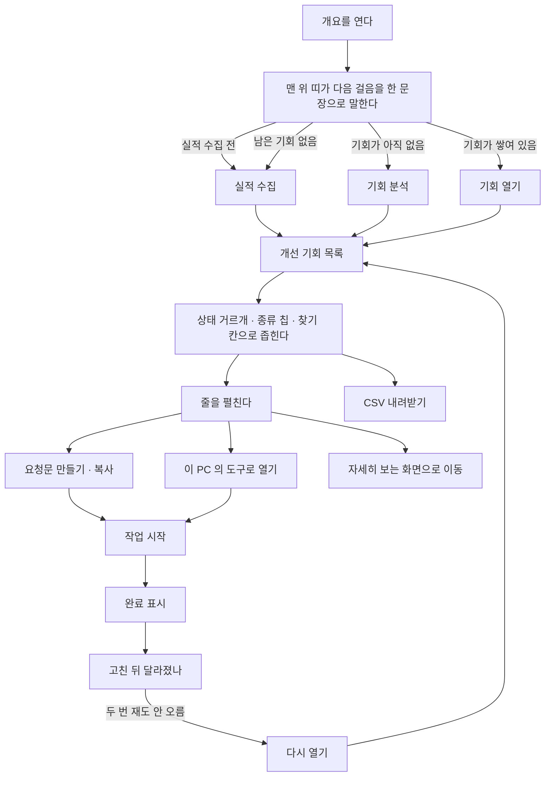

# [개요] — 지금 상태와 다음에 손댈 것을 한자리에서 봅니다

숫자를 구경하는 곳이 아니라, **오늘 무엇부터 손댈지 하나를 골라 들고 나가는 자리**입니다.
맨 위 띠가 다음 걸음을 한 문장으로 말하고, 그 아래 목록이 손댈 것을 점수 순으로 세웁니다.

## 여기서 할 수 있는 것

| 할 일 | 어떻게 | 무엇이 바뀌나 |
| --- | --- | --- |
| 다음 걸음 확인 | 화면 제목 바로 밑의 띠를 읽는다 | 지금 상태에 맞는 한 문장이 선다 — 「실적을 아직 수집하지 않았습니다」 / 「이제 그 숫자에서 손댈 곳을 뽑을 차례입니다」 / 「가장 큰 기회는 …입니다」 / 「남은 기회를 모두 처리했습니다」 |
| 가장 큰 기회 바로 열기 | 띠의 **[기회 열기]** | 목록 맨 위 줄이 펼쳐지고 화면이 그 줄로 부드럽게 내려간다 |
| 실적 수집 · 기회 분석 돌리기 | 띠의 **[실적 수집]** / **[기회 분석]**, 또는 화면 제목 옆 명령 칩 | 로컬에서는 `/capture gsc <사이트>`·`/capture gaps <사이트>` 가 클립보드로 복사되고 「명령을 복사했습니다. 채팅에 붙여 넣으면 실행됩니다.」 알림이 뜬다. 호스팅에서는 같은 자리가 실행 버튼이라 바로 돈다. 띠가 이미 들고 있는 단계는 제목 옆 칩에서 빠진다 |
| KPI 증감 근거 보기 | 클릭·노출·노출된 검색어 숫자 옆 증감에 마우스를 올린다 | 「직전 기준일 → 지금 기준일 · 같은 N일 기준」 이 뜬다 |
| 일별 값 읽기 | 「일별 클릭 추이」 그래프의 아무 날짜 위에 마우스 | 세로 조준선이 서고, 그날의 날짜·클릭·노출·클릭률·평균 순위가 뜬다 |
| 두 합계가 다른 이유 보기 | 그래프 아래 범례의 **(i)** | 위 띠는 검색어별 합(구글이 가린 검색어가 빠짐), 아래는 성과일별 합이라 기준이 다르다는 설명이 뜬다 |
| 상태로 거르기 | 「개선 기회」 머리 오른쪽 **[상태로 거르기]** 선택 | 전체 / 아직 안 함 / 할 일 / 진행 중 / 완료·뺀 것 — 각 항목에 건수가 붙는다. 첫 화면 기본값은 「아직 안 함」 |
| 종류로 거르기 | 목록 위 종류 칩(예: 밀면 오를 검색어, 클릭률 미달 …) | 그 종류만 남는다. 한 번 더 누르면 풀린다. 개수는 지금 보고 있는 상태 묶음 기준. **칩은 기회가 10줄을 넘고 종류가 2가지 이상일 때만 선다** |
| 검색어·주소로 찾기 | 찾기 칸에 입력 | 대상·근거 문장·묶인 변형 검색어까지 훑어 좁힌다. **기회가 10줄 이하면 찾기 칸 자체가 안 선다** |
| 거른 조건 풀기 | 빈 결과의 **[조건 지우기]** | 찾는 말·종류·상태를 모두 비우고 전체를 보여준다 |
| 끝낸 것 보기 | 빈 결과의 **[완료·제외 보기]** | 상태 거르개가 「완료·뺀 것」으로 바뀐다 |
| 목록 더 보기 | 목록 아래 **[N건 더 보기]** | 처음 10줄에서 12줄씩 늘어난다 |
| 기회 한 줄 펼치기 | 줄 아무 곳이나 클릭(탭·엔터도 됨) | 그 줄의 상세가 열린다 — 접힌 줄에는 버튼이 하나도 없고, 누를 것은 전부 펼친 안에 있다 |
| 요청문 만들기 | 펼친 줄의 **[요청문 만들기]** → **[복사]** | AI 에게 그대로 붙여 넣을 요청문 전문이 펼쳐지고, 버튼이 「복사함」으로 바뀐다 |
| 상태 바꾸기 | 펼친 줄의 **[작업 시작]** · **[완료 표시]** · **[이 기회만 빼기]** · **[다시 열기]** | 저장되고 「진행 중으로 옮겼습니다」 같은 알림이 뜬 뒤 화면이 다시 읽힌다. 「완료 표시」는 완료 후 관찰의 기준 시각이 된다. **묶인 줄이면 묶인 검색어 전부에 함께 적용된다** |
| 이 PC 의 도구로 열기 | 펼친 줄의 **[〇〇 로 열기]**(설정에서 고른 개발 도구 이름) | 그 사이트 폴더에서 도구가 열리고, 묶인 기회 전부가 「진행 중」으로 찍힌다. **로컬 전용** — 호스팅에서는 대신 「이 PC 에서 열기」 안내가 서고, 도구를 아직 안 골랐으면 「도구 없음 · [설정에서 고르기]」가 선다 |
| 원래 화면에서 자세히 보기 | 펼친 줄의 **[〇〇 화면에서 자세히 보기 →]** | 그 종류를 자세히 보는 화면(키워드·분석·순위 추적·AI 인용·사이트 점검·경쟁 분석·백링크)으로 옮겨 가고 해당 섹션까지 스크롤한다. 따로 볼 화면이 없는 종류에는 안 뜬다 |
| 목록 내보내기 | **[CSV 내려받기]** | 지금 걸러 놓은 목록 그대로 파일로 떨어진다(브라우저 안에서 끝난다) |
| 고친 뒤 결과 확인 | 「고친 뒤 달라졌나」 표를 읽는다 | 완료로 옮긴 검색어의 완료일·그때·지금·그 뒤 측정 횟수가 나란히 선다 |
| 안 오른 것 다시 열기 | 그 표의 **[다시 열기]** | 두 번 이상 쟀는데 순위가 안 오른 줄에만 뜬다. 누르면 그 기회가 「할 일」로 돌아온다 |
| 표 정렬 | 「고친 뒤 달라졌나」 표의 머리글 클릭 | 그 열 기준으로 정렬된다. **줄이 8개 이상일 때만 머리글이 정렬 손잡이가 된다**. 기회 목록은 정렬 손잡이가 없다 — 서버가 점수 순으로 보낸 순서다 |
| 기준 수집일 바꾸기 | 왼쪽 레일의 **[구글 실적 기준일]** 선택(수집한 날이 2개 이상일 때만 뜸) | 이 화면의 KPI 띠·증감·기회 근거가 그날 기준으로 다시 그려진다. 최신이 아닌 날을 보고 있으면 선택 칸이 산화동색으로 바뀐다 |
| 다시 읽기 | 레일 바닥의 **[새로고침]** | 준비 상태와 데이터를 다시 받는다 |
| 근거 · 주의 읽기 | 곳곳의 **(i)** 표시(탭으로도 닿는다) | 말풍선으로 그 숫자의 기준·주의가 뜬다 |
| 준비 상태 확인 | 화면 맨 위 배너 | 막는 항목이 있을 때만 상자로 서고, 없으면 한 줄로 물러난다. 이 화면에 띠가 서 있으면 배너의 「지금 할 것」 줄은 빠진다 |

**박제본(파일 하나로 내보낸 보고서)에서 사라지는 것**: 찾기 칸, 상태 거르개, 종류 칩,
모든 상태 버튼, 도구로 열기, 다시 열기(대신 「안 올랐음」 배지), 명령 칩, 띠의 버튼.
남는 것은 개수 표시·**[CSV 내려받기]**·요청문 복사·툴팁·펼치기입니다. 상태는 그 보고서를
만든 시점 그대로 굳습니다. 박제본은 처음부터 「전체」로 열려 그때의 트리아지 기록을 다 보여줍니다.

**호스팅 화면에만 더 붙는 것**: KPI 띠에 클릭률·평균 순위 두 칸, 「클릭률과 순위」 섹션,
검색어·페이지·기기로 갈라 보는 표. 호스팅에서 일별 자료가 안 실려 오면 「일별 클릭 추이」
섹션 자체가 서지 않습니다.

## 여기서 얻는 것

### 화면에서 읽는 것

- **지금 성적 세 가지** — 클릭, 노출, 노출된 검색어. 각각 직전 기준일 대비 증감(숫자+%)과,
  수집 회차가 3회 이상이고 값이 움직였을 때만 붙는 작은 추이선. 값 밑에는 「검색어별 N일 합계
  · 직전 1,234」처럼 무엇을 더한 수인지와 견줄 값이 적힙니다.
- **일별 클릭 추이** — 성과일 기준 하루 한 점. 클릭(실선)과 노출(점선)이 자릿수가 달라
  왼쪽·오른쪽 축을 따로 씁니다. 범례가 기간·합계·하루 최고를 말합니다.
- **개선 기회 목록** — 한 줄에 점수(100점 만점)·대상·종류 라벨·근거 한 줄. 같은 지면의
  변형 검색어는 한 줄로 접히고 「검색어 N개」 배지와 「함께: …」 줄이 붙습니다. GA4 전환이
  반영돼 점수가 움직였으면 `GA4 ▲ ×1.4` 배지, 이 기회로 실제 고친 파일이 있으면
  「적용 N건 / 머지됨 N건」 배지가 붙습니다. 목록이 잘렸으면 부제가 「기회 283건 중 점수 높은
  200개까지 이 화면에 오고, 같은 지면끼리는 한 줄로 묶입니다」처럼 잘렸다고 밝힙니다.
- **기회 한 건을 펼치면** — 묶인 검색어 표(검색어·월 검색량·점수·상태와 묶은 이유),
  이 상황에서 할 일(무엇을 + 번호 매긴 순서), 이 검색어로 걸린 페이지 표(페이지·노출·클릭·
  CTR·평균순위), 고칠 페이지 링크, 그 페이지 점검 결과 표(손댈 자리·지금 값·바꿀 값),
  이 기회로 만든 것(파일·브랜치·머지 여부).
- **고친 뒤 달라졌나** — 검색어 / 완료일 / 그때(완료 직전 수집분의 순위·클릭) / 지금(최근
  수집분) / 그 뒤 측정(완료 뒤 수집 횟수) / 다시 열기.

### 밖으로 나가는 것

- **CSV 파일** — `seo-miner-기회-YYYY-MM-DD.csv`(오늘 날짜). 지금 걸러 놓은 목록 그대로.
  열은 `점수`, `종류`, `상태`, `대상`, `함께 묶인 검색어`, `근거`, `생성일` 일곱 개입니다.
  엑셀에서 한글이 안 깨집니다.
- **요청문 전문** — 기회 한 건마다 서버가 그 기회의 근거 표·페이지 점검 결과까지 넣어 써
  놓은 글. 복사해서 Claude Code 에 붙여 넣는 것이 기본이고, 다른 AI 나 담당자에게 넘겨도
  됩니다(답이 HTML 리포트로 열리는 것은 Claude Code 에서입니다).
- **복사되는 명령** — 로컬 화면의 명령 칩은 `/capture gsc <사이트>`, `/capture gaps <사이트>`
  를 클립보드에 넣습니다.

## 언제 쓰나 — 유즈케이스

**1. 오늘 뭘 할지 하나만 고르고 싶다.**
개요를 열고 → 맨 위 띠가 지목한 **[기회 열기]** → 펼쳐진 줄에서 **[요청문 만들기] → [복사]**
→ Claude Code 에 붙여 넣고 → 돌아와서 **[작업 시작]**.

**2. 같은 종류의 기회를 몰아서 처리하고 싶다.**
개요 → 종류 칩에서 하나 선택 → 줄을 하나씩 펼쳐 요청문을 복사하거나 **[〇〇 로 열기]** 로
도구를 띄운다 → 처리한 것부터 **[완료 표시]**.

**3. 지난주에 고친 게 효과가 있었는지 보고 싶다.**
개요 → 「고친 뒤 달라졌나」 표에서 완료일·그때·지금을 비교 → 두 번 쟀는데 순위가 그대로면
**[다시 열기]** 로 다시 목록에 올린다.

**4. 이번 달 손댈 목록을 팀에 넘기고 싶다.**
개요 → 상태를 「아직 안 함」으로 두고 필요하면 종류·검색어로 좁힌다 → **[CSV 내려받기]** →
그 파일을 공유한다.

## 이 화면이 비어 보일 때

**아직 아무것도 수집하지 않았다면** — 띠가 「실적을 아직 수집하지 않았습니다. 이 화면의
숫자가 전부 그 위에서 나옵니다.」라고 말하고 **[실적 수집]** 을 내놓습니다. 여기가
출발점입니다. 한 바퀴도 안 돈 사이트라면 화면이 아예 **[안내]** 로 먼저 보냅니다.

**실적은 수집했는데 기회가 없다면** — 띠가 「실적은 수집했습니다. 이제 그 숫자에서 손댈 곳을
뽑을 차례입니다.」라며 **[기회 분석]** 을 내놓고, 목록 자리에는 「**아직 기회가 없습니다** /
수집한 숫자에서 손댈 곳을 점수 순으로 찾습니다.」가 뜹니다. 이때는 찾기 칸·거르개·칩이
아예 서지 않습니다.

**기회 분석을 돌렸는데도 목록이 비었다면** — 검색어 종류의 기회는 **[심사]** 에서 「작업」으로
보낸 검색어만 이 목록에 오릅니다. [심사] 화면에서 미판정으로 쌓여 있지 않은지 봅니다.

**「남은 기회가 없습니다」가 떴다면** — 거른 탓이 아니라 다 처리했다는 뜻입니다.
**[완료·제외 보기]** 로 처리한 것을 확인하거나, 띠의 **[실적 다시 수집]** 으로 다시 재면
그 사이 달라진 숫자에서 새 기회가 나옵니다.

**「거른 조건에 맞는 기회가 없습니다」가 떴다면** — 찾는 말이나 상태·종류를 좁혀 놓은
상태입니다. **[조건 지우기]** 로 전체를 다시 봅니다.

**일별 그래프 자리에 「일별 실적이 아직 없습니다」가 떴다면** — 하루 단위 자료가 두 날 미만인
경우입니다. 「실적을 한 번 더 수집하면 최근 28일이 하루 단위로 채워집니다.」 — 실적 수집을
한 번 더 돌리면 됩니다.

**「완료한 검색어가 아직 없습니다」가 떴다면** — 정상입니다. 기회를 **[완료 표시]** 로 옮기는
순간부터 그때와 지금을 나란히 재기 시작합니다.

**펼친 줄에 「이 페이지는 아직 점검하지 않았습니다」가 뜬다면** — **내 페이지 점검** 단계를
돌리면 그 자리에 제목·설명·본문을 직접 읽은 진단(손댈 자리·지금 값·바꿀 값)이 채워집니다.

**화면 맨 위에 붉은 준비 상태 목록이 서 있다면** — 막는 항목이 있다는 뜻입니다. 그것부터
치우지 않으면 아래 숫자는 채워지지 않습니다.

<!-- 근거:
  skills/capture/templates/views/overview.html:1-7 (view-def: id/title/sub/sections/stages),
    9-59 (목록 스타일), 62-98 (band·daily-sec·개선 기회·watch-sec 마크업),
    105-108 (OV_act/OV_acts), 117-186 (dailyChart·빈 상태 121-122·툴팁 149-150·범례 181-185),
    188-206 (kpiSpark — 3회 이상·변동 있을 때만), 221-229 (OV_vars 함께 묶인 검색어 4개+외 N개),
    234-256 (oppRow — 점수·대상·종류·검색어 N개 배지·gaBadge·madeBadge·근거·상태, 버튼은 패널로),
    258-281 (OV_see/OV_goSee — KIND_VIEWS 로 화면 이동), 287-296 (OV_PAGE=10·ST_GROUP·ST_OPT),
    300-336 (oppByStatus/oppFiltered/oppReset/oppClosed/filterKind), 340-374 (renderOpps —
    READONLY 도구줄·few<=10 규칙·찾기 칸·상태 select·CSV), 378-390 (oppChips — 2종 이상),
    392-416 (oppList — 개수 표기·빈 결과 두 갈래·더 보기 +12), 420-426 (oppCsv 열 7개),
    433-438 (OV_openTop), 440-454 (OV_watch — 표 열·다시 열기·READONLY 배지),
    456-491 (OV_next 띠 네 갈래), 493-574 (VIEW render — 띠 3칸·was()·daily-sec hidden·
    capped 문구·OPP_ST 기본값)
  skills/capture/templates/dashboard.html:1120-1131 (레일: 사이트·기준 수집일·새로고침),
    1139 (#docban), 1166-1168 (esc/num), 1249-1252 (head=stages), 1425-1436 (SM.host.oppBtn 로컬
    — 도구로 열기·도구 없음), 1448-1463 (viewCmds 제목 옆 명령 칩), 1588-1610 (nextStep),
    1611-1639 (toast), 1646-1656 (act — 로컬 명령칩/호스팅 실행 버튼), 1673-1677 (stageRun),
    1736-1766 (dimHead — 띠가 든 단계는 머리에서 뺌), 1779-1788 (delta),
    1796-1806 (pageTable), 1808-1827 (pageFix — 미점검 문구), 1829-1834 (playList),
    1914-1929 (askBlock — 요청문 상자·복사 안내), 1930-1939 (copyPrompt),
    1963-1964 (OPP_LABEL), 1971-1977 (targetLabel), 1995-2008 (oppScore/oppMeter/isDefensive),
    2010-2016 (gaBadge), 2026-2038 (madeBadge), 2061-2093 (OPP_NEXT/OPP_SET/oppBtn/oppActs/oppRest),
    2485-2540 (oppDetail — det-top 순서·묶음·할일·페이지표·고칠 페이지·만든 것),
    2554-2576 (oppGroup), 2577-2600 (setOpps/setOpp/OPP_DONE 알림),
    2619-2643 (table — SORT_MIN=8 정렬·머리글 ?근거), 2648-2657 (csv 파일명·BOM),
    2695 (READONLY), 2778-2790 (gscdate 선택·past 표시), 2972-2986 (banSync),
    3507-3508 (gscdate change·refresh)
  skills/capture/scripts/dashboard.py:51 (VIEW_ORDER), 60-101 (view_defs/section_defs),
    120-168 (_assemble — hosted 섹션 끼우기·__STAGES__), 571-660 (_axis_gsc — daily/daily_stats/
    trend/gsc_dates), 1190-1297 (_axis_opps — limit=200·opps_total·GA4 승수·label/play·groups),
    1369-1443 (gather — watch/kind_labels/kind_views/creations/brief.attach)
  skills/capture/scripts/db.py:2117-2168 (watch_rows — before/after/runs_since/stalled),
    2170-2180 (gate_sql — 검색어 종류는 verdicts 'work' 필요)
  skills/capture/scripts/scoring.py:153-155 (KEYWORD_KINDS), 3163 (see 주석),
    3331/3349/3422/3462/3483/3523/3569/3584/3599/3618/3659 (see 대상 화면),
    4057-4065 (opportunities gated=True), 4080-4085 (GROUP_KINDS/OPEN_STATUSES)
  skills/capture/scripts/stage.py:105-137 (gsc/gaps 라벨)
  skills/capture/templates/views/triage.html:68-73 (판정 '작업' → [개요]의 기회)
  skills/capture/templates/sections/sm-perf.html, sm-dim.html (호스팅 전용 개요 섹션)
  server/assets/dash.html:813-820 (호스팅 oppBtn — 이 PC 에서 열기), 1631-1663 (클릭률과 순위),
    1665-1700 (검색어·페이지·기기 표)
-->
