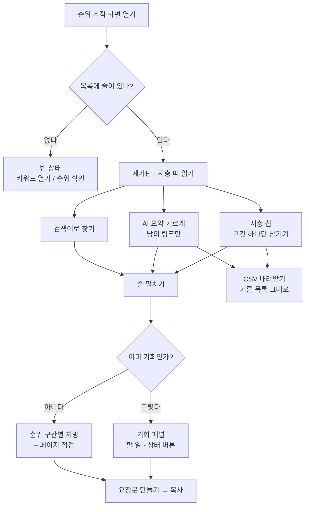

# [순위 추적] — 추적 검색어가 지금 구글 결과에서 몇 위인지, 그 위에 뜬 AI 요약에 내 링크가 실렸는지 보는 곳

추적 중인 검색어를 실제 구글 검색 결과에서 한 번 조회해, 검색어마다 지금 몇 위인지·직전 확인 대비 몇 칸 움직였는지·구글 AI 요약이 떴는지와 거기 내 페이지가 출처로 실렸는지를 한 화면에서 봅니다.

## 여기서 할 수 있는 것

| 할 일 | 어떻게 | 무엇이 바뀌나 |
| --- | --- | --- |
| 구간별로 몇 개씩인지 한눈에 본다 | [순위 구간] 아래 가로 띠(왼쪽이 1위, 오른쪽이 못 찾음). 칸에 커서를 올리면 구간 이름·개수·비율이 뜬다 | 안 바뀜(읽기). 띠 안 세로선이 `1페이지 경계` |
| 한 구간만 남긴다 (지층 칩) | 띠 아래 칩 `1~3위` `4~10위` `11~20위` `20위 밖` `못 찾음` 중 하나를 누른다 | 아래 [검색어별 기록] 목록이 그 구간만 남는다. 같은 칩을 다시 누르면 해제. 개수가 0인 구간은 칩 자체가 안 뜬다 |
| AI 요약 상태로 거른다 | [검색어별 기록] 도구줄의 고르개에서 `전체` / `AI 요약 뜸` / `남의 링크만` / `요약 없음` (각각 개수가 같이 적힌다) | 목록이 그 조건만 남는다 |
| 검색어로 찾는다 | 도구줄의 `검색어로 찾기` 칸에 글자를 친다 | 목록이 그 글자를 포함한 검색어만 남는다(칩·고르개와 함께 걸린다) |
| 조건을 지운다 | 걸러서 0건이 됐을 때 뜨는 [조건 지우기] | 찾기 글자·AI 요약 고르개·지층 칩이 모두 풀린다 |
| 한 검색어를 파고든다 (행 펼치기) | 목록의 줄을 누른다(키보드는 Enter·Space). 줄 앞 `▸`가 `▾`로 바뀐다 | 그 줄 밑이 열려 지금/직전 순위·AI 요약·SERP 피처, 순위에 걸린 페이지 URL, 그리고 할 일과 요청문이 나온다 |
| 목록을 다시 정렬한다 | 열 이름(`점수` `순위` `이전` `Δ` `노출`)을 누른다. 한 번 더 누르면 반대 방향 | 줄 순서가 바뀐다. 기본은 **기회 점수 내림차순**. 정렬하면 펼쳐 둔 줄은 접힌다. 줄이 8개 미만이면 열 이름이 정렬 손잡이가 되지 않는다 |
| 띠가 가리키는 묶음만 본다 | 화면 머리 아래 띠의 [문턱 N개 보기] / [20위 밖 N개] / [못 찾은 N개] 보기 | 그 구간 칩이 켜지고 화면이 목록으로 스크롤된다 |
| AI 요약에 내 링크가 빠진 검색어만 본다 | 화면 맨 아래 [AI 요약] 칸의 검색어 칩을 누른다 | 위 목록이 `남의 링크만`으로 걸러지고 화면이 목록으로 스크롤된다. **칩은 어느 것을 눌러도 같은 거르개가 걸린다**(그 하나만 남기지 않는다) |
| 순위를 다시 조회한다 | 화면 제목 옆 칩, 띠의 [순위 다시 확인], 실패 상자의 [순위 다시 확인] | 로컬에서는 `/capture rank <사이트>` 명령이 복사된다. 호스팅에서는 버튼이 그 단계를 실제로 돌린다 |
| 순위 제공자를 연결한다 | 한 번도 조회한 적이 없을 때 띠에 뜨는 [순위 제공자 연결] | 설정 화면으로 이동. **로컬 전용** — 호스팅에서는 서버가 키를 대므로 이 버튼 대신 [순위 확인]이 선다 |
| 추적 검색어를 늘리러 간다 | [키워드 열기] | [키워드] 화면으로 이동. 그 화면이 없는 배포(박제본)에서는 버튼이 안 뜬다 |
| 지금 보고 있는 목록을 파일로 받는다 | 도구줄의 [CSV 내려받기] | 지금 걸러 놓은 목록 그대로 `.csv` 파일이 내려온다 |
| 기회의 상태를 옮긴다 | 이미 기회로 잡힌 검색어의 줄을 펼치면 나오는 [작업 시작] / [완료 표시] / [이 기회만 빼기] / [다시 열기] | 기회의 상태 배지가 `할 일` → `진행 중` → `완료` 등으로 바뀐다. **박제본에는 안 뜬다**(누를 서버가 없다) |
| 요청문을 복사한다 | 펼친 줄의 [요청문 만들기] → [복사] | 그 검색어를 고치기 위한 글이 통째로 복사된다. Claude Code 에 붙여 넣으면 HTML 리포트로 답이 열린다 |

박제본(저장해 둔 보고서 파일)에서 사라지는 것: 제목 옆 실행 칩, 띠와 빈 상태의 실행 버튼, 기회 상태 버튼. 지층 칩·거르개·찾기·정렬·펼치기·CSV·요청문 복사는 그대로 됩니다.

## 여기서 얻는 것

**순위가 두 가지로 재진다**

이 화면의 순위와 [키워드] 화면의 평균 순위는 서로 다른 값입니다. 섞어 읽으면 같은 검색어에 순위가 두 개 적힌 것처럼 보입니다.

| | 이 화면의 순위 | 구글 실적의 평균 순위 |
| --- | --- | --- |
| 무엇 | 순위 확인 단계가 검색 결과를 **한 번 열어 본 값** | 서치콘솔이 보고한 **기간 평균 게재순위** |
| 언제 | 부제에 적힌 **그 날짜 하루**의 조회 | 실적 수집이 쓴 기간 평균(기본 28일, 수집할 때 바꿀 수 있음) |
| 조건 | 부제에 적힌 제공자·기기(데스크톱/모바일)로 잰 한 조건 | 조건을 가르지 않은 평균 |
| 값 | 정수(3위, 12위, 못 찾으면 `밖`) | 소수(12.4위처럼) |
| 어디 | 이 화면 | [키워드] 화면 |

이 화면이 비어 있을 때 "서치콘솔이 준 평균 순위는 키워드 화면에 이미 있습니다"라고 말하는 것도 그래서입니다. 기회 패널 안에 "이 순위는 구글이 보고한 N일 평균 게재순위입니다"라는 주석이 붙는 자리가 있는데, 그 문장이 붙은 숫자는 이 화면의 조회 값이 아니라 실적 평균입니다.

조회할 때 쓰는 언어·지역은 검색어마다의 로케일(없으면 사이트 로케일)을 수집기가 정합니다. 다만 **이 화면의 부제에는 날짜·제공자·기기만 적힙니다** — 지역은 이 화면에 표시되지 않습니다.

**화면 머리(부제)** — `검색어 N개 · 순위에 잡힌 M개 평균 X위 · YYYY-MM-DD 조회 · 제공자 · 데스크톱|모바일`

**계기판 다섯 칸**

| 칸 | 무엇 |
| --- | --- |
| 1페이지 안 | 10위 안에 든 개수 |
| 1페이지 문턱 | 11~20위 — 한 걸음이면 1페이지 |
| 오른 것 | 직전 확인보다 올라간 개수. ±2칸까지는 보합으로 셉니다 |
| 내린 것 | 직전 확인보다 내려간 개수. 직전 확인일 대비 |
| 20위 밖·못 찾음 | 페이지가 있는지부터 봐야 하는 개수 |

직전 확인이 없으면 [오른 것]·[내린 것]은 `—`에 `견줄 직전 확인 없음`이 붙습니다.

**[순위 구간]** — 구간별 비율 띠와 `1페이지 경계` 선, 구간 칩(이름 + 개수). 추이 그래프는 **확인일이 3회 쌓이면** 그립니다(2점을 잇는 선은 추세가 아니라서).

**[검색어별 기록] 표** — 열은 `검색어` `점수` `순위` `이전` `Δ` `노출` `AI 요약`. `이전`·`Δ`는 직전 확인이 있을 때만 생깁니다.

- `점수` — 기회 점수. 이 목록의 기본 정렬이고, 아직 기회로 안 잡힌 검색어는 `—`
- `순위` — 조회 시점에 실제로 있던 자리. 못 찾았으면 `밖`
- `이전` — 직전 확인일의 순위(지금 순위에 Δ를 되돌린 값)
- `Δ` — 올라간 칸수. ±2칸까지는 노이즈로 보고 `보합`으로 적습니다
- `노출` — 이 검색어로 노출이 가장 큰 페이지의 노출 수(같은 순위라도 규모가 다르므로)
- `AI 요약` — `내 링크 실림` / `남의 링크만` / `요약 없음` / `—`(이번 조회가 안 잼)
- 검색어 밑에는 그 검색어가 이미 기회면 종류 라벨·상태 배지·근거 한 줄이 같이 섭니다

**줄을 펼치면** — 한 줄 요약(지금 N위 · 직전 N위 Δ · AI 요약 상태와 인용 도메인 · SERP 피처 이름), 순위에 걸린 페이지 URL, 그리고

- 이미 기회로 잡힌 검색어: 기회 패널 그대로(요청문, 상태 버튼, 할 일, 이 검색어로 걸린 페이지 표, 고칠 페이지와 점검 결과 표, 이 기회로 만든 것)
- 아직 기회가 아닌 검색어: "이 검색어는 아직 기회 목록에 없습니다. 기회 분석 단계를 한 번 돌리면 점수가 붙습니다." + 페이지 표 + **순위 구간별 처방**(못 찾음 / 1~3위 / 4~10위 / 11~20위 / 20위 밖 다섯 갈래로 할 일이 다릅니다) + 페이지 점검 표 + 요청문

AI 요약이 떴는데 내 링크만 빠진 검색어는, 그 처방 첫 문장에 AI 요약 상황 설명이 한 문장 덧붙습니다.

**[AI 요약] 칸** — `AI 요약이 뜬 N개 중 M개에 내 페이지가 출처로 실렸습니다.` + 나머지가 몇 개인지 + 내 링크가 빠진 검색어 칩 목록.

**밖으로 나가는 것 — CSV**

[CSV 내려받기]는 **지금 걸러 놓은 목록 그대로** 내보냅니다(칩·고르개·찾기 칸이 걸린 뒤의 줄). 파일 이름은 `seo-miner-순위-<내려받은 날짜>.csv`, 엑셀에서 한글이 안 깨지게 BOM 이 붙습니다. 열은 이 아홉입니다:

`검색어`, `점수`, `종류`, `순위`, `이전`, `Δ`, `노출`, `구간`, `AI 요약`

- `순위`는 못 찾았으면 `밖`
- `구간`은 지층 칩과 같은 말(`1~3위` `4~10위` `11~20위` `20위 밖` `못 찾음`)
- `AI 요약`은 `내 링크 실림` / `남의 링크만` / `요약 없음` / 빈 칸(안 잼)
- `이전`·`Δ`는 화면에 그 열이 없어도 파일에는 늘 있고, 값이 없으면 빈 칸입니다

## 언제 쓰나 — 유즈케이스

**1. "제일 적은 손으로 1페이지에 올릴 검색어를 찾고 싶다"**
화면을 열면 띠가 먼저 `1페이지 문턱에 N개가 있습니다`라고 말합니다 → [문턱 N개 보기]를 누르면 11~20위만 남습니다 → 목록은 기회 점수 높은 순이므로 위에서부터 줄을 펼칩니다 → 처방이 "1페이지까지 몇 칸 남았다"로 시작하고, title·H1·빠진 H2·내부 링크를 짚어 줍니다 → [요청문 만들기]를 복사해 넘깁니다.

**2. "순위는 그대로인데 클릭이 줄었다 — AI 요약 때문인지 보고 싶다"**
맨 아래 [AI 요약] 칸에서 `AI 요약이 뜬 N개 중 M개에 내 페이지가 출처로 실렸습니다`를 읽습니다 → 내 링크가 빠진 검색어 칩을 누르면 위 목록이 `남의 링크만`으로 걸러집니다 → 줄을 펼치면 누가 대신 인용됐는지(인용 도메인)가 나오고, 우리 순위가 1페이지 안인지 밖인지에 따라 다른 처방이 붙습니다.

**3. "지난주보다 떨어진 검색어가 뭔지 알고 싶다"**
계기판 [내린 것]이 개수를 말합니다 → 목록에서 `Δ` 열 이름을 눌러 오름차순으로 정렬하면 많이 내려간 것이 위로 옵니다 → 그 줄을 펼쳐 지금/직전 순위와 순위에 걸린 페이지를 확인합니다. (직전 확인이 없으면 `이전`·`Δ` 열 자체가 없습니다 — 한 번 더 조회해야 생깁니다.)

**4. "순위 회의에 쓸 표가 필요하다"**
보고 싶은 구간 칩과 AI 요약 고르개를 걸어 목록을 좁힙니다 → [CSV 내려받기] → 점수·종류·순위·노출까지 들어 있어서 화면 밖에서도 왜 이 순서인지 읽힙니다.

## 이 화면이 비어 보일 때

**"추적 중인 키워드가 없습니다"**
조회할 대상 자체가 없는 상태입니다. 주요 버튼이 [키워드 열기]로 바뀝니다 — [키워드] 화면에서 추적할 검색어를 먼저 정합니다. 서치콘솔이 준 평균 순위는 그 화면에 이미 있으니, 순위 확인은 추적 검색어를 정한 **뒤**의 일입니다.

**"순위를 아직 확인하지 않았습니다"** (순위 조회 기록이 아예 없음)
- 로컬: 띠에 [순위 제공자 연결]이 서고, "순위 제공자를 연결하면 추적 검색어마다 지금 몇 위인지 채워집니다"라고 말합니다.
- 호스팅: 설정 화면이 없고 키를 서버가 대므로 [순위 확인] 버튼이 그 자리를 대신하고, 비용 한 줄이 같은 문장에 붙습니다 — `추적 중인 검색어 N개만큼 제공자 조회 비용이 붙습니다.`

**"이번 조회에서 잡힌 순위가 없습니다"** (조회는 돌았는데 행이 0)
[순위 다시 확인]. 다시 확인하면 검색어마다 지금 몇 위인지, AI 요약에 내 링크가 실렸는지 잡힙니다. 비용 안내가 같은 문장에 붙습니다.

**"지난 조회에서 N건이 실패했습니다"**
실패 상자가 목록 위에 따로 섭니다. 다시 확인하면 실패한 검색어부터 이어서 채워집니다.

**"이 조건에 맞는 검색어가 없습니다"**
자료가 없는 게 아니라 거르개를 너무 좁게 건 것입니다. [조건 지우기]를 누르면 찾기·AI 요약·지층 칩이 모두 풀립니다.

**[AI 요약] 칸이 "이번 조회는 AI 요약을 재지 않았습니다"**
- 지금 쓰는 제공자가 `serper` 이면: 그 제공자가 이 값을 주지 않습니다. 다른 제공자로 조회해야 채워집니다.
- 그 밖이면: 다음 조회부터 검색어마다 붙습니다.

**[AI 요약] 칸이 "AI 요약에 자리를 뺏긴 검색어가 없습니다"**
이건 비어 있는 게 아니라 **문제가 없는 상태**입니다. 확인한 검색어 어디에도 요약이 뜨지 않았다는 뜻입니다.

**점수 열이 통째로 `—`**
순위는 있는데 기회 분석을 아직 안 돌린 것입니다. `기회 분석` 단계를 한 번 돌리면 점수가 붙고, 펼친 줄이 순위 구간별 폴백 처방 대신 기회 패널로 바뀝니다.

**펼친 줄의 페이지 점검이 "아직 점검하지 않았습니다"**
`내 페이지 점검` 단계가 아직 안 돈 페이지입니다. 그 단계가 돌면 제목·설명·본문을 직접 읽고 무엇을 바꿔야 하는지 표로 나옵니다.

**필요한 키**
순위 확인은 **유료 단계**입니다. DataForSEO(아이디·비밀번호) 또는 Serper(API 키) 중 하나가 있어야 돕니다. 없어도 기회 목록까지는 그대로 갑니다. Serper 는 더 싸지만 **구글 AI 요약은 못 봅니다**. 호스팅에서는 키를 서버가 대므로 사용자가 넣을 것이 없습니다.

**목록이 30개에서 잘릴 때**
추적 검색어가 30개를 넘으면 이 화면에는 순위가 좋은 순으로 30개까지만 옵니다. 그때는 [검색어별 기록] 부제가 `추적 검색어 N개 중 30개까지 이 화면에 옵니다.`라고 말합니다. CSV 도 화면에 온 것까지만 나갑니다.

<!-- 근거:
  skills/capture/templates/views/rank.html — 이 화면 전부.
    view-def(4~5행: id·sections ranks·stages rank,gaps·head rank),
    RK_bands()(130~145행: 지층 정의와 경계값을 RULES 에서만 읽음),
    RK_strata()(149~193행: 띠·1페이지 경계·툴팁), RK_chips()(196~203행),
    RK_AIO_OPT(206행: 전체/AI 요약 뜸/남의 링크만/요약 없음),
    RK_filtered()(215~226행: 기본 정렬이 기회 점수 내림차순),
    RK_only/RK_setBand/RK_reset/RK_gapOnly(102~106·238~243행),
    RK_aioCell()(245~251행), RK_playParts()(281~340행: 순위 구간별 다섯 갈래 처방),
    RK_detail()/RK_fallback()(345~385행: 기회면 oppPanel, 아니면 폴백+askBlock),
    RK_toggle/RK_key/RK_collapse(387~418행: 행 펼침과 정렬 시 접힘),
    RK_row()(420~443행: 표 열 구성), RK_list()(445~462행: 열 이름과 툴팁 문구),
    RK_paint()(466~480행: 도구줄 — 찾기 칸·고르개·CSV 버튼),
    RK_csv()(484~500행: CSV 아홉 열), VIEW("rank")(502~709행: 부제 조건줄·
    빈 상태 세 갈래·errBox·계기판 다섯 칸·띠 문장·30개 컷 문구·AI 요약 칸),
    RK_setup()(86~90행: [순위 제공자 연결]은 로컬 전용), RK_goKw()(95~97행).
  skills/capture/templates/dashboard.html — 셸.
    window.nextStep(1588행)·READONLY 시 .acts 제거(1605행),
    window.act(1650행: 로컬 명령 칩 vs 호스팅 실행 버튼), stageRun(1673행),
    viewCmds()/viewChip(1449~1465행·1413행: 제목 옆 칩, 박제본은 없음),
    pageFix(1808행), playList(1829행), askBlock(1914행)·copyPrompt(1930행),
    OPP_LABEL(1963행)·OPP_NEXT/OPP_SET(2056~2063행)·oppActs(2074행)·oppRest(2086행),
    oppPanel/oppDetail(2096행·2485행), rankDelta(2606행: 보합 판정과 툴팁),
    table()(2620행: SORT_MIN=8, 머리글 ">"=숫자열, "?"=툴팁), csv()(2648행: BOM·파일명),
    정렬 위임(2664행 이하), sdAvgNote/SD_PERIOD(2478행·1965행·2877행: gsc_period 일 평균).
  skills/capture/scripts/dashboard.py — 서버 페이로드.
    _axis_rank()(661~760행: rank_date/rank_prev 는 최근 두 조회일, rank_agg 가 읽는
    position·url·serp_features_json·aio_present·aio_cited·aio_domains_json,
    serp_top/serp_outlines/serp_fanout 은 요청문(brief.py)용, aio_gap, aio_play,
    kw_active), gather()(1388~1389행: ranks 를 화면용 30개로 자름),
    _axis_query_pages()(1316~1365행: query_pages·page_audits·page_audit_date),
    _axis_gsc()(624·641~650행: gsc_period 와 rules — page1/striking_hi/rank_noise).
  skills/capture/scripts/scoring.py — PAGE1=10, STRIKING_LO/HI=4,20, RANK_NOISE=3(24~41행),
    rank_delta()(362행: flat 판정), aio_band()(3321~3326행), _AIO_PLAY(3270행 이하),
    aio_gaps()(3012행), ALL_KINDS 에 aio_exposure(145~147행).
  skills/capture/scripts/stage.py — STAGE_LABELS 의 rank(117행: "순위 확인"/"순위 다시 확인"),
    gaps(133행: "기회 분석"/"기회 다시 분석").
  skills/capture/scripts/collect_serp.py — provider/device 인자와 runs.notes 에 적히는
    provider=·device=·errors=(44~90·217~221행), device 는 desktop|mobile 만,
    로케일은 keywords.locale → projects.locale 순(15~17·120·151~152행).
  skills/capture/scripts/collect_gsc.py — --days 기본 28(343행).
  skills/setup/scripts/doctor.py — rank 항목(229~239행: 유료, DataForSEO 또는 Serper,
    "대신 구글 AI 요약은 못 봅니다", owner=server).
  skills/capture/scripts/brief.py — SHAPE_NAMES(50행), _serp_top/_serp_fanout(789·830행),
    aio_gap_ranks·rank_by_kw 사용(1411~1417행).
-->
