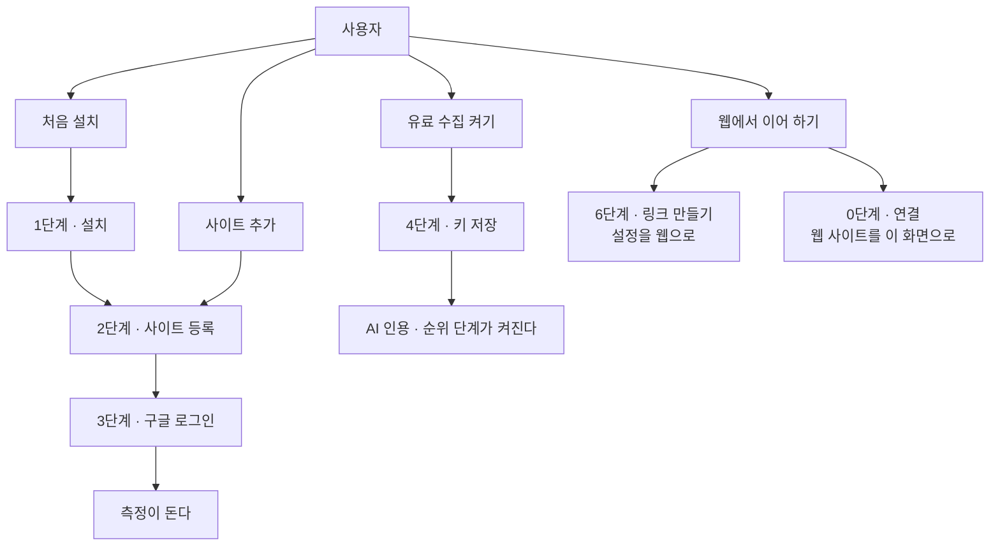

# [설정] — 측정이 시작되기 전에 이 PC 에서 갖춰야 할 것을 채우는 화면

측정을 누가 맡고, 어떤 사이트를, 어떤 자격으로 잴지 이 PC 에 적어 두는 곳입니다. 여기
있는 0~6단계는 **전부 이 PC 전용**입니다 — 웹(호스팅) 화면에서는 이 마법사가 통째로
감춰지고(메뉴의 [설정]에는 호스팅 전용 칸이 대신 섭니다), 내보낸 보고서(박제본)에는
[설정] 화면 자체가 없습니다.

## 단계별로 무엇을 채우나

**0단계 · 쓰는 방식** — 「측정을 맡는 곳」(호스팅 / 이 PC), 「기회를 열 도구」(Claude
Code · Codex · OpenCode · pi), 「터미널」(Orca / 시스템 터미널) 세 묶음과, 사이트마다
코드가 있는 「사이트별 로컬 폴더」를 정합니다. 도구를 안 고르면 기회 카드의 열기
버튼이 어떤 도구를 띄울지 모르고, 폴더를 안 적어 두면 띄울 자리를 모릅니다. 「측정을
맡는 곳」을 호스팅으로 고르면 아래 2·3·4단계가 화면에서 사라지고, 대신 「웹에 연결」
칸이 섭니다.

**1단계 · 기본 부품** — 키워드 수집과 보고서가 쓰는 파이썬 부품 두 개(requests,
pyyaml)를 설치합니다. 없으면 2단계 사이트 등록이 "기본 부품이 아직 없습니다"로
거절되고, 6단계 링크 만들기도 같은 이유로 막힙니다.

**2단계 · 사이트 등록** — 「이름」「종류」「도메인」「언어-지역」「서치콘솔 속성」
「브랜드 표기」「로컬 폴더」「씨앗 키워드」「경쟁사 도메인」「등재·경쟁 도구 이름」.
여기 적은 값이 그 사이트 수집의 기준이 됩니다. 사이트가 하나도 없으면 잴 대상이 없어
대시보드의 다른 화면이 그릴 것을 못 받습니다. 폼은 대시보드를 띄운 폴더의 저장소를
읽어 **빈 칸만** 미리 채웁니다.

**3단계 · 서치콘솔 연결** — 구글 계정으로 로그인 한 번. 이 화면에서 **측정을 막는
것은 이 단계 하나뿐**이고 무료입니다. 연결이 없으면 노출·클릭·평균 순위 실측이 통째로
없어 기회 목록까지 못 갑니다. 접힌 「내 OAuth 클라이언트 쓰기」는 선택입니다 — 넣으면
"확인되지 않은 앱" 경고 화면과 사용자 100명 상한이 없어집니다.

**4단계 · API 키** — 「OpenRouter」「DataForSEO 아이디」「DataForSEO 비밀번호」
「Serper」. 없어도 기회 목록까지는 그대로 갑니다. 키는 새 기능이 아니라 그 단계의
자동화를 켜는 것이고, 없으면 그 단계만 건너뜁니다.

**5단계 · 마케팅 스킬** — 글의 각도와 진단을 맡는 스킬 묶음입니다. 빠진 것이 있을 때만
[스킬 설치] 버튼이 뜹니다. 없어도 측정과 수집은 그대로 돌고 글 품질과 진단 깊이만
얕아집니다.

**6단계 · 웹에서 이어 하기** — 선택입니다. 로컬에 적어 둔 사이트 설정을 그대로 웹
등록 폼으로 실어 보내는 링크를 만듭니다. 측정한 자료는 넘어가지 않습니다.

## 여기서 할 수 있는 것

| 할 일 | 어떻게 | 무엇이 바뀌나 |
| --- | --- | --- |
| 측정을 맡는 곳 고르기 | 0단계 라디오 — **고르는 즉시 저장** | `~/.capture/env` 에 적힙니다. 호스팅을 고르면 2·3·4단계가 숨고 「웹에 연결」 칸이 뜹니다 |
| 기회를 열 도구 고르기 | 0단계 라디오 — **고르는 즉시 저장** | `~/.capture/env`. 기회 카드의 열기 버튼이 이 도구를 띄웁니다. 안 깔린 도구에는 [없음] 배지와 경고 문구가 붙습니다 |
| 터미널 고르기 | 0단계 라디오 — **고르는 즉시 저장** | `~/.capture/env`. 안 고르면 Orca 가 감지될 때 Orca, 아니면 시스템 터미널 |
| 사이트별 로컬 폴더 저장 | 0단계 표에서 행마다 [저장] | `~/.capture/dirs.json`. 없는 폴더는 거절됩니다. 비우고 [저장]하면 그 줄이 지워집니다 |
| 기본 부품 설치 | 1단계 [설치] (이미 있으면 [다시 설치]) | requests · pyyaml 을 pip 로 설치합니다 |
| 사이트 등록 | 2단계 [사이트 등록] | `~/.capture/projects/<이름>.yaml` 이 생기고 보관함에 반영됩니다. 「로컬 폴더」 칸을 채웠으면 `dirs.json` 에도 같이 저장됩니다. 끝나면 0.9초 뒤 [개요] 화면으로 넘어갑니다 |
| 구글 로그인 | 3단계 [구글 로그인] (연결 대기 상태에서만 보입니다) | 구글 수집용 부품을 먼저 깔고 브라우저 창을 한 번 엽니다. 끝나면 토큰이 `~/.capture/gsc_token.json` 에 남고 배지가 [연결됨]으로 바뀝니다 |
| 받아 둔 인증 파일 넣기 | 3단계 [인증 파일 열기] | 구글 수집용 부품을 깐 뒤, 다운로드 폴더에서 최신 인증 JSON 을 찾아 `~/.capture/gsc_oauth_client.json`(OAuth) 또는 `~/.capture/gsc_service_account.json`(서비스 계정)으로 설치합니다 |
| 구글 수집용 부품만 설치 | 3단계 [수집 부품 설치] (부품이 빠졌을 때만 보입니다) | google-api-python-client · google-auth · google-auth-oauthlib 을 pip 로 설치합니다 |
| 내 OAuth 클라이언트 쓰기 | 3단계 접힌 칸에 client_id · client_secret 을 넣고 [클라이언트 저장] | `~/.capture/gsc_oauth_client.json` 이 되고 동봉 클라이언트 대신 이게 쓰입니다. **클라이언트가 바뀌므로 로그인을 한 번 더** 해야 합니다 |
| API 키 저장 | 4단계 네 칸에 넣고 [키 저장] | `~/.capture/env` 에만 들어갑니다. 저장하면 칸이 비워지고 값은 화면에 다시 뜨지 않습니다. 배지가 [N개 저장됨]으로 바뀝니다 |
| 마케팅 스킬 설치 | 5단계 [스킬 설치] (빠진 것이 있을 때만 보입니다) | 빠진 스킬을 대신 깔아 줍니다. 끝난 뒤 **Claude Code 를 한 번 재시작**해야 화면에 뜹니다 |
| 웹으로 넘길 링크 만들기 | 6단계에서 사이트를 고르고 [링크 만들기] | 링크가 만들어져 클립보드에 복사되고 [웹에서 등록] 링크가 뜹니다. 다른 기기에 붙여 넣어도 열립니다 |
| 웹에 연결 | 0단계 「웹에 연결」 칸에 웹 [설정]의 **명령어로 연결하기** 한 줄을 붙여 넣고 [연결] | 그 줄에서 주소와 토큰만 읽어 `~/.capture/remote.json` 에 저장합니다. 붙으면 웹 사이트 목록이 이 대시보드에 함께 뜹니다 |
| 띠의 이동 버튼 | 화면 맨 위 띠의 [사이트 등록] · [구글 연결] · [개요 열기] | 앞의 둘은 그 단계 칸으로 굴러가 버튼에 초점을 줍니다. 준비가 다 끝나면 띠가 [개요 열기]로 바뀝니다 |

실행 버튼(설치·로그인·인증 파일·스킬)은 최대 10분까지 기다리고, 실패하면 화면 맨
아래에 멈춘 자리가 로그로 남습니다.

## 여기서 얻는 것

다 채우면 이 PC 에서 그 사이트의 수집이 돌고, 기회 카드의 열기 버튼이 그 사이트
폴더에서 고른 도구를 띄웁니다.

| 채우는 것 | 열리는 수집 |
| --- | --- |
| 3단계 구글 연결 (무료, **이것만 필수**) | 검색 실적 수집 — 서치콘솔의 노출·클릭·평균 순위 |
| OpenRouter 키 | AI 인용 확인 — ChatGPT·Perplexity·Gemini 가 내 글을 인용하는지 |
| DataForSEO 아이디 + 비밀번호 | 순위 확인 — 검색 결과 순위, 구글 AI 요약, 경쟁사 검색어 |
| Serper 키 | 순위 확인의 대체재 — 더 싸지만 구글 AI 요약은 못 봅니다 |
| 5단계 마케팅 스킬 | 글의 각도와 진단이 깊어집니다 (수집 자체는 없어도 돕니다) |

키워드 찾기·보관함·글 만들기는 키가 필요 없습니다.

## 언제 쓰나 — 유즈케이스

**처음 설치했다 — 어디부터 눌러야 할지 모르겠다.** 화면 맨 위 띠가 안 끝난 첫
단계를 이름으로 말하고 그 칸으로 데려갑니다. 채운 버튼도 화면에 하나뿐입니다:
1단계 [설치] → 2단계 [사이트 등록] → 3단계 [구글 로그인]. 여기까지가 측정이 도는
최소치입니다.

**사이트를 하나 더 재고 싶다.** 2단계 폼만 다시 채우고 [사이트 등록]. 그 사이트
코드가 있는 폴더는 같은 폼의 「로컬 폴더」 칸에 적으면 0단계 표에 그대로 실립니다.

**AI 인용이나 순위까지 자동으로 재고 싶다.** 4단계에서 해당 키를 넣고 [키 저장].
다음 수집부터 그 단계가 켜집니다.

**이 PC 를 끄고도 주기적으로 재고 싶다 / 다른 기기에서 이어 보고 싶다.** 6단계에서
사이트를 고르고 [링크 만들기] → 링크를 열어 웹에 등록합니다. 거꾸로 웹에서 쓰던
사이트를 이 대시보드에서도 보려면, 0단계에서 「측정을 맡는 곳」을 호스팅으로 고른 뒤
「웹에 연결」에 웹 [설정]의 한 줄을 붙여 넣고 [연결]합니다.

## 주의

- **키와 시크릿은 화면에 다시 뜨지 않습니다.** [키 저장]·[클라이언트 저장]을 누르면
  칸이 즉시 비워지고, 서버도 저장한 값을 되돌려주지 않습니다. 저장 자리는
  `~/.capture/env`(API 키·0단계 선택값)와 `~/.capture/gsc_oauth_client.json`
  (OAuth 클라이언트)입니다. 화면에는 [N개 저장됨] 같은 개수만 남습니다.
- **4단계에서 빈 칸은 저장되지 않습니다.** 화면은 값이 적힌 칸만 보냅니다 — 칸을 비운
  채 [키 저장]을 눌러도 이전에 저장한 키는 그대로 남습니다. 네 칸이 모두 비면
  "입력한 칸이 없습니다"로 끝납니다. (사이트별 로컬 폴더는 반대입니다 — 비우고
  [저장]하면 그 줄이 지워집니다.)
- **이미 있는 이름으로는 등록되지 않습니다.** 같은 이름이면 "이미 있습니다 — 다른
  이름을 쓰세요"로 거절됩니다. 등록해 둔 값을 고치려면
  `~/.capture/projects/<이름>.yaml` 을 고칩니다.
- 사이트 「이름」은 파일 이름이 됩니다 — 영문·숫자·`-`·`_` 로 40자까지, 첫 글자는
  영문이나 숫자여야 합니다. 「도메인」은 비울 수 없고, 「서치콘솔 속성」을 비우면
  `sc-domain:도메인` 이 들어갑니다.
- 2단계 폼의 오른쪽 배지는 **등록된 사이트가 하나라도 있는지**를 말하고, 아래 칸은
  **새로 등록할 값**입니다. 배지가 [완료]인데 칸이 비어 보이는 것은 정상입니다.
- 「내 OAuth 클라이언트 쓰기」로 저장한 뒤에는 클라이언트가 바뀌므로 **구글 로그인을
  한 번 더** 해야 합니다.
- [스킬 설치]가 끝나도 지금 열려 있는 Claude Code 는 그 스킬을 모릅니다 — **한 번
  재시작**해야 합니다.
- 「측정을 맡는 곳」을 호스팅으로 고르면 2·3·4단계가 화면에서 사라집니다. 다시 보려면
  「이 PC」로 되돌립니다.
- 고른 「기회를 열 도구」가 이 PC 에 안 깔려 있으면 배지가 [없음]으로 뜹니다 — 그대로
  두면 기회 카드의 열기 버튼이 그때 가서 실패합니다.
- 6단계로 넘어가는 것은 사람이 정한 설정(이름·도메인·종류·언어-지역·서치콘솔 속성·
  씨앗 키워드·브랜드 표기·경쟁 도구·경쟁사)뿐입니다. **측정한 자료는 넘어가지
  않습니다** — 웹이 자기 계정에서 처음부터 다시 잽니다.
- 준비물이 덜 끝난 상태로 대시보드를 열면 다른 화면을 누르기 전까지 이 [설정] 화면이
  첫 화면으로 잡힙니다.

<!-- 근거:
  skills/capture/templates/views/settings.html — view-def(id/title/sections/stages), 0~6단계
    마크업과 라벨, ST_GATE·ST_jump(띠의 이동 버튼), 호스팅에서 #setup 이 감춰진다는 주석.
  skills/capture/templates/dashboard.html — renderSetup/renderUsage/usageOpts(라디오 즉시
    저장)/renderDirs(폴더 표와 행별 [저장])/renderGsc(3-상태 문구·조건부 버튼)/renderCarry/
    setupPrimary(채운 버튼 하나)/prefillProject(빈 칸만 프리필)/runAction·busy·showLog,
    btn-keys 가 값이 있는 칸만 보내는 루프, btn-proj 성공 뒤 setTimeout 900ms → overview,
    SM.land("settings", 3), SM.drop("settings")(박제본).
  skills/capture/scripts/dashboard.py — LOCAL_ROUTES(/api/setup/prefill·carry·dirs·run·keys·
    gsc-client·project·dir·remote·run-tool), ACTIONS(deps·deps_gsc·gsc·gsc_login·skills),
    run_action(timeout 600), save_keys(ENV_FILE=~/.capture/env, 빈 값이면 삭제),
    save_gsc_client(시크릿 비반환), create_project(이름 정규식·중복 거절·gsc_property 기본값·
    PREFILL_FILE 삭제), carry_pack/PREFILL_KEYS, repo_prefill, setup_dirs/setup_dir,
    setup_remote, _assemble(variant local/hosted/frozen).
  skills/capture/scripts/paths.py — dirs_file()=~/.capture/dirs.json, bind_site_dir(폴더 검증),
    gsc() 우선순위와 gsc_token.json / gsc_oauth_client.json / gsc_service_account.json.
  skills/capture/scripts/remote.py — _file()=~/.capture/remote.json, link()/config().
  skills/capture/scripts/stage.py — setup_payload(core_ok·gsc_state·nkeys·show_skills_btn·
    show_deps_gsc_btn·show_setup·guide).
  skills/setup/scripts/doctor.py — MODES/TOOLS/TERMINALS·usage()·MODE_ENV 등, CAPABILITIES
    (키 ↔ 수집 대응, blocking), MARKETING_SKILLS/ALL_SKILLS.
  skills/setup/scripts/connect_gsc.py — dest_for()·인자 없이 돌면 다운로드 폴더에서 회수.
  server/assets/dash.html — #setup{display:none}(호스팅에서 감춤).
  skills/capture/templates/sections/sm-set.html — 호스팅 전용 설정 섹션(settings 뷰).
-->
