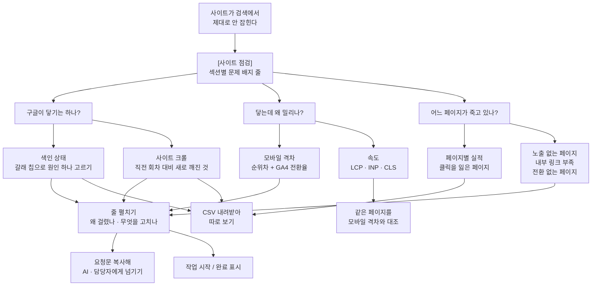

# [사이트 점검] — 검색엔진이 이 사이트에 닿는 길을 한 화면에서 본다

구글이 내 주소 하나하나를 어떻게 다루고 있는지(색인), 사이트를 한 바퀴 돌면 무엇이 걸리는지(크롤), 그리고 그 결과가 기기·속도·페이지 단위 성과로 어떻게 드러나는지를 여덟 섹션으로 갈라 보여 주는 곳입니다.

## 이 화면의 섹션

머리 밑에 **[섹션별 문제]** 배지 줄이 먼저 섭니다 — 색인 · 크롤 · 모바일 · 클릭 감소 · 무노출 · 링크 부족 · 무전환 일곱 개이고, 배지를 누르면 그 섹션으로 갑니다(값은 안 바뀝니다). **[속도]는 이 배지 줄에 없습니다.** 아직 안 잰 섹션은 숫자 대신 `미검사` 라고 적힙니다.

| 섹션 | 무엇을 보는 자리인가 | 어느 수집에서 오나 |
| --- | --- | --- |
| **색인 상태** (눈썹: URL 검사) | 구글 URL 검사 API 가 내 주소 하나하나에 답한 것. 막혔나 / 못 가져갔나 / 대표 URL 이 엇갈렸나 / 아직 안 담겼나 | `색인 검사` |
| **사이트 크롤** (눈썹: 전수 크롤 또는 크롤한 날짜) | 우리가 사이트를 직접 따라 돌며 본 것 — 깨진 내부 링크·리다이렉트 사슬·고아 페이지처럼 한 장만 봐서는 안 나오는 것. 이 섹션의 결론은 목록이 아니라 **직전 회차 대비 새로 깨진 것** | `사이트 크롤` |
| **모바일 격차** (눈썹: MOBILE vs DESKTOP) | 같은 검색어를 기기별로 갈라 평균 순위를 맞댄 것. 격차가 크면 고칠 곳은 글이 아니라 모바일 화면 | `검색 실적 수집`(기기 분해). GA4 가 연결돼 있으면 기기별 전환율 그림이 옆에 붙음 |
| **속도** (눈썹: CORE WEB VITALS) | 기회에 걸린 페이지를 모바일·데스크톱에서 열어 잰 LCP·INP·CLS. 현장(실제 크롬 사용자)과 실험실(지금 한 번 열어 잰 값)을 갈라 적음 | `속도 측정` |
| **페이지별 실적** (눈썹: 기간 비교 또는 기준일) | 이 화면에서 유일하게 **페이지** 단위로 세는 표. 검색어 하나의 순위는 흔들려도 페이지는 안 흔들리므로, 내려가면 진짜 내려가는 것 | `검색 실적 수집`(새로 캐는 것 없이 다시 합침) |
| **노출 없는 페이지** (눈썹: 크롤 × 실적) | 크롤이 200 으로 정상 응답 받았는데 검색 노출이 한 번도 없는 페이지 | `사이트 크롤` × `검색 실적 수집` |
| **내부 링크 부족** (눈썹: 크롤 × 실적) | 노출은 상위인데 사이트 안에서 아무도 안 가리키는 페이지 — 이 화면에서 가장 싼 자리 | `사이트 크롤` × `검색 실적 수집` |
| **전환 없는 페이지** (눈썹: GA4 교차) | 클릭은 버는데 GA4 전환 이벤트가 한 번도 안 잡힌 페이지. **왜 안 되는지는 이 표가 답하지 않습니다** | `GA4 실적 수집` (미연결이면 섹션 자체가 안 보임) |

화면 스스로 선언한 이 화면의 수집 단계는 넷입니다 — `색인 검사` · `사이트 크롤` · `검색 실적 수집` · `속도 측정`. [전환 없는 페이지]만 그 밖(GA4)에서 오고, 그래서 이 화면은 GA4 연결을 재촉하지 않습니다.

## 여기서 할 수 있는 것

| 할 일 | 어떻게 | 무엇이 바뀌나 |
| --- | --- | --- |
| 문제 있는 섹션으로 바로 가기 | 머리 밑 [섹션별 문제] 줄의 배지를 누른다 | 그 섹션으로 스크롤만 합니다. 데이터는 안 건드립니다 |
| 다음 한 수 실행 | 머리 밑 띠에 뜬 문장 하나 + 버튼 하나 | 지금 데이터 상태가 고른 단계 하나를 돌립니다(중단된 색인 → 크롤 없음 → 색인 없음 → 막힌 URL → 크롤 문제 → 색인 문제 → 굶은 링크 → 모바일 순). 같은 명령이 한 화면에 두 번 서지 않게, 띠가 든 단계는 아래 섹션에서 비켜섭니다 |
| 색인 갈래로 거르기 | [색인 상태]의 갈래 칩 — 전체 / robots.txt 차단 / 가져오기 실패 / 대표 URL 엇갈림 / 색인 안 됨 | 아래 표와 CSV 가 그 갈래만 남습니다. 칩 앞의 색 조각이 위 색인 막대의 범례입니다. 되돌리려면 [전체] 칩 |
| 색인 표에서 주소·판정으로 찾기 | [색인 상태] 도구줄의 검색칸 | 표와 CSV 가 같이 걸러집니다. **줄이 여덟 개 이상일 때만 이 칸이 생깁니다** |
| 크롤 갈래로 거르기 | [사이트 크롤]의 갈래 칩(전체 + 이번에 걸린 갈래, 개수 많은 순) | 표와 CSV 가 그 갈래만. 같은 칩을 다시 누르면 전체로 돌아옵니다 |
| 크롤 목록 더 보기 | 표 밑 [N건 더 보기] | 처음 20줄에서 50줄씩 늘립니다 |
| 해결된 것이 무엇이었는지 보기 | [사이트 크롤] 맨 위 비교 줄의 [해결된 N건이 무엇이었는지 보기] | 직전 크롤 대비 사라진 이슈의 갈래·URL 목록이 펴집니다 |
| 모바일 격차에서 검색어 찾기 | [모바일 격차] 도구줄의 검색칸 | 표와 CSV 가 걸러집니다. 여기도 여덟 줄 이상일 때만 생깁니다 |
| 행 펼치기 | 표의 줄을 누른다(키보드는 Enter 또는 Space). 첫 칸의 꺾쇠가 펼칠 수 있다는 표시 | 밑에 왜 걸렸는지 · 할 일 · 고칠 페이지 링크 · 페이지 점검 결과 표 · 요청문 상자가 열립니다. **펼쳐지는 표는 다섯입니다 — 색인 상태 · 사이트 크롤 · 모바일 격차 · 내부 링크 부족 · 전환 없는 페이지.** 속도 · 페이지별 실적 · 노출 없는 페이지는 안 펼쳐집니다 |
| 표 정렬 | 머리글을 누른다 | 그 열 기준으로 다시 세웁니다. **줄이 여덟 개 이상인 표에서만** 머리글이 손잡이가 되고, 펼쳐 둔 줄은 먼저 접힙니다 |
| 열·판정의 근거 보기 | 머리글과 부제의 (i) | 말풍선으로 그 열이 무엇이고 무슨 기준으로 걸렀는지 나옵니다. 키보드로도 닿습니다 |
| 접힌 설명 펴기 | 섹션 아래 회색 한 줄(예: [구글 응답을 그대로 쓴다는 뜻], [현장과 실험실은 다른 숫자다]) | 그 표를 읽는 근거 문단. 문제 0건인 섹션과 아직 안 잰 섹션에서는 이 줄이 감춰집니다 |
| 걸러서 빈 목록이 됐을 때 되돌리기 | [조건 지우기] | 칩·검색칸을 초기화합니다 |
| 기회 상태 바꾸기 | 펼친 줄의 [작업 시작] / [완료 표시] / [다시 열기] / [이 기회만 빼기] | 그 기회의 상태가 바뀌고 화면을 다시 읽습니다. 기회 목록에 없는 줄에는 버튼 대신 "왜 못 다는지"가 적힙니다. **박제본에서는 사라집니다** |
| 콘텐츠 작성 | 기회가 걸린 펼친 줄의 작성 버튼 | **호스팅 전용**입니다. 로컬에서는 이 버튼이 없습니다 |
| 요청문 만들기 | 펼친 줄의 [요청문 만들기] → [복사] | 그 줄의 상황·페이지 상태·할 일·만들어 줄 것이 담긴 요청문 전문이 클립보드로 갑니다. 그대로 Claude Code 나 다른 AI·담당자에게 붙여 넣습니다 |
| 단계 돌리기 | 빈 상태 상자와 띠의 칩 — `/capture index` · `/capture crawl` · `/capture gsc` · `/capture vitals` | **로컬은 명령 칩**이라 누르면 명령이 복사됩니다(사이트 이름까지 붙습니다). **호스팅은 버튼**이라 누르면 바로 돕니다. **박제본에서는 이 칩이 통째로 사라집니다** |
| CSV 내려받기 | 섹션 머리 오른쪽 도구줄의 [CSV 내려받기] | 지금 걸러 놓은 목록이 화면과 같은 순서·같은 칸으로 파일이 됩니다 |
| 고칠 페이지 열기 | 표와 펼침 안의 URL 링크 | 새 탭으로 그 페이지를 엽니다 |

## 여기서 얻는 것

**화면에서 읽는 것**

- **색인 상태** — 검사한 URL 전부를 한 줄로 그린 막대(정상 / 갈래별 문제), 갈래별 개수 칩, 그리고 표: 갈래 · URL · 구글 판정(coverageState 원문) · 진단 · 처방 · 기회 점수. 검사가 하루 할당이나 권한 때문에 중간에 끊겼으면 표 위에서 먼저 그렇다고 말하고, 다시 돌리면 남은 주소부터 이어서 채웁니다.
- **사이트 크롤** — 직전 크롤 대비 새로 생긴 것 / 해결된 것, 갈래 칩, 그리고 표: URL(이번에 새로 생긴 줄은 표시됨) · 갈래 · 심각도(심각 / 권고 / 참고) · 무엇이 · 기회 점수.
- **모바일 격차** — 표: 검색어 · 모바일 · 데스크톱 · 순위차(막대 포함) · 모바일 노출 · 모바일 CTR · 데스크톱 CTR · 기회 점수. GA4 가 연결돼 있으면 위에 그림 둘(이 표에 걸린 검색어의 평균 순위 / GA4 사이트 전체 전환율)이 나란히 서고, 전환율까지 모바일이 아래일 때만 "페이지 자체를 의심할 자리"라는 결론 문장이 붙습니다.
- **속도** — 표: 페이지 · 기기 · LCP · INP · CLS · 점수 · 출처(이 페이지의 실제 사용자 / 사이트 전체 값 / 실험실만 / 못 쟀음). 기준을 넘긴 칸만 붉게 칠하고, 안 잰 값은 회색으로 둡니다.
- **페이지별 실적** — 표: 페이지 · Δ클릭 · 클릭 · 노출 · CTR · 평균 순위 · 검색어 수. GA4 가 연결돼 있으면 세션 · 전환 두 열이 더 붙습니다. 부제가 "몇 개가 클릭 몇 회를 잃었는지"와 "가장 많이 잃은 페이지 한 장"까지 말해 줍니다.
- **노출 없는 페이지** — 표: 페이지 · 깊이 · 본문(단어) · 내부링크 · 제목. 내부링크가 0 인 줄(고아 페이지)은 강조되고, 얕고 링크 많은 페이지가 위에 옵니다.
- **내부 링크 부족** — 표: 페이지 · 노출 등수 · 노출 · 클릭 · 평균 순위 · 내부링크. 펼치면 앵커로 쓸 검색어 후보까지 나옵니다.
- **전환 없는 페이지** — 표: 페이지 · 클릭 · 노출 · 세션 · 검색어 수.

판정 기준값(모바일 노출 하한과 순위차, LCP·INP·CLS 기준, 내부 링크 하한과 노출 상위 범위, 전환 표본의 클릭·세션 하한)은 전부 서버가 내려보내 화면의 부제와 (i) 말풍선에 그대로 찍힙니다 — 문서에 옮겨 적으면 두 벌이 되므로 화면에서 읽습니다.

**밖으로 나가는 것 — CSV 일곱 개**

파일 이름은 모두 `seo-miner-<이름>-<내려받은 날짜>.csv` 꼴이고, 엑셀에서 한글이 안 깨지도록 BOM 이 붙습니다. 내용은 **지금 걸러 놓은 목록 그대로**입니다.

| 섹션 | 파일명 꼴 | 열 |
| --- | --- | --- |
| 색인 상태 | `seo-miner-색인문제-<날짜>.csv` | 점수, 갈래, URL, 구글 판정, verdict, 진단·처방 |
| 사이트 크롤 | `seo-miner-crawl-issues-<날짜>.csv` (이 파일만 이름이 영어입니다) | 점수, URL, 갈래, 심각도, 무엇이 |
| 모바일 격차 | `seo-miner-모바일격차-<날짜>.csv` | 점수, 검색어, 모바일 순위, 데스크톱 순위, 순위차, 모바일 노출, 모바일 CTR(%), 데스크톱 CTR(%) |
| 페이지별 실적 | `seo-miner-페이지성과-<날짜>.csv` | 페이지, Δ클릭, 클릭, 노출, CTR(%), 평균 순위, 검색어 수 (GA4 가 연결돼 있으면 세션, 전환이 더 붙음) |
| 노출 없는 페이지 | `seo-miner-무노출페이지-<날짜>.csv` | URL, 깊이, 본문 단어, 내부링크, 제목 |
| 내부 링크 부족 | `seo-miner-링크굶은페이지-<날짜>.csv` | 페이지, 노출 등수, 노출, 클릭, 평균 순위, 내부링크, 크롤 URL |
| 전환 없는 페이지 | `seo-miner-전환없는페이지-<날짜>.csv` | 페이지, 클릭, 노출, 세션, 검색어 수 |

**[속도] 섹션에는 CSV 가 없습니다.**

그리고 펼친 줄마다 **요청문**이 하나씩 나옵니다 — 그 줄이 왜 걸렸는지, 그 페이지의 현재 제목·설명·H1·H2·본문 길이·구조화 데이터, 할 일, 만들어 줄 것이 한 덩어리로 들어 있어 복사해서 그대로 넘기면 됩니다.

## 언제 쓰나 — 유즈케이스

**1. "구글에 안 뜬다. 담기기는 한 건가?"**
[섹션별 문제] 줄에서 `색인` 배지를 누른다 → 색인 막대로 정상 대비 문제 비중을 본다 → 갈래 칩에서 `robots.txt 차단`부터 고른다(위 갈래를 풀어야 아래가 풀립니다) → 줄을 펼쳐 구글 응답 원문과 처방을 읽는다 → [요청문 만들기] → [복사] 해서 담당자나 AI 에게 넘긴다.

**2. "지난번에 고친 게 진짜 고쳐졌는지, 새로 깨진 건 없는지"**
[사이트 크롤]로 간다 → 맨 위 "직전 크롤 대비 새로 생긴 것 N건 / 해결된 것 N건"을 읽는다 → [해결된 N건이 무엇이었는지 보기]로 확인한다 → `새로 생김` 표시가 붙은 줄부터 펼쳐 고친다 → 사이트를 다시 크롤해 다음 회차에 쌓는다.

**3. "폰에서만 순위가 밀린다"**
[모바일 격차]로 간다 → GA4 가 있으면 순위·전환율 그림 둘을 먼저 본다(둘 다 아래면 글이 아니라 페이지를 의심할 자리입니다) → 노출 큰 검색어부터 펼쳐 어느 페이지가 걸렸는지 확인한다 → 같은 페이지를 [속도] 표에서 찾아 모바일 LCP·CLS 를 대조한다 → 필요하면 속도 측정을 돌린다.

**4. "글을 새로 쓰지 않고 가장 싸게 올릴 자리"**
[페이지별 실적]에서 Δ클릭이 크게 빠진 페이지를 확인한다 → [내부 링크 부족]으로 내려가 노출은 상위인데 링크가 굶은 페이지를 고른다 → 줄을 펼쳐 앵커로 쓸 검색어 후보를 받는다 → 관련 글 본문에 링크 한 줄을 건다 → 다음 크롤·실적 수집에서 내부링크 수와 순위가 올라오는지 본다.

## 이 화면이 비어 보일 때

| 비어 있는 곳 | 먼저 돌릴 것 |
| --- | --- |
| 색인 상태 | `/capture index` (색인 검사). 노출 상위 페이지부터 구글에 하나씩 물어봅니다. "끝까지 못 돌았습니다"가 떠 있으면 다시 돌리면 남은 주소부터 이어서 채웁니다 |
| 사이트 크롤 | `/capture crawl` (사이트 크롤). 내 사이트만 두드리므로 비용이 없습니다. **이 한 번이 아래 [노출 없는 페이지]·[내부 링크 부족]까지 같이 엽니다** |
| 모바일 격차 | `/capture gsc` (검색 실적 수집). 기기 분해는 기본으로 켜져 있어 따로 설정할 것이 없습니다. 옆의 전환율 그림은 GA4 가 연결돼 있을 때만 생깁니다 |
| 속도 | `/capture vitals` (속도 측정). 다만 **기회에 걸린 페이지가 있어야 잴 대상이 정해집니다** — "잰 페이지가 없습니다"가 뜨면 기회 분석이 먼저입니다 |
| 페이지별 실적 | `/capture gsc`. "페이지 축으로 다시 합칠 실적이 없다"고 나오면 검색어만 담던 옛 수집본이므로 실적을 다시 수집합니다 |
| 노출 없는 페이지 · 내부 링크 부족 | 섹션 자체가 안 보이면 **아직 크롤을 안 한 것**입니다(`/capture crawl`). 크롤은 했는데 표가 비었으면 `/capture gsc` 가 더 필요합니다 |
| 전환 없는 페이지 | 섹션 자체가 안 보이면 GA4 가 연결되지 않은 것입니다. 이 화면은 GA4 연결을 재촉하지 않으므로, 쓰려면 GA4 실적 수집을 먼저 붙입니다 |
| 펼친 줄의 "고칠 자리" 표가 "아직 점검하지 않았습니다"라고 할 때 | `/capture pages` (내 페이지 점검). 제목·설명·본문을 직접 읽고 무엇을 바꿀지 적어 줍니다 |
| 표의 [기회] 칸이 비어 있고 상태 버튼이 안 달릴 때 | `/capture gaps` (기회 분석). 기회는 마지막 채점 때 만들어지므로, 그 전에는 점수 칸과 확인·완료 표시가 없습니다 |
| 문제가 0건이라 섹션이 한 줄로 접혔을 때 | 비어 있는 것이 아닙니다. "검사했고 걸린 것이 없다"는 결론이며, 접힌 줄에 무슨 기준으로 검사했는지가 적혀 있습니다. 배지 줄의 `미검사`(아직 안 잼)와는 다른 상태입니다 |

<!-- 근거:
  skills/capture/templates/views/site.html — view-def(id·title·sections·stages), 여덟 섹션 마크업과 렌더 함수
    (renderIndex·renderCrawl·renderDevice·renderVitals·renderPageAxis), 배지 줄 ST_SUM·stSummary·stJump,
    다음 걸음 stPlan/stNext/ST_LEAD/stAct, 갈래표 ST_IX·ST_IX_ORDER 와 처방 ST_IX_PLAY,
    칩 stIxChip/CR_pick, 검색칸 stIxFind/stDevFind, 행 펼침 stExpBind(index·devgap·crawl·pg-starved·pg-noconv),
    CR_N=20·CR_more(+50), CR_diff/CR_fixed, 섹션 접힘 stSec(.sec-ok/.sec-quiet)와 stOk,
    CSV 함수 stIxCsv·CR_csv·stDevCsv·pgPerfCsv·pgDeadCsv·pgStarvedCsv·pgNoConvCsv 의 이름·열,
    표 머리글 상수 PG_PERF_HEAD(+PG_PERF_HEAD_GA4)·PG_DEAD_HEAD·PG_ST_HEAD·PG_NOCONV_HEAD,
    빈 상태 PG_NO_GSC·PG_OLD_SNAP, stDevChart(GA4 미연결이면 빈 문자열),
    섹션 숨김 조건(renderPageDead/renderPageStarved 의 crawled, renderPageNoConv 의 ga4_date,
    renderPageAxis 의 page_perf 부재, renderIndex/renderDevice 의 키 부재)
  skills/capture/templates/dashboard.html — act()/siteArg()(로컬 명령 칩 vs 호스팅 버튼), stageName/stageRun,
    nextStep, table()·SORT_MIN=8(정렬 손잡이·(i) 툴팁), csv()(seo-miner-<이름>-<날짜>.csv + BOM),
    oppActs/oppRest/OPP_SET(작업 시작·완료 표시·다시 열기·이 기회만 빼기), SM.host.oppBtn(호스팅 전용 작성),
    askBlock/copyPrompt(요청문·복사), pageFix(내 페이지 점검이 없을 때의 문구), playList/pageTable,
    READONLY 와 deadSweep(.cmd·.live·.acts 제거), window.__SNAPSHOT__ 분기
  skills/capture/scripts/dashboard.py — _axis_page_perf·_axis_vitals·_axis_crawl·_axis_ga4 와 gather 의 rules/page_rules
  skills/capture/scripts/scoring.py — INDEX_BUCKETS·_index_bucket·index_issues, device_gap,
    page_performance·dead_pages·starved_pages·zero_conversion_pages,
    LCP_GOOD_MS/INP_GOOD_MS/CLS_GOOD, DEVICE_GAP_POS/DEVICE_MIN_IMP,
    STARVED_TOP_N/STARVED_LINKS_IN, GA4_NOCONV_MIN_CLICKS/GA4_NOCONV_MIN_SESSIONS
  skills/capture/scripts/collect_crawl.py — ISSUE_KIND(갈래 이름표)와 심각도 표
  skills/capture/scripts/stage.py — STAGE_LABELS(색인 검사·사이트 크롤·검색 실적 수집·속도 측정·내 페이지 점검·기회 분석)
-->
