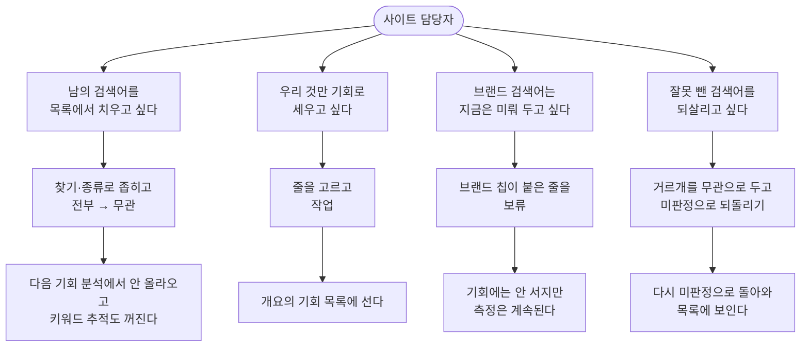

# [심사] — 측정이 물어온 검색어를 기회로 세우기 전에 하나씩 가리는 곳

측정이 긁어 온 검색어 중 **우리 것**만 골라 [개요]의 기회 목록으로 올리고, 남의 것과 지금 안 할 것은 그 앞에서 막는 화면입니다.

## 여기서 할 수 있는 것

| 할 일 | 어떻게 | 무엇이 바뀌나 |
| --- | --- | --- |
| 판정할 줄 고르기 | 줄 맨 왼쪽 체크칸을 누르거나, **줄 아무 데나** 누릅니다(줄 안의 버튼·입력칸은 제 일을 합니다) | 판정 바의 안내가 `선택 N건 →` 으로 바뀌고 판정 버튼 셋이 켜집니다 |
| 보이는 줄 전부 고르기 | 판정 바의 **전부** 체크 | 지금 거른 조건에 걸린 줄 전부가 선택됩니다(안 보이는 줄은 안 골라집니다) |
| **무관** 으로 빼기 | 줄을 고르고 [무관] (키보드 `1`) | 그 검색어의 기회가 [개요]에서 빠지고, 다음 [기회 분석]부터 다시 안 올라옵니다. **같은 검색어의 키워드 추적(순위 수집)도 꺼집니다.** 알림: "무관으로 뺐습니다. 다음 측정부터 안 올라옵니다." |
| **보류** 로 미뤄 두기 | 줄을 고르고 [보류] (키보드 `2`) | 기회 목록에는 안 올라오지만 **키워드 추적은 그대로** 돌아갑니다. 알림: "보류했습니다. 측정은 계속하고 기회에는 안 올립니다." |
| **작업** 으로 보내기 | 줄을 고르고 [작업] (키보드 `3`) | [개요]의 기회 목록에 섭니다. 누른 즉시 화면 데이터도 다시 받아 개수가 맞춰집니다. 알림: "작업으로 보냈습니다. [개요]의 기회에 있습니다." |
| 판정 되돌리기 | 행 오른쪽 [미판정으로 되돌리기] — **판정 거르개가 「미판정」이 아닐 때만** 보입니다 | 그 검색어가 다시 미판정으로 돌아옵니다. 다만 판정 기록만 지웁니다 — 무관 때 꺼진 **키워드 추적은 자동으로 다시 켜지지 않습니다**(화면에 다시 켜는 자리가 없습니다) |
| 판정으로 거르기 | 머리줄 첫 번째 드롭다운: 미판정 / 작업 / 보류 / 무관 (처음엔 「미판정」) | 보는 목록이 바뀌고, 종류 거르개와 고른 줄은 함께 풀립니다 |
| 종류로 거르기 | 두 번째 드롭다운: 「모든 종류」 + 지금 보는 판정 안에 실제로 있는 종류와 그 개수 | 그 진단이 걸린 줄만 남습니다 |
| 검색어로 찾기 | 검색칸 「검색어로 찾기」 | 검색어에 그 말이 든 줄만 남습니다(대소문자 무시). 머리줄 끝에 `보이는 줄 N` 이 덧붙습니다 — 판정별 개수는 거르기와 무관하게 늘 전체입니다 |
| 조건 지우기 | 거른 결과가 비었을 때 뜨는 [조건 지우기] | 판정·종류·찾는 말이 전부 풀리고 「미판정」으로 돌아갑니다 |
| 맨 위로 | 줄이 20개를 넘으면 표 아래에 뜨는 [맨 위로] | 거르개·판정 바가 있는 머리줄로 스크롤합니다(검색칸에 포커스는 주지 않습니다 — 모바일에서 자판이 뜨지 않게) |
| 키보드로 옮겨 다니며 판정 | `j` 아래 · `k` 위 · `스페이스` 고르기 · `1` 무관 · `2` 보류 · `3` 작업. 고른 줄이 없으면 커서가 있는 줄 하나에 먹습니다 | 입력칸 밖에서, 이 화면이 보일 때만 듣습니다. **터치 기기**에서는 키 안내와 버튼 속 숫자가 숨고 "줄을 고르면 판정 버튼이 켜집니다"로 바뀝니다 |
| 이 화면을 채우는 단계 다시 돌리기 | 화면 제목 옆 칩 — **로컬**은 `/capture gaps <사이트>` 명령을 복사해 채팅에 붙이는 칩이고, **호스팅**은 눌러서 바로 도는 버튼입니다 | 기회가 새로 적재되고 새 검색어가 미판정으로 올라옵니다 |
| 남은 일 확인 | 화면 머리의 [다음 행동] 띠(읽기 전용) | 미판정이 남아 있으면 "미판정 N건이 남았습니다. 줄을 고르고 판정 버튼을 누릅니다."가 뜨고, 없으면 띠가 사라집니다 |

- **박제본(내보낸 HTML 기록)에는 이 화면이 통째로 없습니다.** 판정은 서버가 저장하는 것이라 종이에서는 누를 수 없기 때문입니다.
- 나머지는 로컬·호스팅 대시보드에서 똑같이 됩니다(판정을 저장하는 길이 두 배포에 다 있습니다).

## 여기서 얻는 것

**판정은 기회 하나가 아니라 「정규화한 검색어」에 붙습니다.** 대소문자·띄어쓰기·기호를 지운 형태가 같으면 한 줄로 묶이고(행 옆의 `(+N)`이 묶인 변형 수), 판정도 그 한 벌에 한 번만 찍습니다. 그래서:

- 같은 검색어에 진단이 여럿 걸려 있어도(「종류」 칸의 칩들) 판정 한 번이면 전부 따라옵니다.
- 나중에 같은 검색어로 **새** 기회가 생겨도 같은 판정이 그대로 먹습니다. 다시 가릴 일이 없습니다.
- 판정은 사이트별로 남고, 로컬↔호스팅을 오갈 때 다른 데이터와 함께 옮겨 다닙니다.

**게이트는 둘이고, 기준이 다릅니다.**

1. **세울 때** — [기회 분석]이 기회를 적재하는 시점. 무관·보류로 판정된 검색어의 기회는 **아예 만들지 않습니다**. 미판정은 그대로 적재합니다 — 그래야 이 화면이 그 줄을 보고 판정할 수 있습니다.
2. **보일 때** — [개요]가 목록과 개수를 그리는 시점. 검색어를 대상으로 하는 종류는 **「작업」 판정이 있어야만** 뜹니다. 그래서 **미판정 기회는 DB에 있지만 [개요]에는 안 뜹니다** — 이 화면에서 작업으로 보내야 비로소 섭니다. 목록과 개수는 같은 조건을 봅니다(목록은 비었는데 "새 기회 546건"이라고 말하지 않습니다).

그 밖에:

- **무관은 키워드 추적까지 끕니다.** 같은 검색어의 순위 수집 대상에서 빠지므로 다음 회차부터 유료 순위 조회가 줄어듭니다. **보류는 끄지 않습니다** — 우리 검색어라 계속 재 두고, 기회로만 안 올립니다.
- 무관·보류로 뺀 줄도 이 화면에서 사라지지는 않습니다. 해당 판정으로 거르면 다시 보이고, 거기서 되돌릴 수 있습니다.
- 검색어가 아닌 종류(페이지 주소·묶음·도메인이 대상인 진단)는 심사를 안 거치고 바로 기회 목록에 섭니다. 그래서 이 화면에는 올라오지 않습니다.

## 언제 쓰나 — 유즈케이스

**1. "분석은 돌았는데 [개요]에 기회가 안 보인다."**
[심사]로 옵니다 → 거르개는 「미판정」 그대로 → 「점수」가 높은 위쪽부터 읽고, 우리 것인 줄을 골라 [작업] → [개요]로 돌아가면 그 줄들이 기회로 서 있습니다.

**2. "자동완성이 물어온 남의 브랜드·엉뚱한 검색어가 잔뜩이다."**
검색칸에 그 말을 넣거나 「종류」로 좁힙니다 → 판정 바의 [전부] → [무관] → 다음 수집부터 그 검색어들은 다시 안 올라오고, 순위도 안 잽니다.

**3. "우리 브랜드 검색어는 지금 손댈 게 아니다."**
「브랜드」 칩이 붙은 줄을 고릅니다(사이트 이름·브랜드 표기가 든 검색어에 붙습니다) → [보류] → 기회 목록은 깨끗해지고, 순위 측정은 그대로 이어집니다.

**4. "무관으로 뺀 게 알고 보니 우리 것이었다."**
판정 거르개를 「무관」으로 바꿉니다 → 그 줄의 [미판정으로 되돌리기] → 다시 미판정으로 돌아오니 [작업]으로 보냅니다. 키워드 추적은 이 되돌리기로 다시 켜지지 않는다는 점만 기억합니다.

## 이 화면이 비어 보일 때

- **"심사할 검색어가 없습니다"** — 가릴 거리가 아예 없습니다. 안내대로 **기회 분석**을 먼저 돌립니다(화면 제목 옆 칩이 그 단계입니다). 검색어 기회는 그 앞 단계들(서치콘솔·키워드 발굴·순위 등)이 데이터를 넣어 둬야 나오므로, 그래도 비면 수집부터 다시 봅니다.
- **"미판정 검색어가 없습니다 / 전부 가렸습니다."** — 할 일이 끝난 상태입니다. 같이 뜨는 [개요] 버튼을 눌러 작업으로 보낸 기회를 봅니다.
- **"거른 조건에 맞는 검색어가 없습니다"** — 판정·종류·찾는 말을 좁혀 놓아서 비어 보이는 것입니다. [조건 지우기]를 누르면 전체가 다시 보입니다.
- **"심사 목록을 불러오지 못했습니다"** — 목록을 못 받은 경우입니다. [새로고침] 뒤 다시 하면 됩니다.

<!-- 근거:
  skills/capture/templates/views/triage.html:5-9 (view-def: id/title '심사'/sub/stages ["gaps"]),
    52-56 (머리줄 문구), 66-74 (판정 셋·거르개 목록·판정 뒤 알림 문구),
    102-108 (다음 행동 띠), 116-122 (개수줄·'보이는 줄'), 124-129 (거르기 세 겹),
    132-145 (판정/종류/찾기 도구줄과 초기화 규칙), 147·161 (되돌리기는 TR_FILTER 일 때만),
    151-156 (행: 체크·(+N) 변형·브랜드 칩), 157-160 (종류·점수·클릭/노출 칸),
    168-177 (빈 상태 셋 + [조건 지우기] + go("overview")), 180-191 (판정 바·버튼 설명 툴팁),
    199-201·207-210 (맨 위로), 211-214 (조건 지우기/전부 고르기), 217-226 (POST /api/verdict, 작업·되돌리기면 load()),
    229-245 (키보드 j/k/스페이스/1/2/3), 249-254 (행 클릭), 41-45 (터치 기기에서 키 안내 숨김), 86-88 (실패 문구)
  skills/capture/templates/dashboard.html:1413 (로컬 viewChip = 명령 복사 칩), 1441-1462 (호스팅은 실행 버튼),
    1650-1655 (act: 로컬 복사 vs 호스팅 data-run), 2118-2126 (go: 화면 이름은 view-def 정본),
    3528-3534 (박제본에서 READONLY + SM.drop("triage"))
  skills/capture/scripts/dashboard.py:1531-1578 (triage_payload: KEYWORD_KINDS·status new/acked·norm 묶음·변형 수·최고 점수·최신 GSC 클릭/노출·브랜드·판정별 개수),
    1581-1588 (set_verdict, 빈 값이면 미판정), 1617-1620 (ROUTES: GET /api/triage·POST /api/verdict — 로컬·호스팅 공용),
    1219-1221 (개요 개수도 gate_sql 로 센다), 1518-1528 (_brand_keys: 브랜드 칩의 근거)
  skills/capture/scripts/db.py:550-557 (verdicts 표: project_id+key UNIQUE, id 로 pull/push 동행),
    1265 (VERDICTS = irrelevant·hold·work 정본), 1885-1912 (set_verdicts: None 이면 DELETE, irrelevant 만 keywords.is_active=0),
    1914-1917 (verdict_map), 2170-2178 (gate_sql: 검색어 종류는 verdict='work' 여야 통과), 2182-2192 (open_opportunities gated=True)
  skills/capture/scripts/scoring.py:153-156 (KEYWORD_KINDS — 심사를 거치는 종류 한 벌),
    159-165 (norm: 대소문자·기호 지운 키), 3726-3733 (gate_rows: 무관·보류는 적재 안 함, 미판정은 적재),
    4043 (load_opportunities 가 적재 직전 gate_rows), 4055-4065 (화면 목록 gated=True)
  skills/capture/scripts/run_all.py:153 + skills/capture/scripts/stage.py:133 (gaps = 「기회 분석」)
  skills/capture/scripts/collect_serp.py:105 (순위 수집은 is_active=1 만 — 무관이 끄는 것이 이것)
  server/test_app.py:374-392 (호스팅에도 /api/triage·/api/verdict 가 있고 값 검증이 400 으로 돌아온다)
-->
